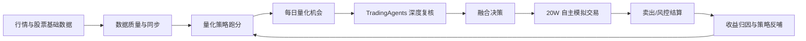

# QuantX A 股自动投研交易平台：功能介绍与操作手册

> 版本：2026-05-18  
> 适用分支：`dev_lym` / `release_0507`  
> 适用对象：项目使用者、运营人员、策略研究人员、后续接手开发者  
> 覆盖范围：当前前端导航内的全部页面、关键隐藏路由、核心自动化任务、数据闭环与页面合理性 Review。

---

## 1. 产品定位与核心目标

本项目是一个面向 A 股的「自动投研 + 量化策略 + TradingAgents 深度分析 + 模拟交易 + 收益闭环」平台。它不是单纯的行情展示或一次性回测工具，而是希望逐步形成以下闭环：



平台最终服务的目标是：

1. 自动发现 A 股机会，不局限于自选股。
2. 用历史数据验证策略是否真正有效。
3. 用 Agent 补充新闻面、基本面、情绪面、风险解释。
4. 用模拟盘沉淀真实可追踪的买卖与收益数据。
5. 用收益结果反过来优化策略权重、风控阈值和推荐参数。

> 重要说明：当前所有「买入/卖出/收益」均为系统模拟与策略验证用途，不等于真实证券账户下单，也不构成投资建议。

---

## 2. 使用前准备

### 2.1 登录

- 页面：`/login`
- 默认管理员账号：`lym / 666`、`xz / 666`
- 登录后系统会保存 Access Token，并通过刷新接口维持登录状态。

### 2.2 推荐使用顺序

如果你是第一次使用，建议按以下顺序理解系统：

1. **工作台 / 总览仪表盘**：先看系统是否健康。
2. **数据同步**：确认行情数据源、历史 K 线、实时行情是否正常。
3. **量化交易 / 收益驾驶舱**：看策略、收益、自动推荐链路是否闭环。
4. **量化交易 / 跑分验证**：验证策略在历史区间的收益。
5. **自主交易 / 交易驾驶舱**：看系统模拟买卖和当前持仓。
6. **复盘优化 / 交易收益闭环**：看推荐是否真的赚钱。
7. **系统运营 / 调度任务**：检查明天开盘/收盘是否能自动跑。

### 2.3 关键概念

| 概念 | 含义 | 主要页面 |
|---|---|---|
| 自选股 | 用户收藏的股票池，适合人工关注和 AI 优选 | 市场与自选、AI 每日优选 |
| 全市场候选 | 系统从 A 股大范围扫描出的机会 | 智能候选、量化今日机会 |
| 量化信号 | 策略基于 K 线/指标/因子给出的 buy/sell/watch 等信号 | 量化今日机会 |
| TradingAgents | 外部多智能体分析系统，提供深度研报和复核 | AI 深度研报、智能候选 |
| 融合决策 | 量化分 + Agent 分 + 市场环境 + 风控后的最终动作 | 量化今日机会、智能候选 |
| 自主模拟盘 | 初始 20W 的自动化纸面交易账户 | 交易驾驶舱 |
| 收益闭环 | 把推荐、买入、卖出、收益、风险归因连接起来 | 交易收益闭环、推荐绩效、闭环优化台 |
| 跑分验证 | 多策略在历史区间批量回测，并输出收益排行榜 | 量化跑分验证 |

---

## 3. 导航结构总览

当前左侧导航分为 7 大模块：

| 一级模块 | 页面 | 路径 | 核心用途 |
|---|---|---|---|
| 工作台 | 总览仪表盘 | `/dashboard` | 系统总览、市场、数据源、AI、后验摘要 |
| 工作台 | 市场与自选 | `/market` | 股票搜索、历史走势、自选股、数据完整性 |
| 自主交易 | 交易驾驶舱 | `/autonomous-trading/overview` | 自动闭环模拟盘 + 手动模拟交易入口 |
| 自主交易 | 每日推荐 | `/autonomous-trading/recommendations` | 每日推荐股票追踪与收益状态 |
| 自主交易 | 风险告警 | `/risk-alerts` | 风控告警列表与处理 |
| 量化交易 | 收益驾驶舱 | `/quant/dashboard` | 量化指标、收益、开盘闭环、策略表现总览 |
| 量化交易 | 今日机会 | `/quant/signals` | 量化信号池、排行榜、Agent 融合审计 |
| 量化交易 | 跑分验证 | `/quant/backtests` | 多策略历史收益验证、失败重试/续跑 |
| 量化交易 | 策略权重 | `/quant/strategies` | 策略库、权重、资金分配与反哺 |
| AI投研 | 深度研报 | `/ai-advisor` | 单股 TradingAgents 深度分析 |
| AI投研 | 每日优选 | `/screener` | AI 定时优选与历史信号后验 |
| AI投研 | 智能候选 | `/recommendations` | 多因子候选、Agent 提交、归档、模拟盘同步 |
| 复盘优化 | 交易收益闭环 | `/recommendation-trade-outcomes` | 推荐到模拟交易的收益闭环明细 |
| 复盘优化 | 推荐绩效 | `/recommendation-performance` | AI/量化信号多周期后验绩效 |
| 复盘优化 | 尾盘账本 | `/agent-tail-alpha` | Agent 尾盘建议收益追踪 |
| 复盘优化 | 闭环优化台 | `/autonomous-trading/optimization` | 自主荐股策略与风控参数优化建议 |
| 复盘优化 | 策略版本 | `/recommendation-loop-policies` | 推荐策略参数版本、晋级与烟测 |
| 复盘优化 | 策略实验 | `/strategy-experiment-lab` | 多风格荐股策略实验对比 |
| 事件回测 | 事件回测 | `/backtest` | 传统事件驱动回测创建与结果查看 |
| 事件回测 | 组合收益 | `/portfolio` | 历史选股 + 持有时间收益模拟 |
| 事件回测 | 策略中心 | `/strategy` | 历史回测策略收益排行榜 |
| 系统运营 | 调度任务 | `/tasks` | 定时任务、队列、执行日志、参数审计 |
| 系统运营 | 数据同步 | `/data-update` | 行情同步、数据源健康、队列管理 |
| 系统运营 | 运行日志 | `/logs` | 后端运行日志查询 |
| 系统运营 | 交易日记 | `/journals` | 人工复盘日记 |
| 系统运营 | 用户管理 | `/users` | 管理员管理账号 |
| 系统运营 | 个人中心 | `/profile` | 个人资料和头像 |

隐藏/兼容路由：

| 路径 | 说明 |
|---|---|
| `/paper-trading` | 自动跳转到 `/autonomous-trading/overview?tab=manual`，即手动模拟交易 Tab |
| `/quant` | 自动跳转到 `/quant/dashboard` |
| `/backtest/:id` | 指定事件回测报告详情页 |
| 其他未知路径 | 自动跳转 `/dashboard` |

---

## 4. 工作台模块

### 4.1 总览仪表盘

- 路径：`/dashboard`
- 导航：工作台 → 总览仪表盘
- 主要用途：快速判断系统是否健康，以及今天最值得关注的入口。

#### 页面内容

1. **数据源韧性**：查看数据源健康、fallback 是否正常。
2. **行情质量画像**：查看行情数据覆盖与质量。
3. **TradingAgents 连接**：查看外部 Agent 服务在线状态。
4. **量化推荐后验**：查看推荐信号多周期表现摘要。
5. **大盘核心指数**：展示核心指数近 30 天走势。
6. **回测数据概览**：展示回测数量、收益等基础统计。
7. **市场情绪雷达**：展示市场热度、风险或情绪状态。
8. **最近回测**：快速进入最近回测报告。
9. **研究运营中心**：跳转智能候选、数据同步等关键页面。

#### 常用操作

- 点击「智能候选」进入自动荐股候选池。
- 点击「新建回测」进入事件回测。
- 点击「组合收益」进入历史持有收益模拟。
- 如果数据源或 AI 状态异常，优先进入「数据同步」或「调度任务」排查。

#### 适合谁看

- 每天打开系统的第一屏。
- 运营人员检查整体链路。
- 不想深入明细，只想知道系统是否正常的人。

---

### 4.2 市场与自选

- 路径：`/market`
- 导航：工作台 → 市场与自选
- 主要用途：搜索股票、查看历史走势、维护自选股、检查数据完整性。

#### 页面 Tab

1. **全部股票**
   - 搜索股票代码/名称。
   - 按市场、行业、上市状态查看。
   - 点击股票可查看右侧历史走势。
   - 可加入自选股。

2. **收藏夹 / 自选股**
   - 查看已收藏股票。
   - 支持从自选股进入历史走势。
   - 支持移除收藏。
   - 自选股会被 AI 每日优选、部分推荐任务优先使用。

3. **数据完整性**
   - 查看股票历史 K 线覆盖率、平均完整性、缺失情况。
   - 支持刷新完整性统计缓存。
   - 如果完整性较低，可跳转数据同步页面修复。

#### 股票详情区

选中股票后可看到：

- K 线/价格走势。
- 成交量走势。
- 基础信息。
- 加入或移除自选操作。

#### 常用操作

1. 搜索股票：输入 `600519`、`贵州茅台` 等关键词。
2. 加入自选：点击「收藏」或「添加到收藏夹」。
3. 查看走势：点击股票行后查看价格和成交量图。
4. 修复数据：如果提示数据不足，进入「数据同步」执行历史 K 线补齐。

---

## 5. 自主交易模块

### 5.1 交易驾驶舱

- 路径：`/autonomous-trading/overview`
- 导航：自主交易 → 交易驾驶舱
- 主要用途：查看 20W 自主模拟盘的整体收益、持仓、交易流水，以及手动模拟交易。

#### 页面定位

该页面已经把之前容易混淆的「交易驾驶舱」和「模拟交易台」合并：

- **自动闭环驾驶舱**：系统自动荐股、自动模拟买入、自动卖出结算的总览。
- **手动模拟交易**：保留人工买卖、交易计划、收益归因能力。

#### Tab：自动闭环驾驶舱

核心内容：

1. **模拟盘总资产**：默认初始资金 20W，展示总资产、现金、仓位、市值。
2. **累计收益 / 实现盈亏 / 浮动盈亏**：判断自动荐股是否带来正收益。
3. **当前持仓**：股票、数量、成本、现价、市值、浮盈亏、仓位占比。
4. **交易流水**：买入/卖出、价格、金额、实现盈亏。
5. **推荐追踪摘要**：哪些推荐已进入模拟盘，哪些还在观察。
6. **自主交易纪律**：推荐最低分、仓位倍率等策略纪律。

常用按钮：

| 按钮 | 作用 | 注意事项 |
|---|---|---|
| 刷新驾驶舱 | 重新读取模拟盘快照 | 只读操作 |
| 执行卖出/风控结算 | 触发模拟盘风控退出检查 | 会根据卖出信号、止损、止盈、最长持有期结算模拟交易 |
| 全市场推荐并模拟跟单 | 触发全市场推荐并进入模拟盘 | 可能调用推荐、归档、风控、模拟盘链路，耗时较长 |
| 查看每日推荐 | 跳转每日推荐追踪页面 | 只看每天推荐列表时使用 |

#### Tab：手动模拟交易

核心内容来自 `PaperTrading` 页面：

1. **当前总资产、可用资金、累计收益率**。
2. **资产走势**。
3. **当前持仓**。
4. **手动买入/卖出表单**。
5. **交易流水记录**。
6. **交易计划**：盘前/盘后动作建议，可写入飞书。
7. **收益归因与策略反哺**：把已闭环交易的结果用于策略优化。

常用操作：

- 手动买入：选择股票、方向、数量/金额，提交模拟交易。
- 查看历史：打开交易流水记录。
- 风控检查：预演或执行止损/止盈/卖出信号。
- 写入飞书：将收益归因或交易计划同步到飞书多维表格。

#### 使用建议

- 日常只看「自动闭环驾驶舱」。
- 需要人工干预或测试买卖时，切到「手动模拟交易」。
- 不建议频繁人工修改自动模拟盘，否则会影响收益闭环的策略归因纯度。

---

### 5.2 每日推荐

- 路径：`/autonomous-trading/recommendations`
- 导航：自主交易 → 每日推荐
- 主要用途：按日期查看系统每天推荐了哪些股票，以及这些推荐在模拟盘中的收益追踪。

#### 页面内容

1. **推荐总览指标**：推荐数、持仓数、完成数、收益等。
2. **日期分组列表**：按交易日查看推荐。
3. **推荐状态**：观察、已模拟买入、已卖出、跳过等。
4. **收益追踪**：每只推荐股票的模拟盈亏、收益率、状态。
5. **收盘操作区**：可执行风险检查，刷新推荐状态。

#### 常用操作

- 选择日期范围查看历史推荐。
- 点击「执行风控检查」刷新卖出/结算状态。
- 点击「交易驾驶舱」返回总体持仓和资金曲线。

#### 如何解读

- 如果推荐很多但进入模拟盘很少，说明风控或最低分限制较严。
- 如果推荐进入模拟盘后长期浮亏，需要去「交易收益闭环」查看是哪类策略或市场环境拖累。

---

### 5.3 风险告警

- 路径：`/risk-alerts`
- 导航：自主交易 → 风险告警
- 主要用途：查看系统检测到的风控告警。

#### 页面内容

1. 未读告警数量。
2. 告警列表：级别、标题、内容、时间。
3. 标记已读操作。
4. 风控配置更新入口。

#### 常用操作

- 查看高风险告警。
- 处理后标记已读。
- 如果频繁出现同类告警，应进入「策略版本」或「调度任务」调整风控阈值。

---

## 6. 量化交易模块

量化交易模块通过 `QuantResearchWorkbench` 统一承载，左侧导航下的 4 个页面实际是同一工作台的 4 个 Tab。

### 6.1 收益驾驶舱

- 路径：`/quant/dashboard`
- 导航：量化交易 → 收益驾驶舱
- 主要用途：一页看清量化策略、历史跑分、模拟收益、Agent 融合、开盘链路是否有效。

#### 页面内容

1. **历史冠军收益**：最近完成跑分中的冠军策略和收益。
2. **纯量化模拟收益**：只使用量化策略的模拟账户表现。
3. **Agent 融合模拟收益**：量化 + Agent 复核后的模拟账户表现。
4. **实时行情落盘**：实时行情是否写入 `realtime_quotes`。
5. **开盘/收盘闭环状态**：开盘推荐、收盘复盘、收益回写链路。
6. **指标目录**：当前量化指标与策略能力覆盖。
7. **策略参数建议**：从历史跑分和模拟收益中沉淀出的参数建议。
8. **参数版本验证**：候选参数进入小仓实验盘后的表现。
9. **策略家族收益**：不同策略家族模拟账户收益对比。
10. **历史数据收益排行榜**：各策略在最近跑分中的超额收益排序。

#### 常用操作

- 刷新驾驶舱，查看最新量化状态。
- 如果历史冠军收益为空，先去「跑分验证」发起跑分。
- 如果今日机会为空，去「今日机会」手动生成信号。
- 如果模拟账户没有收益样本，确认调度任务是否正常运行。

#### 适合谁看

- 量化策略负责人。
- 想知道「这套量化系统有没有产生收益」的用户。
- 排查明天开盘是否能自动推荐。

---

### 6.2 今日机会 / 量化信号池

- 路径：`/quant/signals`
- 导航：量化交易 → 今日机会
- 主要用途：查看当前交易日的量化信号、排行榜、Agent 融合审计。

#### 页面内容

1. **实时行情落盘提示**：是否已将 AKShare/其他实时行情写入本地快照。
2. **信号总数、买入信号、Agent 候选、平均量化分**。
3. **今日最该看的结论**：默认只展示核心结论，减少信息过载。
4. **最近 Agent 融合审计**：展示 Agent 复核后的最终动作、分数、当前股价、核心理由。
5. **量化排行榜**：纯量化策略排序。
6. **Agent 融合后排行榜**：融合决策排序。
7. **量化信号明细**：股票、策略、信号、分数、理由、风险标记。

#### 常用按钮

| 操作 | 作用 |
|---|---|
| 生成量化信号 | 按选择策略、股票池、日期生成信号 |
| 运行量化融合闭环 | 生成信号、归档、Agent 复核、模拟盘采样 |
| 刷新 | 重新读取信号和融合审计 |

#### 使用建议

- 每天开盘后优先看「今日最该看的结论」。
- 若要知道为什么推荐，查看明细中的核心理由和风险标记。
- 如果 Agent 融合后把量化强票降级，应重点关注分歧原因。

---

### 6.3 跑分验证 / 策略跑分实验室

- 路径：`/quant/backtests`
- 导航：量化交易 → 跑分验证
- 主要用途：选择多个量化策略，在指定时间范围和股票池上做历史收益跑分。

#### 页面内容

1. **跑分配置区**
   - 股票池：全市场 / 自选股。
   - 策略：多选策略。
   - 时间范围：开始日期、结束日期。
   - 高级参数：初始资金、候选上限、最大持仓、单票仓位、最低分、成交规则、滑点/税费、涨跌停/停牌过滤等。

2. **最近失败提示**
   - 展示最近失败任务的错误原因。
   - 如果是队列锁问题，会提示 `job stalled / missing lock`。
   - 支持「按原参数重试/续跑」。

3. **跑分 KPI**
   - 跑分范围。
   - 运行耗时。
   - 冠军收益。
   - 交易次数。

4. **本次跑分信息**
   - 开始时间、结束时间。
   - 队列等待。
   - 运行阶段。
   - 扫描股票数。
   - 基准收益。
   - 策略结果数量。
   - 重试次数。

5. **历史跑分任务**
   - 每条任务展示状态、收益、耗时、错误。
   - 失败任务可点重试按钮。

6. **冠军策略资金曲线**
   - 展示本次跑分中收益最高策略的资金曲线。

7. **策略跑分对比表**
   - 总收益 / 超额收益 / 基准收益。
   - 最大回撤 / 夏普。
   - 胜率 / 交易次数 / 平均持仓天数。
   - 真实执行诊断：买入/卖出成交数、阻塞数、手续费、印花税、滑点成本。

#### 常用操作流程

1. 选择「全市场」。
2. 选择 3-7 个策略。
3. 选择 6 个月或 1 年作为首轮验证周期。
4. 点击「开始跑分」。
5. 等待任务从 `队列中 / 运行中` 变为 `已完成`。
6. 先看冠军收益，再看超额收益、回撤、交易次数。
7. 如果失败，点击「按原参数重试/续跑」。

#### 最近一次失败说明

最近一次线上任务失败原因是 Bull 队列长任务锁续约丢失：

- 错误：`job stalled more than allowable limit`
- 日志：`Missing lock ... delayed`
- 任务本身已有策略结果落库，但状态被队列失败覆盖。
- 当前已加长队列锁周期，并把默认跑分并发降为 1。

---

### 6.4 策略权重 / 量化策略库

- 路径：`/quant/strategies`
- 导航：量化交易 → 策略权重
- 主要用途：查看当前量化策略库、策略权重、真实收益反哺和 20W 策略资金分配建议。

#### 当前策略类型

| 策略 key | 策略名 | 类型 |
|---|---|---|
| `ma_trend` | 双均线趋势 | 趋势 |
| `macd_trend` | MACD 趋势 | 趋势 |
| `rsi_reversion` | RSI 均值回归 | 均值回归 |
| `bollinger_reversion` | 布林带回归 | 均值回归 |
| `relative_strength_momentum` | 相对强弱动量 | 动量 |
| `breakout_atr` | ATR/Donchian 突破 | 突破 |
| `multi_factor_ranking` | 多因子排序 | 多因子 |
| `volume_price_confirmation` | 量价确认 | 量价 |
| `low_volatility_quality` | 低波质量防守 | 防守/质量 |

#### 页面内容

1. 策略列表：策略名、分类、默认参数、风险等级、标签。
2. 真实收益反哺策略权重：从模拟盘闭环交易中统计胜率、超额收益、样本数。
3. 策略动作：increase、slight_increase、observe、reduce、pause。
4. 20W 模拟资金策略组合建议：策略资金占比、建议资金、单票上限。
5. 降权/暂停策略提示。

#### 常用操作

- 点击「刷新权重」重新计算策略权重。
- 查看哪些策略被加权或降权。
- 对比策略预算是否过于集中。

#### 如何解读

- 策略权重不是只看历史跑分，还会结合真实模拟盘闭环表现。
- 样本数不足时系统会倾向观察，不会贸然放大。
- 如果某策略近期收益明显转弱，会自动降低推荐和仓位影响。

---

## 7. AI 投研模块

### 7.1 深度研报

- 路径：`/ai-advisor`
- 导航：AI投研 → 深度研报
- 主要用途：对单只股票调用 TradingAgents 做深度分析。

#### 页面内容

1. 股票代码输入。
2. TradingAgents 健康状态：健康分、最近延迟、能力信息。
3. 最近归档信号。
4. 流式分析过程：基本面、技术面、新闻面、情绪面、风险等。
5. 最终结论：买入、卖出、持有、观察等。

#### 常用操作

1. 输入股票代码，如 `sh.600519`。
2. 点击开始分析。
3. 等待多智能体分析完成。
4. 查看最终建议和核心理由。
5. 必要时清空当前分析重新开始。

#### 使用建议

- 不建议对大量股票逐个手动跑深度研报；批量候选应使用「智能候选」或「量化今日机会」中的 Agent 提交能力。
- 单股研报适合人工深入研究某只重点标的。

---

### 7.2 每日优选

- 路径：`/screener`
- 导航：AI投研 → 每日优选
- 主要用途：查看 AI 定时任务生成的每日优选结果及其后验表现。

#### 页面内容

1. AI 每日优选列表。
2. 决策标签：BUY、SELL、HOLD、WATCH 等。
3. 1/3/5/10/20 日后验收益。
4. AI 建议后验表现统计。
5. 归档信号数量、平均收益、胜率等。
6. 详情弹窗：查看单条优选的完整内容。

#### 常用操作

- 点击同步，把 AI 每日优选同步为可验证信号。
- 查看某只股票的优选详情。
- 对比不同周期收益，判断 AI 推荐质量。

---

### 7.3 智能候选推荐

- 路径：`/recommendations`
- 导航：AI投研 → 智能候选
- 主要用途：基于多因子和反馈机制生成候选池，并可提交 Agent、归档信号、同步模拟盘。

#### 页面内容

1. 候选策略风格：均衡推荐、趋势动量、价值安全、低波稳健。
2. 股票池：自选池优先 / 全市场样本。
3. 候选数量：10、20、30、50。
4. 候选表格：股票、评分、价格、后验反馈、风险、仓位计划、趋势、理由。
5. 量化初筛后验表现。
6. 多策略共识。
7. 交易纪律卡片。
8. 自动闭环执行结果摘要。

#### 常用按钮

| 按钮 | 作用 |
|---|---|
| 刷新候选 | 重新生成多因子候选 |
| 补全画像 | 为候选同步基础资料/估值快照 |
| 提交 Agent | 将候选提交 TradingAgents 深度分析 |
| 归档信号 | 保存为可后验验证的投研信号 |
| 模拟盘预演 | 只看会买什么，不实际写入模拟交易 |
| 同步模拟盘 | 将符合条件的候选写入模拟盘 |
| 全自动闭环 | 量化初筛、归档、Agent 复核、后验验证、模拟盘一体执行 |

#### 使用建议

- 如果只是想看今天有哪些机会，用刷新候选即可。
- 如果要让系统形成收益闭环，应使用归档信号或全自动闭环。
- 如果不确定策略是否过激，先点模拟盘预演。

---

## 8. 复盘优化模块

### 8.1 交易收益闭环

- 路径：`/recommendation-trade-outcomes`
- 导航：复盘优化 → 交易收益闭环
- 主要用途：把推荐信号和模拟交易结果连接起来，判断推荐是否真的赚钱。

#### 页面内容

1. 综合盈亏。
2. 闭环 / 持仓数量。
3. 超额胜率。
4. MFE / MAE：最大有利波动 / 最大不利波动。
5. 闭环收益曲线。
6. 强弱片段雷达。
7. 市场环境稳健分。
8. 共识组平均超额。
9. 自适应策略建议。
10. 推荐交易明细。

#### 常用操作

- 刷新收益闭环。
- 执行闭环结果刷新。
- 写入飞书多维表格。
- 根据明细查看哪些策略、行业、市场环境在赚钱或亏钱。

#### 如何解读

- 若综合盈亏为正，但超额胜率低，说明可能只是市场 Beta。
- 若 MFE 高但最终收益低，说明止盈/卖出机制可能太弱。
- 若某市场环境持续亏损，应去策略版本或闭环优化台调整风险阈值。

---

### 8.2 推荐绩效实验室

- 路径：`/recommendation-performance`
- 导航：复盘优化 → 推荐绩效
- 主要用途：从信号层面评估 AI/量化推荐在多个持有周期的表现。

#### 页面内容

1. 信号来源质量日报。
2. 可赚钱片段排行。
3. 多策略共识信号前瞻收益。
4. 总信号数。
5. 指定周期样本数。
6. 平均收益、胜率、盈亏比。
7. 累计推荐收益曲线。
8. 不同持有周期表现。
9. 建议类型表现。
10. 月度推荐质量。
11. 最赚钱标的贡献。
12. 最近完成的信号样本。

#### 常用操作

- 刷新后验收益。
- 生成/刷新信号质量日报。
- 观察不同周期：1d、3d、5d、10d、20d。

#### 使用建议

- 用它判断「推荐信号本身」是否有效。
- 用「交易收益闭环」判断「信号进入模拟盘后」是否有效。

---

### 8.3 Agent 尾盘建议 Alpha 账本

- 路径：`/agent-tail-alpha`
- 导航：复盘优化 → 尾盘账本
- 主要用途：单独追踪 TradingAgents 尾盘建议在后续周期的收益。

#### 页面内容

1. 尾盘建议总数。
2. 完成样本数。
3. 平均超额。
4. 方向超额胜率。
5. 尾盘 Agent 组合收益曲线。
6. 持有周期对比。
7. 决策/置信片段。
8. 最佳 / 最弱标的片段。
9. 账本结论。
10. 下一步动作。
11. 最近尾盘建议多周期跟踪。

#### 常用操作

- 刷新账本。
- 刷新 Agent 尾盘信号后验收益。

#### 使用建议

- 用它判断 Agent 在尾盘时点是否有 Alpha。
- 如果尾盘 Alpha 持续无效，可降低 Agent 尾盘模拟盘跟单比例。

---

### 8.4 自主荐股闭环优化台

- 路径：`/autonomous-trading/optimization`
- 导航：复盘优化 → 闭环优化台
- 主要用途：总结自主荐股闭环的收益路径、强弱片段、策略预算、参数调整建议。

#### 页面内容

1. 推荐后收益路径。
2. 下一轮调参结论。
3. 策略/预算动作建议。
4. 市场 / 行业环境表现矩阵。
5. 优先放大 / 降权片段。
6. 头部标的收益路径。
7. 策略版本和预算执行审计。

#### 常用操作

- 刷新优化台。
- 跳转交易驾驶舱。
- 跳转策略版本实验室。

#### 如何解读

- 「放大」代表近期收益和稳定性较好，可增加权重。
- 「降权/暂停」代表风险或收益表现不达标。
- 优化台更偏策略管理，不是日内看盘页面。

---

### 8.5 策略参数版本实验室

- 路径：`/recommendation-loop-policies`
- 导航：复盘优化 → 策略版本
- 主要用途：管理全市场荐股闭环的参数版本、晋级榜、风险阈值建议。

#### 页面内容

1. 最新策略参数快照。
2. 不同风格版本表现。
3. 版本晋级榜。
4. 参数组合冠军榜。
5. 参数维度冠军。
6. 策略参数版本明细。
7. 风险阈值稳定性建议。

#### 常用操作

- 执行闭环安全烟测。
- 用晋级建议执行小仓预演。
- 刷新策略版本表现。

#### 使用建议

- 不建议频繁手动改参数。
- 只有当收益闭环有足够样本后，再依据晋级榜调整。

---

### 8.6 荐股策略实验室

- 路径：`/strategy-experiment-lab`
- 导航：复盘优化 → 策略实验
- 主要用途：比较不同荐股策略风格和参数组合的候选质量。

#### 页面内容

1. 策略版本数量。
2. 共识标的数量。
3. 冠军强推荐数量。
4. 冠军轻仓数量。
5. 策略质量分排行。
6. 实验结论。
7. 策略实验明细。

#### 常用操作

- 选择股票池、候选数量、策略风格。
- 运行策略实验。
- 查看冠军策略和共识标的。

#### 使用建议

- 适合策略研究，不适合日常快速看盘。
- 结果应结合后验收益和模拟盘闭环再决定是否晋级。

---

## 9. 事件回测模块

### 9.1 事件回测

- 路径：`/backtest`
- 导航：事件回测 → 事件回测
- 主要用途：传统事件驱动回测的创建、管理和结果查看。

#### 页面 Tab

1. **回测列表**
   - 查看历史回测任务。
   - 支持查看报告、删除回测。

2. **新建回测**
   - 配置回测名称、股票、时间范围、初始资金、策略类型、参数、滑点、手续费等。

3. **结果分析**
   - 选择回测后查看收益曲线、交易明细、指标。

#### 常用操作

1. 点击「新建回测」。
2. 填写股票代码、时间范围、策略参数。
3. 运行回测。
4. 在回测列表点击「查看结果」。

#### 与量化跑分的区别

| 项目 | 事件回测 | 量化跑分验证 |
|---|---|---|
| 适用对象 | 单个/少量策略的事件驱动模拟 | 多策略、多股票池批量评分 |
| 页面 | `/backtest` | `/quant/backtests` |
| 输出 | 单次回测报告 | 多策略收益排行榜 |
| 是否服务每日自动荐股 | 间接 | 直接 |

---

### 9.2 回测报告详情

- 路径：`/backtest/:id`
- 导航入口：事件回测列表 → 查看报告
- 主要用途：查看单个事件回测的详细结果。

#### 页面内容

1. 总收益率。
2. 年化收益率。
3. 夏普比率。
4. 最大回撤。
5. 胜率。
6. 盈亏比。
7. 净值曲线。
8. 日收益图。
9. 交易明细。
10. 回测配置详情。

---

### 9.3 组合收益

- 路径：`/portfolio`
- 导航：事件回测 → 组合收益
- 主要用途：历史选股 + 选择持有时间，看组合收益表现。

#### 页面 Tab

1. **配置模拟**
   - 选择股票。
   - 设置买入日期。
   - 设置持有天数。
   - 设置初始资金。
   - 选择等权或加权配置。
   - 可从收藏夹选择股票。
   - 可应用热门组合或历史组合。

2. **模拟结果**
   - 总收益率。
   - 年化收益率。
   - 最大回撤等指标。
   - 股票收益详情。
   - 每日收益走势。
   - 配置详情。

#### 常用操作

1. 从收藏夹选择股票，或手动输入代码。
2. 选择历史买入日期。
3. 设置持有天数，如 5、10、20、60。
4. 点击模拟。
5. 查看每日收益和个股贡献。

#### 使用建议

- 适合验证「某天买入一组股票，持有 N 天」是否赚钱。
- 适合检验 Agent/量化推荐的持有周期。

---

### 9.4 策略中心 / 策略大厅

- 路径：`/strategy`
- 导航：事件回测 → 策略中心
- 主要用途：对历史事件回测结果做排行榜展示。

#### 页面内容

1. 已运行回测总数。
2. 平均总收益率。
3. 成功运行数。
4. 策略收益排行榜。
5. 查看报告、删除记录。

#### 使用建议

- 该页面更像 `/backtest` 的结果聚合视图。
- 如果只需要创建回测，直接去「事件回测」。
- 如果要对比历史回测表现，看「策略中心」。

---

## 10. 系统运营模块

### 10.1 调度任务 / 自动荐股作战室

- 路径：`/tasks`
- 导航：系统运营 → 调度任务
- 主要用途：管理定时任务、查看自动化链路健康、执行任务、看队列和日志。

#### 页面内容

1. **关键任务启用数**。
2. **严重问题数**。
3. **队列等待/延迟**。
4. **最近闭环交易/跳过**。
5. **自动化链路健康图**：展示数据、AI、量化、模拟盘、飞书等链路是否正常。
6. **下一步建议**：系统根据健康状态给出的运维建议。
7. **运维健康**：schema、队列、部署冒烟等状态。
8. **最近荐股闭环**：最近自动荐股任务结果。
9. **任务编排清单**：所有定时任务表格。
10. **参数变更审计**：任务参数修改记录。
11. **历史执行记录弹窗**：每个任务的执行日志和队列详情。

#### 常用操作

| 操作 | 说明 |
|---|---|
| 刷新 | 重新读取任务和健康状态 |
| 新建任务 | 创建定时任务 |
| 手动执行 | 立即执行某个任务 |
| 查看日志 | 查看任务历史执行记录 |
| 编辑 | 修改 cron、参数、启停状态 |
| 删除 | 删除任务 |
| 风险阈值建议 | 预览或应用风险阈值调整 |

#### 默认核心定时任务

| 任务 | 类型 | 默认时间 | 作用 |
|---|---|---|---|
| 每日行情增量同步 | `DAILY_UPDATE` | 工作日 17:10 | 同步最近行情 |
| 全量股票日线同步 | `SYNC_HISTORY` | 工作日 18:00 | 补齐全市场日线 |
| 基准指数行情同步 | `BENCHMARK_INDEX_SYNC` | 工作日 15:05 | 同步沪深300等基准指数 |
| 量化策略开盘机会扫描 | `QUANT_DAILY_PIPELINE` | 工作日 09:35 | 开盘后生成量化机会、Agent复核、模拟盘跟单 |
| 量化开盘链路看门狗 | `QUANT_OPEN_WATCHDOG` | 工作日 09:55 | 检查开盘量化链路是否成功 |
| 量化策略全市场扫描 | `QUANT_DAILY_PIPELINE` | 工作日 15:32 | 收盘前后全市场量化扫描和闭环 |
| AI优选-早盘分析 | `AI_DAILY_SCREENER` | 工作日 09:00 | 自选股 AI 早盘优选 |
| AI优选-午盘分析 | `AI_DAILY_SCREENER` | 工作日 12:30 | 自选股 AI 午盘优选 |
| AI优选-收盘分析 | `AI_DAILY_SCREENER` | 工作日 14:30 | 自选股 AI 收盘优选 |
| 全市场AI机会扫描 | `AI_DAILY_SCREENER` | 工作日 14:35 | 全市场 AI 候选扫描 |
| 全市场荐股闭环 | `AUTO_RECOMMENDATION_LOOP` | 工作日 15:45 | 推荐、归档、Agent、模拟盘一体闭环 |
| 推荐绩效后验刷新 | `SIGNAL_PERFORMANCE_REFRESH` | 工作日 15:20 | 刷新推荐信号收益 |
| Agent尾盘建议收益追踪 | `SIGNAL_PERFORMANCE_REFRESH` | 工作日 15:25 | 追踪 Agent 尾盘建议收益 |
| 信号质量日报 | `SIGNAL_QUALITY_DAILY_REPORT` | 工作日 16:30 | 生成信号质量日报并写飞书 |
| 推荐信号模拟盘跟单 | `PAPER_TRADING_AUTO_SYNC` | 工作日 15:40 | 推荐信号进入模拟盘 |
| Agent尾盘建议模拟盘跟单 | `PAPER_TRADING_AUTO_SYNC` | 工作日 15:42 | Agent 尾盘建议进入模拟盘 |
| 模拟盘风控退出检查 | `PAPER_TRADING_RISK_CHECK` | 工作日 15:50 | 止损、止盈、卖出信号、最长持有期结算 |
| 推荐交易收益闭环刷新 | `RECOMMENDATION_TRADE_OUTCOME_REFRESH` | 工作日 16:02 | 刷新推荐到交易的闭环收益 |
| 模拟盘收益归因报告 | `PAPER_TRADING_ATTRIBUTION_REPORT` | 工作日 16:05 | 写入收益归因飞书报告 |
| 模拟盘交易计划报告 | `PAPER_TRADING_DAILY_PLAN` | 工作日 16:10 | 生成次日交易计划并写飞书 |

#### 排查建议

- 如果明天开盘没有推荐，先看：量化策略开盘机会扫描、量化开盘链路看门狗。
- 如果有推荐但没进模拟盘，看：推荐信号模拟盘跟单、Agent尾盘建议模拟盘跟单。
- 如果持仓没有卖出，看：模拟盘风控退出检查。
- 如果飞书没有结果，看任务日志中的 `report_to_feishu` 和飞书错误。

---

### 10.2 数据同步 / 数据更新与系统监控

- 路径：`/data-update`
- 导航：系统运营 → 数据同步
- 主要用途：管理行情同步、数据源健康、数据质量、更新队列。

#### 页面内容

1. **系统健康**：数据库、Redis、队列等状态。
2. **数据源韧性**：AKShare、Baostock、Tushare、东方财富、腾讯、新浪、TradingAgents 健康状态。
3. **量化数据可用度**：历史 K 线、实时行情、财务因子、日内数据、Agent 分析可用情况。
4. **历史 K 线动态路由计划**：当前优先使用哪个数据源，失败后如何 fallback。
5. **数据源健康明细**：每个数据源最近错误、健康分、延迟、能力。
6. **数据质量画像**：扫描标的数、平均质量分、低质量占比、滞后标的。
7. **队列状态**：等待、活跃、失败、延迟任务数。
8. **操作区**：手动同步、新股同步、完整性检查、批量同步、清理队列。
9. **统计最近 7 天**：成功率分布、更新趋势。
10. **任务队列**：具体队列任务列表，可取消/重试。
11. **更新日志**：同步任务历史日志。

#### 常用操作

| 操作 | 作用 |
|---|---|
| 手动同步每日行情 | 触发最近行情同步 |
| 新股同步 | 更新股票列表 |
| 完整性检查 | 检查历史数据缺失情况 |
| 批量数据同步 | 指定股票或全市场同步历史数据 |
| 质量扫描 | 检查 K 线异常、缺口、滞后 |
| 修复 Top 质量问题 | 对质量较差股票批量补数 |
| 清理队列 | 清理失败/卡住的数据同步任务 |
| 取消任务 | 停止指定队列任务 |
| 重试任务 | 重跑失败队列任务 |

#### 数据源说明

| 数据源 | 主要用途 | 特点 |
|---|---|---|
| AKShare | 免费行情、实时行情、基础数据 | 覆盖广，但稳定性受上游影响 |
| Baostock | 历史日线兜底 | 免费，适合补历史数据 |
| Tushare Pro | 复权、财务因子、指数成分 | 性价比高，但需要 token |
| 东方财富 | 历史 K 线 fallback | 免费，适合作为兜底 |
| 腾讯 | 实时/准实时行情、基准指数 | 当前多处使用 `tencent_only` 提升稳定性 |
| 新浪 | 实时行情兜底 | 轻量 fallback |
| TradingAgents | 外部投研分析 | 不提供行情主数据，提供分析结论 |

---

### 10.3 运行日志

- 路径：`/logs`
- 导航：系统运营 → 运行日志
- 主要用途：查询后端系统日志。

#### 页面内容

1. info、warn、error、debug 统计。
2. 日志筛选：级别、关键词、类型。
3. 自动刷新开关。
4. 终端风格日志列表。

#### 常用操作

- 打开自动刷新，观察任务执行。
- 搜索 `量化跑分`、`Feishu`、`TradingAgents`、`error` 等关键词。
- 出现任务失败时，先看调度任务日志，再看运行日志。

---

### 10.4 交易日记

- 路径：`/journals`
- 导航：系统运营 → 交易日记
- 主要用途：人工记录每日交易复盘。

#### 页面内容

1. 复盘日历。
2. 指定日期日记。
3. 新增、编辑、删除日记。

#### 使用建议

- 用于记录人工判断、市场情绪、系统推荐是否符合预期。
- 可与推荐绩效、交易收益闭环一起复盘。

---

### 10.5 用户管理

- 路径：`/users`
- 导航：系统运营 → 用户管理
- 权限：管理员可见
- 主要用途：管理系统用户。

#### 页面内容

1. 用户总数、管理员数、普通用户数、禁用数。
2. 账号列表。
3. 新增用户。
4. 编辑用户。
5. 修改密码。
6. 删除用户。

---

### 10.6 个人中心

- 路径：`/profile`
- 导航：系统运营 → 个人中心 / 右上角用户下拉
- 主要用途：查看和修改当前用户资料。

#### 页面内容

1. 用户名、昵称、手机号、邮箱、角色。
2. 上传头像。
3. 更新个人资料。
4. 退出登录入口在右上角用户菜单。

---

## 11. 飞书多维表格写入说明

系统已将原微信回调替换为飞书开放平台写入。以下任务会将摘要写入飞书多维表格：

1. 量化策略全市场扫描。
2. 量化策略开盘机会扫描。
3. 量化开盘链路看门狗。
4. 基准指数行情同步。
5. 全市场荐股闭环。
6. 信号质量日报。
7. Agent尾盘建议收益追踪。
8. 推荐交易收益闭环刷新。
9. 模拟盘收益归因报告。
10. 模拟盘交易计划报告。

### message 字段规范

当前约定：

- message 字段只放**结论和核心理由**，不要放完整分析。
- 推荐/模拟交易场景要注明当前股价或 Agent 分析时拿到的股价。
- 量化推荐场景要说明这是量化交易场景推荐。
- 可使用 Markdown，但要避免过长，防止飞书字段截断。
- 完整分析应放在摘要字段或详情字段，不应塞进 message。

---

## 12. 核心业务流程操作手册

### 12.1 明天开盘前如何确认系统能自动荐股

1. 进入「系统运营 → 调度任务」。
2. 检查以下任务是否启用：
   - 量化策略开盘机会扫描。
   - 量化开盘链路看门狗。
   - 推荐信号模拟盘跟单。
   - 模拟盘风控退出检查。
3. 进入「系统运营 → 数据同步」。
4. 检查数据源健康、实时行情落盘、历史 K 线可用度。
5. 进入「量化交易 → 收益驾驶舱」。
6. 查看开盘链路提示和实时行情落盘状态。
7. 如需手动演练，进入「量化交易 → 今日机会」点击运行量化融合闭环。

### 12.2 如何发起一次策略跑分验证

1. 进入「量化交易 → 跑分验证」。
2. 选择股票池：建议先用全市场。
3. 选择策略：建议至少选择多因子、动量、量价、低波质量。
4. 选择时间范围：建议先 180 天，再扩大到 1 年或 3 年。
5. 高级参数使用默认：20W、最大 8 持仓、次日开盘、T+1、涨跌停/停牌过滤。
6. 点击开始跑分。
7. 观察历史任务状态。
8. 完成后重点看：总收益、超额收益、最大回撤、交易次数、执行阻塞。
9. 失败时点击重试/续跑。

### 12.3 如何把推荐进入模拟盘并追踪收益

1. 进入「AI投研 → 智能候选」。
2. 选择全市场样本、候选数量。
3. 点击刷新候选。
4. 可先点击模拟盘预演。
5. 确认后点击同步模拟盘或全自动闭环。
6. 进入「自主交易 → 交易驾驶舱」查看持仓。
7. 次日或收盘后执行风控结算。
8. 进入「复盘优化 → 交易收益闭环」查看收益。

### 12.4 如何评估 Agent 是否真的有用

1. 进入「复盘优化 → 尾盘账本」。
2. 查看 Agent 尾盘建议平均超额和方向胜率。
3. 进入「复盘优化 → 推荐绩效」。
4. 筛选 TradingAgents 来源信号，查看 5d/10d/20d 收益。
5. 进入「量化交易 → 今日机会」。
6. 对比纯量化排行榜和 Agent 融合后排行榜。
7. 如果 Agent 经常降低收益，应在策略版本中降低 Agent 权重或只保留风险过滤作用。

### 12.5 如何排查没有写入飞书

1. 进入「系统运营 → 调度任务」。
2. 找到对应任务，点击查看日志。
3. 查看任务参数中 `report_to_feishu` 是否为 true。
4. 进入「系统运营 → 运行日志」。
5. 搜索 `Feishu`、`多维表格`、`report`。
6. 如果是字段截断，检查 message 是否过长。
7. 如果是权限错误，检查飞书应用是否有表格权限。

### 12.6 如何排查跑分失败

1. 进入「量化交易 → 跑分验证」。
2. 查看最近失败提示。
3. 如果是 `job stalled` / `missing lock`：点击重试/续跑。
4. 如果是数据缺失：进入数据同步补齐历史 K 线。
5. 如果是策略参数错误：减少策略数量或恢复默认高级参数。
6. 进入「系统运营 → 运行日志」搜索 `量化跑分`。
7. 如果队列积压，进入「系统运营 → 数据同步」或「调度任务」查看队列。

---

## 13. 页面合理性 Review 与优化建议

基于以上功能梳理，当前系统能力已经比较完整，但也存在页面数量多、部分概念重叠、用户认知成本高的问题。下面是整体 Review。

### 13.1 当前页面分组是否合理

总体分组方向是合理的：

- 工作台：总览和市场。
- 自主交易：模拟盘执行与每日推荐。
- 量化交易：量化策略、信号、跑分、收益。
- AI投研：Agent 和 AI 候选。
- 复盘优化：后验收益、策略版本、优化。
- 事件回测：传统回测与组合持有收益。
- 系统运营：数据、任务、日志、用户。

但问题是：

1. **AI投研、量化交易、复盘优化之间边界仍然复杂**。普通用户不容易理解「智能候选」「今日机会」「每日推荐」的区别。
2. **复盘优化模块页面过多**，很多页面都在讲收益、版本、实验、优化。
3. **事件回测与量化跑分存在概念重叠**，但底层用途不同，需要进一步明确。
4. **系统运营页面信息密度很高**，适合管理员，不适合普通用户。

---

### 13.2 可能冗余或应合并的页面

#### 建议 1：合并「智能候选」和「量化今日机会」的普通用户视图

- 当前页面：
  - `/recommendations` 智能候选推荐
  - `/quant/signals` 量化今日机会

两者都在回答「今天买什么」。区别是一个偏多因子/AI候选，一个偏量化策略信号。建议：

- 保留两个底层页面。
- 新增一个更面向用户的统一入口：**今日交易机会**。
- 页面内用来源标签区分：纯量化、Agent融合、AI优选、策略共识。
- 高级用户仍可进入原始页面看细节。

优先级：高。

#### 建议 2：合并「推荐绩效」「尾盘账本」「交易收益闭环」的一级入口

- 当前页面：
  - `/recommendation-trade-outcomes` 交易收益闭环。
  - `/recommendation-performance` 推荐绩效。
  - `/agent-tail-alpha` 尾盘账本。

这三个都是收益后验，只是粒度不同。建议新增：**收益复盘中心**。

Tab 设计：

1. 交易闭环：推荐进模拟盘后的真实模拟收益。
2. 信号绩效：所有归档信号的多周期收益。
3. Agent尾盘：Agent 尾盘建议专项收益。
4. 强弱片段：行业/市场环境/策略来源归因。

优先级：中高。

#### 建议 3：「策略版本」和「策略实验」可以合并为策略研究中心

- 当前页面：
  - `/recommendation-loop-policies` 策略版本。
  - `/strategy-experiment-lab` 策略实验。
  - `/autonomous-trading/optimization` 闭环优化台也部分重叠。

建议合并为：**策略研究与版本中心**。

Tab 设计：

1. 优化建议。
2. 参数版本。
3. 策略实验。
4. 风险阈值。
5. 晋级/回滚记录。

优先级：中。

#### 建议 4：「策略中心」与「事件回测」可以弱化一个入口

- 当前页面：
  - `/backtest` 回测管理。
  - `/strategy` 策略大厅。

策略大厅本质上是回测结果排行榜，可作为事件回测内的 Tab，而不是左侧独立页面。

建议：

- 将「策略中心」移动到「事件回测」页面内。
- 左侧只保留「事件回测」「组合收益」。

优先级：中。

---

### 13.3 缺少的页面或能力

#### 缺少 1：统一的「今日该做什么」页面

当前信息分散在：

- 总览仪表盘。
- 今日机会。
- 智能候选。
- 每日推荐。
- 交易驾驶舱。

建议新增或强化首页为：**今日作战台**。

它只回答 5 个问题：

1. 今天系统推荐买什么？
2. 为什么推荐？
3. 当前股价是多少？
4. 建议仓位是多少？
5. 当前持仓要不要卖？

优先级：最高。

#### 缺少 2：统一的「真实可操作结论」层

很多页面指标非常丰富，但用户最想知道：

- 买 / 不买 / 观察 / 卖。
- 买多少。
- 什么时候复查。
- 风险是什么。

建议在所有投研/量化/模拟页面顶部统一加一个「结论条」：

```text
今日结论：谨慎买入 2 只，观察 5 只，卖出/减仓 1 只。
核心原因：市场环境中性偏强，量化动量策略有效，Agent 对其中 2 只确认基本面风险较低。
风险：现金水位 12%，行业集中度接近上限，不追高涨停附近标的。
```

优先级：高。

#### 缺少 3：自动交易闭环的「因果链路详情」

现在能看到很多结果，但如果一只股票被买入，用户可能想知道：

```text
为什么买入？
来自哪个任务？
哪个策略打分？
Agent 是否复核？
当时价格多少？
风控为什么允许？
最后为什么卖出？
收益如何？
```

建议新增：**单笔推荐链路详情页**。

路径示例：`/recommendation-trade-outcomes/:id` 或 `/signals/:id/trace`

优先级：高。

#### 缺少 4：策略配置的可视化编辑器

当前很多策略参数藏在任务 JSON 或高级参数中，对普通用户不友好。建议新增：

- 策略启用/停用。
- 每个策略默认参数。
- 每个策略适用市场环境。
- 每个策略最大仓位。
- 策略晋级/降级规则。

可以放在「量化策略权重」或未来的「策略研究中心」。

优先级：中高。

#### 缺少 5：实盘前检查清单

虽然当前是模拟盘，但目标是赚钱，未来如果接近实盘，需要每天自动输出：

- 数据是否新鲜。
- 任务是否按时完成。
- 推荐是否生成。
- 风控是否允许新增。
- 飞书是否写入。
- 当前最大风险。

可在「调度任务」或「今日作战台」中实现。

优先级：中。

---

### 13.4 信息架构建议：下一版导航

建议下一版左侧导航从 7 组收敛到 5 组：

```text
1. 今日作战
   - 今日作战台
   - 今日机会
   - 当前持仓
   - 卖出/风控

2. 策略研究
   - 量化收益驾驶舱
   - 跑分验证
   - 策略库与权重
   - 策略版本与实验

3. 收益复盘
   - 交易收益闭环
   - 信号绩效
   - Agent尾盘账本
   - 交易日记

4. 数据与系统
   - 市场与自选
   - 数据同步
   - 调度任务
   - 运行日志

5. 账号与设置
   - 个人中心
   - 用户管理
```

其中：

- 「今日作战」面向普通使用。
- 「策略研究」面向策略开发与验证。
- 「收益复盘」面向复盘和反哺。
- 「数据与系统」面向运维。
- 「账号与设置」面向管理。

---

### 13.5 优先级落地建议

#### P0：先降低用户决策成本

1. 新增/强化「今日作战台」。
2. 把今日推荐、今日卖出、当前持仓、风险限制放到一页。
3. 每条推荐统一显示：动作、当前价、仓位、核心理由、风险、来源。

#### P1：收益后验页面收敛

1. 将推荐绩效、尾盘账本、交易收益闭环收敛为「收益复盘中心」。
2. 保留原路由做兼容跳转。
3. 让用户只需知道「信号有没有赚钱」「交易有没有赚钱」「Agent有没有贡献」。

#### P2：策略研究页面收敛

1. 将策略版本、策略实验、闭环优化台合并为「策略研究中心」。
2. 明确区分：策略、参数、风险阈值、预算、晋级/回滚。

#### P3：增加链路追踪详情

1. 对每个推荐信号建立 trace 页面。
2. 展示从生成、Agent、归档、模拟买入、卖出、收益的完整链路。
3. 这会极大提升系统可信度。

#### P4：继续优化页面视觉与文案

1. 所有页面顶部统一「结论优先」。
2. 图表和表格下沉，默认折叠复杂细节。
3. 深色块减少，仅保留强调状态。
4. 按「用户要做什么」而不是「系统有什么能力」组织页面。

---

## 14. 当前页面完整性检查结论

### 已覆盖能力

- 股票搜索、自选股、历史行情。
- 数据同步、数据源健康、数据质量。
- 传统事件回测。
- 历史组合持有收益模拟。
- 量化策略库、信号池、跑分验证、收益驾驶舱。
- TradingAgents 单股研报、每日优选、全市场候选。
- 自主模拟盘、手动模拟交易、风险退出。
- 推荐收益闭环、信号绩效、Agent 尾盘账本。
- 策略版本、策略实验、闭环优化。
- 定时任务、队列、日志、审计、用户管理。
- 飞书多维表格写入。

### 主要不足

1. 页面太多，普通用户很难判断该先进哪一页。
2. 「今日买什么 / 卖什么」还没有一个足够明确的统一作战入口。
3. 多个收益复盘页面重叠，需要合并。
4. 策略实验、策略版本、闭环优化概念相近，需要整合。
5. 单只股票/单条信号的完整链路追踪还不够直观。

### 总体判断

系统功能已经从「工具集合」逐步成长为「自动荐股闭环平台」，但下一阶段的关键不是继续堆页面，而是：

> 把复杂能力收敛成少数几个高信任、低认知成本的操作入口，让用户每天只需要看清：今天买什么、为什么买、买多少、什么时候卖、这套系统长期有没有赚钱。

