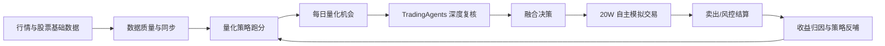

# QuantX A 股自动投研交易平台：功能介绍与操作手册

> 版本：2026-05-18（飞书机器人摘要通知接入后更新）
> 适用分支：`main` / `dev_lym` / `release_0507`
> 适用对象：项目使用者、运营人员、策略研究人员、后续接手开发者
> 覆盖范围：当前前端导航内的全部页面、关键隐藏路由、核心自动化任务、数据闭环与页面合理性 Review。

---

## 1. 产品定位与核心目标

本项目是一个面向 A 股的「自动投研 + 量化策略 + TradingAgents 深度分析 + 模拟交易 + 收益闭环」平台。它不是单纯的行情展示或一次性回测工具，而是希望逐步形成以下闭环：



平台最终服务的目标是：

1. 自动发现 A 股机会，不局限于自选股。
2. 用历史数据验证策略是否真正有效。
3. 用 Agent 补充新闻面、基本面、情绪面、风险解释。
4. 用模拟盘沉淀真实可追踪的买卖与收益数据。
5. 用收益结果反过来优化策略权重、风控阈值和推荐参数。

> 重要说明：当前所有「买入/卖出/收益」均为系统模拟与策略验证用途，不等于真实证券账户下单，也不构成投资建议。

---

## 2. 使用前准备

### 2.1 登录

- 页面：`/login`
- 默认管理员账号：`lym / 666`、`xz / 666`
- 登录后系统会保存 Access Token，并通过刷新接口维持登录状态。

### 2.2 推荐使用顺序

如果你是第一次使用，建议按以下顺序理解系统：

1. **工作台 / 总览仪表盘**：先看系统是否健康。
2. **数据同步**：确认行情数据源、历史 K 线、实时行情是否正常。
3. **量化交易 / 收益驾驶舱**：看策略、收益、自动推荐链路是否闭环。
4. **量化交易 / 跑分验证**：验证策略在历史区间的收益。
5. **自主交易 / 交易驾驶舱**：看系统模拟买卖和当前持仓。
6. **复盘优化 / 交易收益闭环**：看推荐是否真的赚钱。
7. **系统运营 / 调度任务**：检查明天开盘/收盘是否能自动跑。

### 2.3 关键概念

| 概念          | 含义                                                | 主要页面                           |
| ------------- | --------------------------------------------------- | ---------------------------------- |
| 自选股        | 用户收藏的股票池，适合人工关注和 AI 优选            | 市场与自选、AI 每日优选            |
| 全市场候选    | 系统从 A 股大范围扫描出的机会                       | 智能候选、量化今日机会             |
| 量化信号      | 策略基于 K 线/指标/因子给出的 buy/sell/watch 等信号 | 量化今日机会                       |
| TradingAgents | 外部多智能体分析系统，提供深度研报和复核            | AI 深度研报、智能候选              |
| 融合决策      | 量化分 + Agent 分 + 市场环境 + 风控后的最终动作     | 量化今日机会、智能候选             |
| 自主模拟盘    | 初始 20W 的自动化纸面交易账户                       | 交易驾驶舱                         |
| 收益闭环      | 把推荐、买入、卖出、收益、风险归因连接起来          | 交易收益闭环、推荐绩效、闭环优化台 |
| 跑分验证      | 多策略在历史区间批量回测，并输出收益排行榜          | 量化跑分验证                       |

---

## 3. 导航结构总览

当前左侧导航分为 7 大模块：

| 一级模块 | 页面           | 路径                                  | 核心用途                                                |
| -------- | -------------- | ------------------------------------- | ------------------------------------------------------- |
| 工作台   | 总览仪表盘     | `/dashboard`                          | 系统总览、市场、数据源、AI、后验摘要                    |
| 工作台   | 市场与自选     | `/market`                             | 股票搜索、历史走势、自选股、数据完整性                  |
| 自主交易 | 交易驾驶舱     | `/autonomous-trading/overview`        | 自动闭环模拟盘 + 手动模拟交易入口                       |
| 自主交易 | 每日推荐       | `/autonomous-trading/recommendations` | 每日推荐股票追踪与收益状态                              |
| 自主交易 | 风险告警       | `/risk-alerts`                        | 风控告警列表与处理                                      |
| 量化交易 | 收益驾驶舱     | `/quant/dashboard`                    | 量化指标、收益、开盘闭环、策略表现总览                  |
| 量化交易 | 今日机会       | `/quant/signals`                      | 量化信号池、排行榜、Agent 融合审计                      |
| 量化交易 | 跑分验证       | `/quant/backtests`                    | 多策略历史收益验证、失败重试/续跑                       |
| 量化交易 | 策略权重       | `/quant/strategies`                   | 策略库、权重、资金分配与反哺                            |
| AI 投研  | 深度研报       | `/ai-advisor`                         | 单股 TradingAgents 深度分析                             |
| AI 投研  | 每日优选       | `/screener`                           | AI 定时优选与历史信号后验                               |
| AI 投研  | 智能候选       | `/recommendations`                    | 多因子候选、Agent 提交、归档、模拟盘同步                |
| 收益复盘 | 复盘总览       | `/review`                             | 来源对比、累计盈亏、强弱片段、下一步反哺动作            |
| 收益复盘 | 交易明细       | `/review/trades`                      | 推荐到模拟交易的收益闭环明细                            |
| 收益复盘 | 信号绩效       | `/review/performance`                 | AI/量化信号多周期后验绩效                               |
| 收益复盘 | Agent 尾盘账本 | `/review/agent-tail`                  | Agent 尾盘建议收益追踪                                  |
| 收益复盘 | 单笔链路追踪   | `/signals/:id/trace`                  | 单条推荐从信号、价格、策略、Agent、风控到收益的因果链路 |
| 复盘优化 | 闭环优化台     | `/autonomous-trading/optimization`    | 自主荐股策略与风控参数优化建议                          |
| 复盘优化 | 策略版本       | `/recommendation-loop-policies`       | 推荐策略参数版本、晋级与烟测                            |
| 复盘优化 | 策略实验       | `/strategy-experiment-lab`            | 多风格荐股策略实验对比                                  |
| 事件回测 | 事件回测       | `/backtest`                           | 传统事件驱动回测创建与结果查看                          |
| 事件回测 | 组合收益       | `/portfolio`                          | 历史选股 + 持有时间收益模拟                             |
| 事件回测 | 策略中心       | `/strategy`                           | 历史回测策略收益排行榜                                  |
| 系统运营 | 调度任务       | `/tasks`                              | 定时任务、队列、执行日志、参数审计                      |
| 系统运营 | 数据同步       | `/data-update`                        | 行情同步、数据源健康、队列管理                          |
| 系统运营 | 运行日志       | `/logs`                               | 后端运行日志查询                                        |
| 系统运营 | 交易日记       | `/journals`                           | 人工复盘日记                                            |
| 系统运营 | 用户管理       | `/users`                              | 管理员管理账号                                          |
| 系统运营 | 个人中心       | `/profile`                            | 个人资料和头像                                          |

隐藏/兼容路由：

| 路径                                 | 说明                                                                     |
| ------------------------------------ | ------------------------------------------------------------------------ |
| `/paper-trading`                     | 自动跳转到 `/autonomous-trading/overview?tab=manual`，即手动模拟交易 Tab |
| `/quant`                             | 自动跳转到 `/quant/dashboard`                                            |
| `/recommendation-performance`        | 兼容跳转到 `/review/performance`                                         |
| `/agent-tail-alpha`                  | 兼容跳转到 `/review/agent-tail`                                          |
| `/recommendation-trade-outcomes`     | 兼容跳转到 `/review/trades`                                              |
| `/recommendation-trade-outcomes/:id` | 兼容打开单笔推荐链路追踪                                                 |
| `/backtest/:id`                      | 指定事件回测报告详情页                                                   |
| 其他未知路径                         | 自动跳转 `/dashboard`                                                    |

---

## 4. 工作台模块

### 4.1 总览仪表盘

- 路径：`/dashboard`
- 导航：工作台 → 总览仪表盘
- 主要用途：快速判断系统是否健康，以及今天最值得关注的入口。

#### 页面内容

1. **数据源韧性**：查看数据源健康、fallback 是否正常。
2. **行情质量画像**：查看行情数据覆盖与质量。
3. **TradingAgents 连接**：查看外部 Agent 服务在线状态。
4. **量化推荐后验**：查看推荐信号多周期表现摘要。
5. **大盘核心指数**：展示核心指数近 30 天走势。
6. **回测数据概览**：展示回测数量、收益等基础统计。
7. **市场情绪雷达**：展示市场热度、风险或情绪状态。
8. **最近回测**：快速进入最近回测报告。
9. **研究运营中心**：跳转智能候选、数据同步等关键页面。

#### 常用操作

- 点击「智能候选」进入自动荐股候选池。
- 点击「新建回测」进入事件回测。
- 点击「组合收益」进入历史持有收益模拟。
- 如果数据源或 AI 状态异常，优先进入「数据同步」或「调度任务」排查。

#### 适合谁看

- 每天打开系统的第一屏。
- 运营人员检查整体链路。
- 不想深入明细，只想知道系统是否正常的人。

---

### 4.2 市场与自选

- 路径：`/market`
- 导航：工作台 → 市场与自选
- 主要用途：搜索股票、查看历史走势、维护自选股、检查数据完整性。

#### 页面 Tab

1. **全部股票**

   - 搜索股票代码/名称。
   - 按市场、行业、上市状态查看。
   - 点击股票可查看右侧历史走势。
   - 可加入自选股。

2. **收藏夹 / 自选股**

   - 查看已收藏股票。
   - 支持从自选股进入历史走势。
   - 支持移除收藏。
   - 自选股会被 AI 每日优选、部分推荐任务优先使用。

3. **数据完整性**
   - 查看股票历史 K 线覆盖率、平均完整性、缺失情况。
   - 支持刷新完整性统计缓存。
   - 如果完整性较低，可跳转数据同步页面修复。

#### 股票详情区

选中股票后可看到：

- K 线/价格走势。
- 成交量走势。
- 基础信息。
- 加入或移除自选操作。

#### 常用操作

1. 搜索股票：输入 `600519`、`贵州茅台` 等关键词。
2. 加入自选：点击「收藏」或「添加到收藏夹」。
3. 查看走势：点击股票行后查看价格和成交量图。
4. 修复数据：如果提示数据不足，进入「数据同步」执行历史 K 线补齐。

---

## 5. 自主交易模块

### 5.1 交易驾驶舱

- 路径：`/autonomous-trading/overview`
- 导航：自主交易 → 交易驾驶舱
- 主要用途：查看 20W 自主模拟盘的整体收益、持仓、交易流水，以及手动模拟交易。

#### 页面定位

该页面已经把之前容易混淆的「交易驾驶舱」和「模拟交易台」合并：

- **自动闭环驾驶舱**：系统自动荐股、自动模拟买入、自动卖出结算的总览。
- **手动模拟交易**：保留人工买卖、交易计划、收益归因能力。

#### Tab：自动闭环驾驶舱

核心内容：

1. **模拟盘总资产**：默认初始资金 20W，展示总资产、现金、仓位、市值。
2. **累计收益 / 实现盈亏 / 浮动盈亏**：判断自动荐股是否带来正收益。
3. **当前持仓**：股票、数量、成本、现价、市值、浮盈亏、仓位占比。
4. **交易流水**：买入/卖出、价格、金额、实现盈亏。
5. **推荐追踪摘要**：哪些推荐已进入模拟盘，哪些还在观察。
6. **自主交易纪律**：推荐最低分、仓位倍率等策略纪律。

常用按钮：

| 按钮                 | 作用                       | 注意事项                                           |
| -------------------- | -------------------------- | -------------------------------------------------- |
| 刷新驾驶舱           | 重新读取模拟盘快照         | 只读操作                                           |
| 执行卖出/风控结算    | 触发模拟盘风控退出检查     | 会根据卖出信号、止损、止盈、最长持有期结算模拟交易 |
| 全市场推荐并模拟跟单 | 触发全市场推荐并进入模拟盘 | 可能调用推荐、归档、风控、模拟盘链路，耗时较长     |
| 查看每日推荐         | 跳转每日推荐追踪页面       | 只看每天推荐列表时使用                             |

#### Tab：手动模拟交易

核心内容来自 `PaperTrading` 页面：

1. **当前总资产、可用资金、累计收益率**。
2. **资产走势**。
3. **当前持仓**。
4. **手动买入/卖出表单**。
5. **交易流水记录**。
6. **交易计划**：盘前/盘后动作建议，可写入飞书。
7. **收益归因与策略反哺**：把已闭环交易的结果用于策略优化。
8. **执行意图与拒单归因**：查看最近自动买入/卖出为什么成交、计划、跳过、拒绝或继续持有，避免只看已成交样本造成误判。

常用操作：

- 手动买入：选择股票、方向、数量/金额，提交模拟交易。
- 查看历史：打开交易流水记录。
- 风控检查：预演或执行止损/止盈/卖出信号。
- 写入飞书：将收益归因或交易计划同步到飞书多维表格。
- 看拒单归因：在「执行意图与拒单归因」中优先看结论条和主要原因，如果大量集中在“真实成交约束/资金/收益闸门”，说明系统不是没推荐，而是纪律没有放行。
- 看拒单后验：在「拒单后验复盘」中看“可能错杀 / 拦截有效 / 平均相对收益”，再看「规则建议」是建议放松、收紧还是继续观察，用于判断风控是否过严并反向调整阈值。
- 看后验缓存：在「拒单后验复盘」的小型缓存条中查看“快照命中 / 缓存/计算 / 本次模式”。日常页面刷新默认只读复用缓存，定时交易计划会在完成后刷新快照，避免页面反复扫描日线数据。
- 看单票链路：在「最近未成交/跳过」里点击「看链路」，查看该股票从信号、买卖意图、拒单原因到 1/3/5/10 日后验收益的完整链路，并看到同类规则是否已经形成稳定调参建议。
- 看稳定窗口：在「稳定窗口」中确认 7/14/30 日窗口是否连续给出同方向建议；只有至少两个窗口同向且样本数足够时，才会标记为“可进入调参候选”。
- 看参数预览：在「参数调整预览」中查看下一轮可能调整的阈值，例如最低日均成交额、单日新增持仓上限、收益闸门质量分、最低推荐评分、默认单票仓位等；当前只预览不应用。
- 应用调参：先点击「生成审计预览」查看会影响哪些自动跟单/交易计划任务和参数；确认后再点「写入任务参数」。该操作只更新定时任务参数并写入审计日志，不会立即触发买卖，也不会修改历史交易。
- 看计划反哺：在「今日交易计划」的“拒单后验已进入下一轮计划建议”中查看这些规则建议是否已进入下一轮计划；稳定规则会以“调参候选/参数预览”的复盘动作出现，仍不会绕过审计直接改阈值。
- 运维刷新：后端提供 `POST /api/paper-trading/order-intents/hindsight/refresh` 用于主动刷新订单意图后验快照；传 `dry_run: true` 时只预演预计写入数量，不改库，适合部署 smoke 和排障验证。

#### 使用建议

- 日常只看「自动闭环驾驶舱」。
- 需要人工干预或测试买卖时，切到「手动模拟交易」。
- 不建议频繁人工修改自动模拟盘，否则会影响收益闭环的策略归因纯度。

---

### 5.2 每日推荐

- 路径：`/autonomous-trading/recommendations`
- 导航：自主交易 → 每日推荐
- 主要用途：按日期查看系统每天推荐了哪些股票，以及这些推荐在模拟盘中的收益追踪。

#### 页面内容

1. **推荐总览指标**：推荐数、持仓数、完成数、收益等。
2. **日期分组列表**：按交易日查看推荐。
3. **推荐状态**：观察、已模拟买入、已卖出、跳过等。
4. **收益追踪**：每只推荐股票的模拟盈亏、收益率、状态。
5. **收盘操作区**：可执行风险检查，刷新推荐状态。

#### 常用操作

- 选择日期范围查看历史推荐。
- 点击「执行风控检查」刷新卖出/结算状态。
- 点击「交易驾驶舱」返回总体持仓和资金曲线。

#### 如何解读

- 如果推荐很多但进入模拟盘很少，说明风控或最低分限制较严。
- 如果推荐进入模拟盘后长期浮亏，需要去「交易收益闭环」查看是哪类策略或市场环境拖累。

---

### 5.3 风险告警

- 路径：`/risk-alerts`
- 导航：自主交易 → 风险告警
- 主要用途：查看系统检测到的风控告警。

#### 页面内容

1. 未读告警数量。
2. 告警列表：级别、标题、内容、时间。
3. 标记已读操作。
4. 风控配置更新入口。

#### 常用操作

- 查看高风险告警。
- 处理后标记已读。
- 如果频繁出现同类告警，应进入「策略版本」或「调度任务」调整风控阈值。

---

## 6. 量化交易模块

量化交易模块通过 `QuantResearchWorkbench` 统一承载，左侧导航下的 4 个页面实际是同一工作台的 4 个 Tab。

### 6.1 收益驾驶舱

- 路径：`/quant/dashboard`
- 导航：量化交易 → 收益驾驶舱
- 主要用途：一页看清量化策略、历史跑分、模拟收益、Agent 融合、开盘链路是否有效。

#### 页面内容

1. **历史冠军收益**：最近完成跑分中的冠军策略和收益。
2. **纯量化模拟收益**：只使用量化策略的模拟账户表现。
3. **Agent 融合模拟收益**：量化 + Agent 复核后的模拟账户表现。
4. **实时行情落盘**：实时行情是否写入 `realtime_quotes`。
5. **开盘/收盘闭环状态**：开盘推荐、收盘复盘、收益回写链路。
6. **指标目录**：当前量化指标与策略能力覆盖。
7. **策略参数建议**：从历史跑分和模拟收益中沉淀出的参数建议。
8. **参数版本验证**：候选参数进入小仓实验盘后的表现。
9. **策略家族收益**：不同策略家族模拟账户收益对比。
10. **历史数据收益排行榜**：各策略在最近跑分中的超额收益排序。

#### 常用操作

- 刷新驾驶舱，查看最新量化状态。
- 如果历史冠军收益为空，先去「跑分验证」发起跑分。
- 如果今日机会为空，去「今日机会」手动生成信号。
- 如果模拟账户没有收益样本，确认调度任务是否正常运行。

#### 适合谁看

- 量化策略负责人。
- 想知道「这套量化系统有没有产生收益」的用户。
- 排查明天开盘是否能自动推荐。

---

### 6.2 今日机会 / 量化信号池

- 路径：`/quant/signals`
- 导航：量化交易 → 今日机会
- 主要用途：查看当前交易日的量化信号、排行榜、Agent 融合审计。

#### 页面内容

1. **实时行情落盘提示**：是否已将 AKShare/其他实时行情写入本地快照。
2. **信号总数、买入信号、Agent 候选、平均量化分**。
3. **今日最该看的结论**：默认只展示核心结论，减少信息过载。
4. **最近 Agent 融合审计**：展示 Agent 复核后的最终动作、分数、当前股价、核心理由。
5. **量化排行榜**：纯量化策略排序。
6. **Agent 融合后排行榜**：融合决策排序。
7. **量化信号明细**：股票、策略、信号、分数、理由、风险标记。

#### 常用按钮

| 操作             | 作用                                   |
| ---------------- | -------------------------------------- |
| 生成量化信号     | 按选择策略、股票池、日期生成信号       |
| 运行量化融合闭环 | 生成信号、归档、Agent 复核、模拟盘采样 |
| 刷新             | 重新读取信号和融合审计                 |

#### 使用建议

- 每天开盘后优先看「今日最该看的结论」。
- 若要知道为什么推荐，查看明细中的核心理由和风险标记。
- 如果 Agent 融合后把量化强票降级，应重点关注分歧原因。

---

### 6.3 跑分验证 / 策略跑分实验室

- 路径：`/quant/backtests`
- 导航：量化交易 → 跑分验证
- 主要用途：选择多个量化策略，在指定时间范围和股票池上做历史收益跑分。

#### 页面内容

1. **跑分配置区**

   - 股票池：全市场 / 自选股。
   - 策略：多选策略。
   - 时间范围：开始日期、结束日期。
   - 高级参数：初始资金、候选上限、最大持仓、单票仓位、最低分、成交规则、滑点/税费、涨跌停/停牌过滤等。
   - 样本外验证参数：训练集%、验证集%、测试集自动补齐。
   - 滚动验证参数：窗口数、窗口天数、步长天数。
   - 参数网格搜索：点击「网格搜索」后，系统会为所选策略生成多组参数跑分任务。

2. **最近失败提示**

   - 展示最近失败任务的错误原因。
   - 如果是队列锁问题，会提示 `job stalled / missing lock`。
   - 支持「按原参数重试/续跑」。

3. **跑分 KPI**

   - 跑分范围。
   - 运行耗时。
   - 冠军收益。
   - 交易次数。

4. **本次跑分信息**

   - 开始时间、结束时间。
   - 队列等待。
   - 运行阶段。
   - 扫描股票数。
   - 基准收益。
   - 策略结果数量。
   - 重试次数。

5. **历史跑分任务**

   - 每条任务展示状态、收益、耗时、错误。
   - 失败任务可点重试按钮。

6. **冠军策略资金曲线**

   - 展示本次跑分中收益最高策略的资金曲线。

7. **策略跑分对比表**

   - 总收益 / 超额收益 / 基准收益。
   - 最大回撤 / 夏普。
   - 胜率 / 交易次数 / 平均持仓天数。
   - 真实执行诊断：买入/卖出成交数、阻塞数、手续费、印花税、滑点成本。
   - 样本外验证：验证集/测试集超额收益、泛化差距、通过/观察 verdict。

8. **训练 / 验证 / 测试分区**

   - 展示冠军策略在训练集、验证集、测试集上的收益、超额、回撤、交易数。
   - 如果验证/测试落差过大，页面提示“观察”，不建议直接放大仓位。

9. **参数网格搜索摘要**
   - 展示最近网格实验的完成度、失败数、冠军参数、测试集超额和验证结论。
   - 点击候选卡片可直接打开对应跑分任务详情。
   - 点击「沉淀参数版本」可将网格冠军写入 `quant_strategy_param_versions`，版本类型为 `grid_search`。
   - 沉淀成功后页面会显示已写入的参数版本 Tag；每日量化扫描会按「手工覆盖 > champion > active_candidate（网格/实验）> 默认参数」自动选择参数，并在新信号里写入参数版本归因。

#### 常用操作流程

1. 选择「全市场」。
2. 选择 3-7 个策略。
3. 选择 6 个月或 1 年作为首轮验证周期。
4. 点击「开始跑分」。
5. 如需更稳健验证，点击「滚动验证」，系统会按多个时间窗口创建队列任务。
6. 等待任务从 `队列中 / 运行中` 变为 `已完成`。
7. 先看冠军收益，再看超额收益、回撤、交易次数。
8. 再看样本外验证：验证集/测试集都不差，才适合进入小仓模拟。
9. 如果失败，点击「按原参数重试/续跑」。
10. 如果网格搜索冠军稳定，点击「沉淀参数版本」；沉淀后不需要再手工复制参数，后续开盘量化扫描会自动读取该 `grid_search` 候选，并进入参数 A/B 收益验证。

#### 网格搜索到开盘扫描的自动链路

1. 跑分验证页点击「网格搜索」，系统按策略生成多组参数跑分任务。
2. 任务完成后，系统按样本外验证、测试集超额、总收益、最大回撤综合排序。
3. 点击「沉淀参数版本」，冠军参数会写入 `quant_strategy_param_versions`：
   - 验证通过：`status = active_candidate`。
   - 暂未通过：`status = observing`，只做观察，不会优先放大。
4. 每日量化闭环运行时会自动读取参数版本：
   - 手工覆盖优先级最高。
   - 已晋级 champion 其次。
   - `grid_search` / `experiment` 的 active candidate 再次。
   - 没有候选时使用默认参数 baseline。
5. 新生成的量化信号会携带 `param_version_key`、`param_version_type`、`param_version_status`，后续 1/3/5/10 日收益验证和模拟盘收益会反哺该参数版本是否晋级/降级/回滚。
6. 开盘扫描前默认会先刷新本地估值、资金流、质量因子，避免多因子策略读取过旧因子。定时任务可通过 `sync_factors_before_scan=false` 临时关闭。
7. 如果想确认下一次开盘扫描究竟会采用哪些参数版本，可进入「策略研究 → 研究总览」查看“下一次开盘扫描将采用的参数版本”，或调用 `GET /api/quant/param-versions/active-scan`。
8. 开盘前可以进入「策略研究 → 研究总览」查看顶部“开盘前链路自检”，或调用 `GET /api/strategy-research/opening-preflight`，确认量化日扫任务、因子覆盖、实时行情、参数版本和飞书配置是否就绪。

#### 因子数据源选择

- 因子同步接口支持 `provider=auto | local_derived | tushare`。
- 默认 `auto`：
  - 如果后端配置 `TUSHARE_ENABLED=true` 且存在 `TUSHARE_TOKEN` / `TUSHARE_PRO_TOKEN`，系统会优先尝试 Tushare 的 `daily_basic`、`moneyflow`、`fina_indicator`。
  - 如果 Tushare 未配置、权限不足或某个接口失败，系统继续使用 `local_derived`，即基于已落库日线和股票快照派生估值、量价资金流、质量代理分。
- 数据同步页「量化因子落盘」会展示估值、资金流、质量三类因子的来源构成，便于确认当前到底是 Tushare 真实因子还是本地派生因子。
- 策略读取层只读因子表，不直接耦合 provider；后续接聚宽/掘金等付费源，只需新增 provider 写入同样的因子表。

#### 最近一次失败说明

最近一次线上任务失败原因是 Bull 队列长任务锁续约丢失：

- 错误：`job stalled more than allowable limit`
- 日志：`Missing lock ... delayed`
- 任务本身已有策略结果落库，但状态被队列失败覆盖。
- 当前已加长队列锁周期，并把默认跑分并发降为 1。

---

### 6.4 策略权重 / 量化策略库

- 路径：`/quant/strategies`
- 导航：量化交易 → 策略权重
- 主要用途：查看当前量化策略库、策略权重、真实收益反哺和 20W 策略资金分配建议。

#### 当前策略类型

| 策略 key                     | 策略名            | 类型      |
| ---------------------------- | ----------------- | --------- |
| `ma_trend`                   | 双均线趋势        | 趋势      |
| `macd_trend`                 | MACD 趋势         | 趋势      |
| `rsi_reversion`              | RSI 均值回归      | 均值回归  |
| `bollinger_reversion`        | 布林带回归        | 均值回归  |
| `relative_strength_momentum` | 相对强弱动量      | 动量      |
| `breakout_atr`               | ATR/Donchian 突破 | 突破      |
| `multi_factor_ranking`       | 多因子排序        | 多因子    |
| `volume_price_confirmation`  | 量价确认          | 量价      |
| `low_volatility_quality`     | 低波质量防守      | 防守/质量 |

#### 页面内容

1. 策略列表：策略名、分类、默认参数、风险等级、标签。
2. 真实收益反哺策略权重：从模拟盘闭环交易中统计胜率、超额收益、样本数。
3. 策略动作：increase、slight_increase、observe、reduce、pause。
4. 20W 模拟资金策略组合建议：策略资金占比、建议资金、单票上限。
5. 降权/暂停策略提示。

#### 常用操作

- 点击「刷新权重」重新计算策略权重。
- 查看哪些策略被加权或降权。
- 对比策略预算是否过于集中。

#### 如何解读

- 策略权重不是只看历史跑分，还会结合真实模拟盘闭环表现。
- 样本数不足时系统会倾向观察，不会贸然放大。
- 如果某策略近期收益明显转弱，会自动降低推荐和仓位影响。

---

## 7. AI 投研模块

### 7.1 深度研报

- 路径：`/ai-advisor`
- 导航：AI 投研 → 深度研报
- 主要用途：对单只股票调用 TradingAgents 做深度分析。

#### 页面内容

1. 股票代码输入。
2. TradingAgents 健康状态：健康分、最近延迟、能力信息。
3. 最近归档信号。
4. 流式分析过程：基本面、技术面、新闻面、情绪面、风险等。
5. 最终结论：买入、卖出、持有、观察等。

#### 常用操作

1. 输入股票代码，如 `sh.600519`。
2. 点击开始分析。
3. 等待多智能体分析完成。
4. 查看最终建议和核心理由。
5. 必要时清空当前分析重新开始。

#### 使用建议

- 不建议对大量股票逐个手动跑深度研报；批量候选应使用「智能候选」或「量化今日机会」中的 Agent 提交能力。
- 单股研报适合人工深入研究某只重点标的。

---

### 7.2 每日优选

- 路径：`/screener`
- 导航：AI 投研 → 每日优选
- 主要用途：查看 AI 定时任务生成的每日优选结果及其后验表现。

#### 页面内容

1. AI 每日优选列表。
2. 决策标签：BUY、SELL、HOLD、WATCH 等。
3. 1/3/5/10/20 日后验收益。
4. AI 建议后验表现统计。
5. 归档信号数量、平均收益、胜率等。
6. 详情弹窗：查看单条优选的完整内容。

#### 常用操作

- 点击同步，把 AI 每日优选同步为可验证信号。
- 查看某只股票的优选详情。
- 对比不同周期收益，判断 AI 推荐质量。

---

### 7.3 智能候选推荐

- 路径：`/recommendations`
- 导航：AI 投研 → 智能候选
- 主要用途：基于多因子和反馈机制生成候选池，并可提交 Agent、归档信号、同步模拟盘。

#### 页面内容

1. 候选策略风格：均衡推荐、趋势动量、价值安全、低波稳健。
2. 股票池：自选池优先 / 全市场样本。
3. 候选数量：10、20、30、50。
4. 候选表格：股票、评分、价格、后验反馈、风险、仓位计划、趋势、理由。
5. 量化初筛后验表现。
6. 多策略共识。
7. 交易纪律卡片。
8. 自动闭环执行结果摘要。

#### 常用按钮

| 按钮       | 作用                                                 |
| ---------- | ---------------------------------------------------- |
| 刷新候选   | 重新生成多因子候选                                   |
| 补全画像   | 为候选同步基础资料/估值快照                          |
| 提交 Agent | 将候选提交 TradingAgents 深度分析                    |
| 归档信号   | 保存为可后验验证的投研信号                           |
| 模拟盘预演 | 只看会买什么，不实际写入模拟交易                     |
| 同步模拟盘 | 将符合条件的候选写入模拟盘                           |
| 全自动闭环 | 量化初筛、归档、Agent 复核、后验验证、模拟盘一体执行 |

#### 使用建议

- 如果只是想看今天有哪些机会，用刷新候选即可。
- 如果要让系统形成收益闭环，应使用归档信号或全自动闭环。
- 如果不确定策略是否过激，先点模拟盘预演。

---

## 8. 收益复盘模块

### 8.1 复盘总览

- 路径：`/review`
- 导航：收益复盘 → 复盘总览
- 后端接口：`GET /api/review/performance-center`
- 主要用途：把推荐交易收益闭环、信号绩效、信号质量、Agent 尾盘账本和组合风险画像收敛到一页。

#### 页面内容

1. **复盘结论**：系统当前是否真的在赚钱、是否跑赢基准。
2. **来源对比**：量化推荐、TradingAgents、每日优选等来源的收益差异。
3. **收益曲线**：交易闭环的累计盈亏路径。
4. **优胜片段**：近期可以放大的策略/来源/环境片段。
5. **弱片段**：需要降权、冷却或继续采样的片段。
6. **下一步动作**：系统建议的参数/风控/策略调整。
7. **最近样本**：最近闭环的推荐交易和信号表现。

#### 使用建议

- 每周复盘优先看这个页面，不必分别打开多个收益后验页。
- 如果某个来源长期跑输，应跳转「策略研究总览」或「策略权重」做降权。
- 如果交易收益为正但超额收益为负，说明系统可能只是吃到市场 Beta，需要提高选股门槛。

---

### 8.2 交易收益闭环

- 路径：`/review/trades`
- 兼容路径：`/recommendation-trade-outcomes`
- 导航：收益复盘 → 交易明细
- 主要用途：把推荐信号和模拟交易结果连接起来，判断推荐是否真的赚钱。

#### 页面内容

1. 综合盈亏。
2. 闭环 / 持仓数量。
3. 超额胜率。
4. MFE / MAE：最大有利波动 / 最大不利波动。
5. 闭环收益曲线。
6. 强弱片段雷达。
7. 市场环境稳健分。
8. 共识组平均超额。
9. 自适应策略建议。
10. 推荐交易明细。

#### 常用操作

- 刷新收益闭环。
- 执行闭环结果刷新。
- 写入飞书多维表格。
- 根据明细查看哪些策略、行业、市场环境在赚钱或亏钱。

#### 如何解读

- 若综合盈亏为正，但超额胜率低，说明可能只是市场 Beta。
- 若 MFE 高但最终收益低，说明止盈/卖出机制可能太弱。
- 若某市场环境持续亏损，应去策略版本或闭环优化台调整风险阈值。

#### 查看单笔链路

- 在交易明细或飞书摘要中点击链路，可进入 `/signals/:id/trace`。
- 也可以打开兼容路径 `/recommendation-trade-outcomes/:id`。
- 链路页会展示：任务来源、推荐时价格、量化命中、Agent/融合复核、风控原因、买入/卖出流水、最终收益。

---

### 8.3 单笔推荐链路追踪

- 路径：`/signals/:id/trace`
- 兼容路径：`/recommendation-trade-outcomes/:id`
- 后端接口：`GET /api/signals/:id/trace`
- 主要用途：回答“为什么买、为什么卖、最后有没有赚钱”。

#### 页面内容

1. **顶部结论**：这笔推荐当前是否有效、收益和超额收益是多少。
2. **关键证据**：不看长报告也能判断的 6–8 条核心证据。
3. **链路步骤**：信号生成 → 量化评分 → Agent/融合复核 → 风控放行 → 模拟买入 → 卖出闭环/持仓跟踪。
4. **风控与链路完整度**：量化证据数量、融合审计数量、风险/仓位/市场环境。
5. **核心交易证据**：信号日期、买入价、当前/卖出价、数量、基准收益。
6. **为什么买 / 为什么卖**：买入理由、卖出或继续持仓原因。
7. **关联任务与交易记录**：同日自动化任务日志和模拟交易流水。

#### 常用场景

- 飞书机器人摘要里看到一只标的后，点击「链路」进入详情。
- 复盘亏损交易时，检查是信号错、风控错、执行价错，还是卖出规则不合理。
- 优化策略时，把链路页中的 `trace_id`、`signal_id`、`outcome_id` 用作定位依据。

---

### 8.4 推荐绩效实验室

- 路径：`/review/performance`
- 兼容路径：`/recommendation-performance`
- 导航：收益复盘 → 信号绩效
- 主要用途：从信号层面评估 AI/量化推荐在多个持有周期的表现。

#### 页面内容

1. 信号来源质量日报。
2. 可赚钱片段排行。
3. 多策略共识信号前瞻收益。
4. 总信号数。
5. 指定周期样本数。
6. 平均收益、胜率、盈亏比。
7. 累计推荐收益曲线。
8. 不同持有周期表现。
9. 建议类型表现。
10. 月度推荐质量。
11. 最赚钱标的贡献。
12. 最近完成的信号样本。

#### 常用操作

- 刷新后验收益。
- 生成/刷新信号质量日报。
- 观察不同周期：1d、3d、5d、10d、20d。

#### 使用建议

- 用它判断「推荐信号本身」是否有效。
- 用「交易收益闭环」判断「信号进入模拟盘后」是否有效。

---

### 8.5 Agent 尾盘建议 Alpha 账本

- 路径：`/review/agent-tail`
- 兼容路径：`/agent-tail-alpha`
- 导航：收益复盘 → Agent 尾盘账本
- 主要用途：单独追踪 TradingAgents 尾盘建议在后续周期的收益。

#### 页面内容

1. 尾盘建议总数。
2. 完成样本数。
3. 平均超额。
4. 方向超额胜率。
5. 尾盘 Agent 组合收益曲线。
6. 持有周期对比。
7. 决策/置信片段。
8. 最佳 / 最弱标的片段。
9. 账本结论。
10. 下一步动作。
11. 最近尾盘建议多周期跟踪。

#### 常用操作

- 刷新账本。
- 刷新 Agent 尾盘信号后验收益。

#### 使用建议

- 用它判断 Agent 在尾盘时点是否有 Alpha。
- 如果尾盘 Alpha 持续无效，可降低 Agent 尾盘模拟盘跟单比例。

---

### 8.6 自主荐股闭环优化台

- 路径：`/autonomous-trading/optimization`
- 导航：复盘优化 → 闭环优化台
- 主要用途：总结自主荐股闭环的收益路径、强弱片段、策略预算、参数调整建议。

#### 页面内容

1. 推荐后收益路径。
2. 下一轮调参结论。
3. 策略/预算动作建议。
4. 市场 / 行业环境表现矩阵。
5. 优先放大 / 降权片段。
6. 头部标的收益路径。
7. 策略版本和预算执行审计。

#### 常用操作

- 刷新优化台。
- 跳转交易驾驶舱。
- 跳转策略版本实验室。

#### 如何解读

- 「放大」代表近期收益和稳定性较好，可增加权重。
- 「降权/暂停」代表风险或收益表现不达标。
- 优化台更偏策略管理，不是日内看盘页面。

---

### 8.7 策略参数版本实验室

- 路径：`/recommendation-loop-policies`
- 导航：复盘优化 → 策略版本
- 主要用途：管理全市场荐股闭环的参数版本、晋级榜、风险阈值建议。

#### 页面内容

1. 最新策略参数快照。
2. 不同风格版本表现。
3. 版本晋级榜。
4. 参数组合冠军榜。
5. 参数维度冠军。
6. 策略参数版本明细。
7. 风险阈值稳定性建议。

#### 常用操作

- 执行闭环安全烟测。
- 用晋级建议执行小仓预演。
- 刷新策略版本表现。

#### 使用建议

- 不建议频繁手动改参数。
- 只有当收益闭环有足够样本后，再依据晋级榜调整。

---

### 8.8 荐股策略实验室

- 路径：`/strategy-experiment-lab`
- 导航：复盘优化 → 策略实验
- 主要用途：比较不同荐股策略风格和参数组合的候选质量。

#### 页面内容

1. 策略版本数量。
2. 共识标的数量。
3. 冠军强推荐数量。
4. 冠军轻仓数量。
5. 策略质量分排行。
6. 实验结论。
7. 策略实验明细。

#### 常用操作

- 选择股票池、候选数量、策略风格。
- 运行策略实验。
- 查看冠军策略和共识标的。

#### 使用建议

- 适合策略研究，不适合日常快速看盘。
- 结果应结合后验收益和模拟盘闭环再决定是否晋级。

---

## 9. 事件回测模块

### 9.1 事件回测

- 路径：`/backtest`
- 导航：事件回测 → 事件回测
- 主要用途：传统事件驱动回测的创建、管理和结果查看。

#### 页面 Tab

1. **回测列表**

   - 查看历史回测任务。
   - 支持查看报告、删除回测。

2. **新建回测**

   - 配置回测名称、股票、时间范围、初始资金、策略类型、参数、滑点、手续费等。

3. **结果分析**
   - 选择回测后查看收益曲线、交易明细、指标。

#### 常用操作

1. 点击「新建回测」。
2. 填写股票代码、时间范围、策略参数。
3. 运行回测。
4. 在回测列表点击「查看结果」。

#### 与量化跑分的区别

| 项目                 | 事件回测                    | 量化跑分验证             |
| -------------------- | --------------------------- | ------------------------ |
| 适用对象             | 单个/少量策略的事件驱动模拟 | 多策略、多股票池批量评分 |
| 页面                 | `/backtest`                 | `/quant/backtests`       |
| 输出                 | 单次回测报告                | 多策略收益排行榜         |
| 是否服务每日自动荐股 | 间接                        | 直接                     |

---

### 9.2 回测报告详情

- 路径：`/backtest/:id`
- 导航入口：事件回测列表 → 查看报告
- 主要用途：查看单个事件回测的详细结果。

#### 页面内容

1. 总收益率。
2. 年化收益率。
3. 夏普比率。
4. 最大回撤。
5. 胜率。
6. 盈亏比。
7. 净值曲线。
8. 日收益图。
9. 交易明细。
10. 回测配置详情。

---

### 9.3 组合收益

- 路径：`/portfolio`
- 导航：事件回测 → 组合收益
- 主要用途：历史选股 + 选择持有时间，看组合收益表现。

#### 页面 Tab

1. **配置模拟**

   - 选择股票。
   - 设置买入日期。
   - 设置持有天数。
   - 设置初始资金。
   - 选择等权或加权配置。
   - 可从收藏夹选择股票。
   - 可应用热门组合或历史组合。

2. **模拟结果**
   - 总收益率。
   - 年化收益率。
   - 最大回撤等指标。
   - 股票收益详情。
   - 每日收益走势。
   - 配置详情。

#### 常用操作

1. 从收藏夹选择股票，或手动输入代码。
2. 选择历史买入日期。
3. 设置持有天数，如 5、10、20、60。
4. 点击模拟。
5. 查看每日收益和个股贡献。

#### 使用建议

- 适合验证「某天买入一组股票，持有 N 天」是否赚钱。
- 适合检验 Agent/量化推荐的持有周期。

---

### 9.4 策略中心 / 策略大厅

- 路径：`/strategy`
- 导航：事件回测 → 策略中心
- 主要用途：对历史事件回测结果做排行榜展示。

#### 页面内容

1. 已运行回测总数。
2. 平均总收益率。
3. 成功运行数。
4. 策略收益排行榜。
5. 查看报告、删除记录。

#### 使用建议

- 该页面更像 `/backtest` 的结果聚合视图。
- 如果只需要创建回测，直接去「事件回测」。
- 如果要对比历史回测表现，看「策略中心」。

---

## 10. 系统运营模块

### 10.1 调度任务 / 自动荐股作战室

- 路径：`/tasks`
- 导航：系统运营 → 调度任务
- 主要用途：管理定时任务、查看自动化链路健康、执行任务、看队列和日志。

#### 页面内容

1. **关键任务启用数**。
2. **严重问题数**。
3. **队列等待/延迟**。
4. **最近闭环交易/跳过**。
5. **自动化链路健康图**：展示数据、AI、量化、模拟盘、飞书等链路是否正常。
6. **下一步建议**：系统根据健康状态给出的运维建议。
7. **运维健康**：schema、队列、部署冒烟等状态。
8. **最近荐股闭环**：最近自动荐股任务结果。
9. **任务编排清单**：所有定时任务表格。
10. **参数变更审计**：任务参数修改记录。
11. **历史执行记录弹窗**：每个任务的执行日志和队列详情。

#### 常用操作

| 操作         | 说明                      |
| ------------ | ------------------------- |
| 刷新         | 重新读取任务和健康状态    |
| 新建任务     | 创建定时任务              |
| 手动执行     | 立即执行某个任务          |
| 查看日志     | 查看任务历史执行记录      |
| 编辑         | 修改 cron、参数、启停状态 |
| 删除         | 删除任务                  |
| 风险阈值建议 | 预览或应用风险阈值调整    |

#### 默认核心定时任务

| 任务                     | 类型                                   | 默认时间     | 作用                                       |
| ------------------------ | -------------------------------------- | ------------ | ------------------------------------------ |
| 每日行情增量同步         | `DAILY_UPDATE`                         | 工作日 17:10 | 同步最近行情                               |
| 全量股票日线同步         | `SYNC_HISTORY`                         | 工作日 18:00 | 补齐全市场日线                             |
| 基准指数行情同步         | `BENCHMARK_INDEX_SYNC`                 | 工作日 15:05 | 同步沪深 300 等基准指数                    |
| 量化策略开盘机会扫描     | `QUANT_DAILY_PIPELINE`                 | 工作日 09:35 | 开盘后生成量化机会、Agent 复核、模拟盘跟单 |
| 量化开盘链路看门狗       | `QUANT_OPEN_WATCHDOG`                  | 工作日 09:55 | 检查开盘量化链路是否成功                   |
| 量化策略全市场扫描       | `QUANT_DAILY_PIPELINE`                 | 工作日 15:32 | 收盘前后全市场量化扫描和闭环               |
| AI 优选-早盘分析         | `AI_DAILY_SCREENER`                    | 工作日 09:00 | 自选股 AI 早盘优选                         |
| AI 优选-午盘分析         | `AI_DAILY_SCREENER`                    | 工作日 12:30 | 自选股 AI 午盘优选                         |
| AI 优选-收盘分析         | `AI_DAILY_SCREENER`                    | 工作日 14:30 | 自选股 AI 收盘优选                         |
| 全市场 AI 机会扫描       | `AI_DAILY_SCREENER`                    | 工作日 14:35 | 全市场 AI 候选扫描                         |
| 全市场荐股闭环           | `AUTO_RECOMMENDATION_LOOP`             | 工作日 15:45 | 推荐、归档、Agent、模拟盘一体闭环          |
| 推荐绩效后验刷新         | `SIGNAL_PERFORMANCE_REFRESH`           | 工作日 15:20 | 刷新推荐信号收益                           |
| Agent 尾盘建议收益追踪   | `SIGNAL_PERFORMANCE_REFRESH`           | 工作日 15:25 | 追踪 Agent 尾盘建议收益                    |
| 信号质量日报             | `SIGNAL_QUALITY_DAILY_REPORT`          | 工作日 16:30 | 生成信号质量日报并写飞书                   |
| 推荐信号模拟盘跟单       | `PAPER_TRADING_AUTO_SYNC`              | 工作日 15:40 | 推荐信号进入模拟盘                         |
| Agent 尾盘建议模拟盘跟单 | `PAPER_TRADING_AUTO_SYNC`              | 工作日 15:42 | Agent 尾盘建议进入模拟盘                   |
| 模拟盘风控退出检查       | `PAPER_TRADING_RISK_CHECK`             | 工作日 15:50 | 止损、止盈、卖出信号、最长持有期结算       |
| 推荐交易收益闭环刷新     | `RECOMMENDATION_TRADE_OUTCOME_REFRESH` | 工作日 16:02 | 刷新推荐到交易的闭环收益                   |
| 模拟盘收益归因报告       | `PAPER_TRADING_ATTRIBUTION_REPORT`     | 工作日 16:05 | 写入收益归因飞书报告                       |
| 模拟盘交易计划报告       | `PAPER_TRADING_DAILY_PLAN`             | 工作日 16:10 | 生成次日交易计划并写飞书                   |

#### 排查建议

- 如果明天开盘没有推荐，先看：量化策略开盘机会扫描、量化开盘链路看门狗。
- 如果有推荐但没进模拟盘，看：推荐信号模拟盘跟单、Agent 尾盘建议模拟盘跟单。
- 如果持仓没有卖出，看：模拟盘风控退出检查。
- 如果飞书没有结果，看任务日志中的 `report_to_feishu` 和飞书错误。

---

### 10.2 数据同步 / 数据更新与系统监控

- 路径：`/data-update`
- 导航：系统运营 → 数据同步
- 主要用途：管理行情同步、数据源健康、数据质量、更新队列。

#### 页面内容

1. **系统健康**：数据库、Redis、队列等状态。
2. **数据源韧性**：AKShare、Baostock、Tushare、东方财富、腾讯、新浪、TradingAgents 健康状态。
3. **量化数据可用度**：历史 K 线、实时行情、财务因子、资金流、估值、日内数据、Agent 分析可用情况。
4. **动态路由计划**：当前历史 K 线、财务因子、资金流、估值优先使用哪个数据源，失败后如何 fallback。
5. **数据源健康明细**：每个数据源最近错误、健康分、延迟、能力。
6. **量化因子落盘**：估值分位、资金流、财务/质量因子的覆盖率、样本和下一步动作。
7. **数据质量画像**：扫描标的数、平均质量分、低质量占比、滞后标的。
8. **队列状态**：等待、活跃、失败、延迟任务数。
9. **操作区**：手动同步、新股同步、完整性检查、批量同步、清理队列。
10. **统计最近 7 天**：成功率分布、更新趋势。
11. **任务队列**：具体队列任务列表，可取消/重试。
12. **更新日志**：同步任务历史日志。

#### 常用操作

| 操作              | 作用                                        |
| ----------------- | ------------------------------------------- |
| 手动同步每日行情  | 触发最近行情同步                            |
| 新股同步          | 更新股票列表                                |
| 完整性检查        | 检查历史数据缺失情况                        |
| 批量数据同步      | 指定股票或全市场同步历史数据                |
| 质量扫描          | 检查 K 线异常、缺口、滞后                   |
| 修复 Top 质量问题 | 对质量较差股票批量补数                      |
| 同步因子          | 基于已有日线/快照生成估值、资金流、质量因子 |
| 清理队列          | 清理失败/卡住的数据同步任务                 |
| 取消任务          | 停止指定队列任务                            |
| 重试任务          | 重跑失败队列任务                            |

#### 因子落盘说明

当前因子表已经独立建模，便于后续扩展策略：

| 表名                        | 当前字段/用途                          | 后续增强方向                       |
| --------------------------- | -------------------------------------- | ---------------------------------- |
| `stock_valuation_factors`   | PE、PB、市值、PE/PB 250 日分位、估值分 | 接 Tushare/JQ 的历史估值和行业分位 |
| `stock_money_flow_factors`  | 量比、换手、5/20 日动量、资金流代理分  | 接东方财富/Tushare 真实主力资金流  |
| `stock_fundamental_factors` | 本地质量代理分                         | 接 ROE、毛利率、成长、负债率、EPS  |

接口：

- `GET /api/market/factors/coverage`：查看因子覆盖率、最新交易日、样本和下一步建议。
- `POST /api/market/factors/sync`：同步/重建因子，支持 `scope`、`symbols`、`limit`、`as_of`。

注意：当前免费版因子用于“可运行的基线闭环”；真实财务质量和主力资金流仍建议配置 Tushare Pro 或更稳定的付费源。

当前已读取因子表的策略：

- `multi_factor_ranking`：估值分、资金流分、质量分参与综合打分。
- `volume_price_confirmation`：资金流分会增强或降低量价确认分。
- `low_volatility_quality`：估值安全分和质量分增强防守策略评分。

#### 数据源说明

| 数据源        | 主要用途                     | 特点                                   |
| ------------- | ---------------------------- | -------------------------------------- |
| AKShare       | 免费行情、实时行情、基础数据 | 覆盖广，但稳定性受上游影响             |
| Baostock      | 历史日线兜底                 | 免费，适合补历史数据                   |
| Tushare Pro   | 复权、财务因子、指数成分     | 性价比高，但需要 token                 |
| 东方财富      | 历史 K 线 fallback           | 免费，适合作为兜底                     |
| 腾讯          | 实时/准实时行情、基准指数    | 当前多处使用 `tencent_only` 提升稳定性 |
| 新浪          | 实时行情兜底                 | 轻量 fallback                          |
| TradingAgents | 外部投研分析                 | 不提供行情主数据，提供分析结论         |

---

### 10.3 运行日志

- 路径：`/logs`
- 导航：系统运营 → 运行日志
- 主要用途：查询后端系统日志。

#### 页面内容

1. info、warn、error、debug 统计。
2. 日志筛选：级别、关键词、类型。
3. 自动刷新开关。
4. 终端风格日志列表。

#### 常用操作

- 打开自动刷新，观察任务执行。
- 搜索 `量化跑分`、`Feishu`、`TradingAgents`、`error` 等关键词。
- 出现任务失败时，先看调度任务日志，再看运行日志。

---

### 10.4 交易日记

- 路径：`/journals`
- 导航：系统运营 → 交易日记
- 主要用途：人工记录每日交易复盘。

#### 页面内容

1. 复盘日历。
2. 指定日期日记。
3. 新增、编辑、删除日记。

#### 使用建议

- 用于记录人工判断、市场情绪、系统推荐是否符合预期。
- 可与推荐绩效、交易收益闭环一起复盘。

---

### 10.5 用户管理

- 路径：`/users`
- 导航：系统运营 → 用户管理
- 权限：管理员可见
- 主要用途：管理系统用户。

#### 页面内容

1. 用户总数、管理员数、普通用户数、禁用数。
2. 账号列表。
3. 新增用户。
4. 编辑用户。
5. 修改密码。
6. 删除用户。

---

### 10.6 个人中心

- 路径：`/profile`
- 导航：系统运营 → 个人中心 / 右上角用户下拉
- 主要用途：查看和修改当前用户资料。

#### 页面内容

1. 用户名、昵称、手机号、邮箱、角色。
2. 上传头像。
3. 更新个人资料。
4. 退出登录入口在右上角用户菜单。

---

## 11. 飞书多维表格与机器人通知说明

系统已将原微信回调替换为飞书开放平台。当前飞书链路分为两类：

1. **飞书多维表格**：沉淀完整任务结果、复盘数据、策略审计和可追踪记录。
2. **飞书机器人 webhook**：在荐股完成后推送一条简洁可决策摘要，方便用户快速判断今天是否要行动。

### 11.1 多维表格写入范围

以下任务会将摘要写入飞书多维表格：

1. 量化策略全市场扫描。
2. 量化策略开盘机会扫描。
3. 量化开盘链路看门狗。
4. 基准指数行情同步。
5. 全市场荐股闭环。
6. 信号质量日报。
7. Agent 尾盘建议收益追踪。
8. 推荐交易收益闭环刷新。
9. 模拟盘收益归因报告。
10. 模拟盘交易计划报告。

### 11.2 多维表格 message 字段规范

当前约定：

- message 字段只放**结论和核心理由**，不要放完整分析。
- 推荐/模拟交易场景要注明当前股价或 Agent 分析时拿到的股价。
- 量化推荐场景要说明这是量化交易场景推荐。
- 可使用 Markdown，但要避免过长，防止飞书字段截断。
- 完整分析应放在摘要字段或详情字段，不应塞进 message。

### 11.3 飞书机器人荐股摘要通知

以下荐股完成场景会额外发送飞书机器人富文本摘要：

| 场景             | 触发入口                                                      | 推送内容                                                                | 设计目标                            |
| ---------------- | ------------------------------------------------------------- | ----------------------------------------------------------------------- | ----------------------------------- |
| 量化交易场景推荐 | `QUANT_DAILY_PIPELINE` / `/api/quant/daily-pipeline/run`      | 量化扫描结论、Top 标的、现价、动作、评分、建议仓位、风控                | 开盘/收盘后快速知道量化策略推荐什么 |
| 全市场荐股闭环   | `AUTO_RECOMMENDATION_LOOP` / 智能候选全自动闭环               | 全市场推荐结论、Agent 复核数量、模拟盘动作、Top 标的、风控              | 快速知道全市场闭环是否给出可买机会  |
| 模拟盘荐股同步   | `PAPER_TRADING_AUTO_SYNC` / 自主模拟盘同步                    | 本轮模拟买入/计划买入、跳过数量、Top 推荐、风控                         | 快速知道推荐是否已进入 20W 模拟盘   |
| 模拟盘风控退出   | `PAPER_TRADING_RISK_CHECK` / `/api/paper-trading/*risk-check` | 检查持仓数量、卖出/计划数量、Top 退出标的、现价、执行价、盈亏、持仓天数 | 快速知道今天是否需要卖出或继续持有  |

机器人消息坚持「少而准」：

```text
荐股摘要｜量化交易场景推荐

结论：本轮推荐 3 只，模拟盘已买入 1 笔，跳过 1 条，下方展示 Top 2。
范围：全市场｜交易日 2026-05-18｜量化扫描 180 只
推荐标的：
1. 浦发银行(600000)｜现价¥8.88｜可小仓试买｜分82.5｜仓位5%｜趋势确认且量能改善
2. 平安银行(000001)｜现价¥12.34｜观察｜分79.2｜仓位3%｜多策略共识增强
风控：降仓验证｜组合风险进入谨慎区，本轮半仓验证
风控：降仓验证｜时间：2026-05-18 19:48
```

消息中**不会**推送完整长篇分析，只保留：

1. 本轮是否有推荐。
2. 推荐数量和模拟盘执行数量。
3. Top 标的、当前价、动作、评分、建议仓位。
4. 一条核心理由或风险提示。
5. 风控状态。

风控/卖出场景示例：

```text
风控摘要｜模拟盘风控退出

结论：检查 8 只持仓，已模拟卖出 1 只，继续持有 7 只。
范围：自主模拟盘｜已按规则结算｜自适应风控：止损7%/止盈14%
1. 浦发银行(600000)｜现价¥8.80｜执行价¥8.79｜已卖出｜止损｜盈亏-7.32%｜6天
风控：暂停新增｜现金水位偏低｜时间：2026-05-18 19:48
```

### 11.4 飞书配置与开关

后端环境变量：

| 变量                                                   | 作用                   | 建议                       |
| ------------------------------------------------------ | ---------------------- | -------------------------- |
| `FEISHU_APP_ID` / `FEISHU_APP_SECRET`                  | 飞书开放平台应用鉴权   | 多维表格写入必需           |
| `FEISHU_BITABLE_APP_TOKEN` / `FEISHU_BITABLE_TABLE_ID` | 多维表格 app/table     | 多维表格写入必需           |
| `FEISHU_RECOMMENDATION_BOT_WEBHOOK`                    | 荐股摘要机器人 webhook | 荐股完成后推送简洁消息     |
| `DISABLE_FEISHU_BOT_WEBHOOK=true`                      | 关闭机器人推送         | 本地调试或不想打扰群时使用 |
| `FEISHU_RECOMMENDATION_BOT_MAX_ITEMS`                  | 机器人最多展示 Top N   | 默认 5，建议 3-5           |
| `FEISHU_BOT_WEBHOOK_TIMEOUT_MS`                        | webhook 超时时间       | 默认 10000ms               |

任务级开关：

- `report_to_feishu=false`：关闭该任务的飞书上报，通常也不会发送机器人摘要。
- `notify_to_feishu_bot=false`：只关闭机器人摘要，保留多维表格写入。

推荐实践：

- 生产环境保留多维表格和机器人摘要。
- lym/xxz 等开发环境如不希望自动发消息，可设置 `DISABLE_FEISHU_BOT_WEBHOOK=true` 或在任务参数中设置 `notify_to_feishu_bot=false`。
- 机器人消息用于快速决策，多维表格用于完整追踪和复盘，两者不要混用。

---

## 12. 核心业务流程操作手册

### 12.1 明天开盘前如何确认系统能自动荐股

1. 进入「系统运营 → 调度任务」。
2. 检查以下任务是否启用：
   - 量化策略开盘机会扫描。
   - 量化开盘链路看门狗。
   - 推荐信号模拟盘跟单。
   - 模拟盘风控退出检查。
3. 进入「系统运营 → 数据同步」。
4. 检查数据源健康、实时行情落盘、历史 K 线可用度。
5. 进入「量化交易 → 收益驾驶舱」。
6. 查看开盘链路提示和实时行情落盘状态。
7. 如需手动演练，进入「量化交易 → 今日机会」点击运行量化融合闭环。

### 12.2 如何发起一次策略跑分验证

1. 进入「量化交易 → 跑分验证」。
2. 选择股票池：建议先用全市场。
3. 选择策略：建议至少选择多因子、动量、量价、低波质量。
4. 选择时间范围：建议先 180 天，再扩大到 1 年或 3 年。
5. 高级参数使用默认：20W、最大 8 持仓、次日开盘、T+1、涨跌停/停牌过滤。
6. 点击开始跑分。
7. 观察历史任务状态。
8. 完成后重点看：总收益、超额收益、最大回撤、交易次数、执行阻塞。
9. 失败时点击重试/续跑。

### 12.3 如何把推荐进入模拟盘并追踪收益

1. 进入「AI 投研 → 智能候选」。
2. 选择全市场样本、候选数量。
3. 点击刷新候选。
4. 可先点击模拟盘预演。
5. 确认后点击同步模拟盘或全自动闭环。
6. 进入「自主交易 → 交易驾驶舱」查看持仓。
7. 次日或收盘后执行风控结算。
8. 进入「复盘优化 → 交易收益闭环」查看收益。

### 12.4 如何评估 Agent 是否真的有用

1. 进入「复盘优化 → 尾盘账本」。
2. 查看 Agent 尾盘建议平均超额和方向胜率。
3. 进入「复盘优化 → 推荐绩效」。
4. 筛选 TradingAgents 来源信号，查看 5d/10d/20d 收益。
5. 进入「量化交易 → 今日机会」。
6. 对比纯量化排行榜和 Agent 融合后排行榜。
7. 如果 Agent 经常降低收益，应在策略版本中降低 Agent 权重或只保留风险过滤作用。

### 12.5 如何排查没有写入飞书

1. 进入「系统运营 → 调度任务」。
2. 找到对应任务，点击查看日志。
3. 查看任务参数中 `report_to_feishu` 是否为 true。
4. 进入「系统运营 → 运行日志」。
5. 搜索 `Feishu`、`多维表格`、`report`。
6. 如果是字段截断，检查 message 是否过长。
7. 如果是权限错误，检查飞书应用是否有表格权限。

### 12.6 如何排查飞书机器人没有收到荐股摘要

1. 先确认该任务是否属于荐股完成场景：
   - 量化策略开盘机会扫描 / 量化策略全市场扫描。
   - 全市场荐股闭环。
   - 推荐信号模拟盘跟单或自主模拟盘荐股同步。
2. 进入「系统运营 → 调度任务」，查看任务参数：
   - `report_to_feishu` 不应为 `false`。
   - `notify_to_feishu_bot` 不应为 `false`。
3. 检查后端环境变量：
   - `FEISHU_RECOMMENDATION_BOT_WEBHOOK` 是否配置。
   - `DISABLE_FEISHU_BOT_WEBHOOK` 是否被设置为 `true`。
4. 进入「系统运营 → 运行日志」，搜索：
   - `飞书机器人荐股摘要已推送`
   - `飞书机器人荐股摘要推送失败`
   - `飞书机器人荐股摘要推送异常`
5. 如果多维表格有记录但机器人没有消息，优先检查 webhook 是否失效、群机器人是否被移除、飞书群是否限制外部机器人。
6. 如果机器人消息太长或不够聚焦，调整服务端摘要逻辑或设置 `FEISHU_RECOMMENDATION_BOT_MAX_ITEMS=3`。

### 12.7 如何排查跑分失败

1. 进入「量化交易 → 跑分验证」。
2. 查看最近失败提示。
3. 如果是 `job stalled` / `missing lock`：点击重试/续跑。
4. 如果是数据缺失：进入数据同步补齐历史 K 线。
5. 如果是策略参数错误：减少策略数量或恢复默认高级参数。
6. 进入「系统运营 → 运行日志」搜索 `量化跑分`。
7. 如果队列积压，进入「系统运营 → 数据同步」或「调度任务」查看队列。

---

## 13. 页面合理性 Review 与优化建议

基于以上功能梳理，当前系统能力已经比较完整，但也存在页面数量多、部分概念重叠、用户认知成本高的问题。下面是整体 Review。

### 13.1 当前页面分组是否合理

总体分组方向是合理的：

- 工作台：总览和市场。
- 自主交易：模拟盘执行与每日推荐。
- 量化交易：量化策略、信号、跑分、收益。
- AI 投研：Agent 和 AI 候选。
- 复盘优化：后验收益、策略版本、优化。
- 事件回测：传统回测与组合持有收益。
- 系统运营：数据、任务、日志、用户。

但问题是：

1. **AI 投研、量化交易、复盘优化之间边界仍然复杂**。普通用户不容易理解「智能候选」「今日机会」「每日推荐」的区别。
2. **复盘优化模块页面过多**，很多页面都在讲收益、版本、实验、优化。
3. **事件回测与量化跑分存在概念重叠**，但底层用途不同，需要进一步明确。
4. **系统运营页面信息密度很高**，适合管理员，不适合普通用户。

---

### 13.2 可能冗余或应合并的页面

#### 建议 1：合并「智能候选」和「量化今日机会」的普通用户视图

- 当前页面：
  - `/recommendations` 智能候选推荐
  - `/quant/signals` 量化今日机会

两者都在回答「今天买什么」。区别是一个偏多因子/AI 候选，一个偏量化策略信号。建议：

- 保留两个底层页面。
- 新增一个更面向用户的统一入口：**今日交易机会**。
- 页面内用来源标签区分：纯量化、Agent 融合、AI 优选、策略共识。
- 高级用户仍可进入原始页面看细节。

优先级：高。

#### 建议 2：合并「推荐绩效」「尾盘账本」「交易收益闭环」的一级入口（已完成第一阶段）

- 当前页面：
  - `/recommendation-trade-outcomes` 交易收益闭环。
  - `/recommendation-performance` 推荐绩效。
  - `/agent-tail-alpha` 尾盘账本。

这三个都是收益后验，只是粒度不同。已新增：**收益复盘中心**。

当前实现：

- 路径：`/review`
- 后端聚合接口：`GET /api/review/performance-center`
- 左侧导航：收益复盘 → 复盘总览
- 聚合内容：
  - 推荐交易收益闭环。
  - 信号多周期后验绩效。
  - 信号质量日报。
  - TradingAgents 尾盘账本。
  - 当前组合风险画像。

Tab 设计：

1. 复盘总览：结论、来源对比、累计盈亏、优胜/弱片段、下一步动作。
2. 交易闭环：推荐进模拟盘后的真实模拟收益。
3. 信号绩效：所有归档信号的多周期收益。
4. Agent 尾盘：Agent 尾盘建议专项收益。
5. 交易日记：人工复盘记录。

优先级：中高。

#### 建议 3：「策略版本」和「策略实验」可以合并为策略研究中心（已完成第一阶段）

- 当前页面：
  - `/recommendation-loop-policies` 策略版本。
  - `/strategy-experiment-lab` 策略实验。
  - `/autonomous-trading/optimization` 闭环优化台也部分重叠。

已合并为：**策略研究中心**。

当前实现：

- 路径：`/strategy-research`
- 后端聚合接口：`GET /api/strategy-research/center`
- 左侧导航：策略研究 → 策略研究总览
- 聚合内容：
  - 策略库与启停状态。
  - 策略收益权重与加权/降权原因。
  - 20W 模拟资金策略预算。
  - 历史跑分实验冠军。
  - 参数版本 A/B 验证与生命周期建议。
  - 自主模拟盘闭环优化建议。

Tab 设计：

1. 研究总览：结论、策略矩阵、可晋级/待降权片段、下一步动作。
2. 优化建议。
3. 参数版本。
4. 策略实验。
5. 策略权重。
6. 事件策略榜。

优先级：中。

#### 建议 4：「策略中心」与「事件回测」可以弱化一个入口

- 当前页面：
  - `/backtest` 回测管理。
  - `/strategy` 策略大厅。

策略大厅本质上是回测结果排行榜，可作为事件回测内的 Tab，而不是左侧独立页面。

建议：

- 将「策略中心」移动到「事件回测」页面内。
- 左侧只保留「事件回测」「组合收益」。

优先级：中。

---

### 13.3 缺少的页面或能力

#### 缺少 1：统一的「今日该做什么」页面

当前信息分散在：

- 总览仪表盘。
- 今日机会。
- 智能候选。
- 每日推荐。
- 交易驾驶舱。

建议新增或强化首页为：**今日作战台**。

它只回答 5 个问题：

1. 今天系统推荐买什么？
2. 为什么推荐？
3. 当前股价是多少？
4. 建议仓位是多少？
5. 当前持仓要不要卖？

优先级：最高。

#### 缺少 2：统一的「真实可操作结论」层

很多页面指标非常丰富，但用户最想知道：

- 买 / 不买 / 观察 / 卖。
- 买多少。
- 什么时候复查。
- 风险是什么。

建议在所有投研/量化/模拟页面顶部统一加一个「结论条」：

```text
今日结论：谨慎买入 2 只，观察 5 只，卖出/减仓 1 只。
核心原因：市场环境中性偏强，量化动量策略有效，Agent 对其中 2 只确认基本面风险较低。
风险：现金水位 12%，行业集中度接近上限，不追高涨停附近标的。
```

优先级：高。

#### 缺少 3：自动交易闭环的「因果链路详情」（已完成第一阶段）

现在能看到很多结果，但如果一只股票被买入，用户可能想知道：

```text
为什么买入？
来自哪个任务？
哪个策略打分？
Agent 是否复核？
当时价格多少？
风控为什么允许？
最后为什么卖出？
收益如何？
```

已新增：**单笔推荐链路详情页**。

路径：`/signals/:id/trace`

兼容路径：`/recommendation-trade-outcomes/:id`

当前能力：

- 标准接口：`GET /api/signals/:id/trace`
- 返回 `summary`、`key_evidence`、`decision_context`、`steps`、`trades`、`quant_signals`、`fusion_audits`、`task_logs`。
- 页面顶部结论优先，展示推荐时价格、买入价、当前/卖出价、收益率、超额收益。
- 飞书机器人推荐摘要支持标的链路链接，便于从消息直接进入系统详情。

优先级：高。

#### 缺少 4：策略配置的可视化编辑器

当前很多策略参数藏在任务 JSON 或高级参数中，对普通用户不友好。建议新增：

- 策略启用/停用。
- 每个策略默认参数。
- 每个策略适用市场环境。
- 每个策略最大仓位。
- 策略晋级/降级规则。

可以放在「量化策略权重」或未来的「策略研究中心」。

优先级：中高。

#### 缺少 5：实盘前检查清单

虽然当前是模拟盘，但目标是赚钱，未来如果接近实盘，需要每天自动输出：

- 数据是否新鲜。
- 任务是否按时完成。
- 推荐是否生成。
- 风控是否允许新增。
- 飞书是否写入。
- 当前最大风险。

可在「调度任务」或「今日作战台」中实现。

优先级：中。

---

### 13.4 信息架构建议：下一版导航

建议下一版左侧导航从 7 组收敛到 5 组：

```text
1. 今日作战
   - 今日作战台
   - 今日机会
   - 当前持仓
   - 卖出/风控

2. 策略研究
   - 量化收益驾驶舱
   - 跑分验证
   - 策略库与权重
   - 策略版本与实验

3. 收益复盘
   - 交易收益闭环
   - 信号绩效
   - Agent尾盘账本
   - 交易日记

4. 数据与系统
   - 市场与自选
   - 数据同步
   - 调度任务
   - 运行日志

5. 账号与设置
   - 个人中心
   - 用户管理
```

其中：

- 「今日作战」面向普通使用。
- 「策略研究」面向策略开发与验证。
- 「收益复盘」面向复盘和反哺。
- 「数据与系统」面向运维。
- 「账号与设置」面向管理。

---

### 13.5 优先级落地建议

#### P0：先降低用户决策成本

1. 新增/强化「今日作战台」。
2. 把今日推荐、今日卖出、当前持仓、风险限制放到一页。
3. 每条推荐统一显示：动作、当前价、仓位、核心理由、风险、来源。

#### P1：收益后验页面收敛

1. 将推荐绩效、尾盘账本、交易收益闭环收敛为「收益复盘中心」。
2. 保留原路由做兼容跳转。
3. 让用户只需知道「信号有没有赚钱」「交易有没有赚钱」「Agent 有没有贡献」。

#### P2：策略研究页面收敛

1. 将策略版本、策略实验、闭环优化台合并为「策略研究中心」。
2. 明确区分：策略、参数、风险阈值、预算、晋级/回滚。

#### P3：增加链路追踪详情

1. 对每个推荐信号建立 trace 页面。
2. 展示从生成、Agent、归档、模拟买入、卖出、收益的完整链路。
3. 这会极大提升系统可信度。

#### P4：继续优化页面视觉与文案

1. 所有页面顶部统一「结论优先」。
2. 图表和表格下沉，默认折叠复杂细节。
3. 深色块减少，仅保留强调状态。
4. 按「用户要做什么」而不是「系统有什么能力」组织页面。

---

## 14. 当前页面完整性检查结论

### 已覆盖能力

- 股票搜索、自选股、历史行情。
- 数据同步、数据源健康、数据质量。
- 传统事件回测。
- 历史组合持有收益模拟。
- 量化策略库、信号池、跑分验证、收益驾驶舱。
- TradingAgents 单股研报、每日优选、全市场候选。
- 自主模拟盘、手动模拟交易、风险退出。
- 推荐收益闭环、信号绩效、Agent 尾盘账本。
- 策略版本、策略实验、闭环优化。
- 定时任务、队列、日志、审计、用户管理。
- 飞书多维表格写入。

### 主要不足

1. 页面太多，普通用户很难判断该先进哪一页。
2. 「今日买什么 / 卖什么」还没有一个足够明确的统一作战入口。
3. 多个收益复盘页面重叠，需要合并。
4. 策略实验、策略版本、闭环优化概念相近，需要整合。
5. 单只股票/单条信号的完整链路追踪还不够直观。

### 总体判断

系统功能已经从「工具集合」逐步成长为「自动荐股闭环平台」，但下一阶段的关键不是继续堆页面，而是：

> 把复杂能力收敛成少数几个高信任、低认知成本的操作入口，让用户每天只需要看清：今天买什么、为什么买、买多少、什么时候卖、这套系统长期有没有赚钱。

---

## 15. 后续迭代计划（2026-05 后续）

下一阶段不再以「新增更多页面」为主要目标，而是围绕“能否稳定赚钱”建立更短、更可信的决策链路。优先级如下。

### P0：今日作战台与通知闭环（最高优先级）

目标：用户每天只看一个入口和一条飞书消息，就能知道今天该怎么做。

1. **新增/强化「今日作战台」**

   - 聚合今日推荐、当前持仓、卖出/减仓、风控状态。
   - 每条标的统一显示：动作、现价、建议仓位、核心理由、风险、来源。
   - 页面默认只展示结论，高级分析折叠。
   - 已新增「开盘可信门禁」：聚合运行时买入门禁、开盘自检、行情/因子落盘、任务链路、模拟盘风险、TradingAgents 与飞书状态，直接给出 `可运行 / 降仓运行 / 暂停新增`。
   - 只读接口：`GET /api/today/opening-readiness?factor_limit=80`；今日作战台接口也会返回 `opening_readiness`，用于页面顶部结论。

2. **飞书机器人摘要继续打磨**

   - 区分开盘推荐、尾盘推荐、卖出/风控提醒。
   - 推送中明确“买入 / 观察 / 卖出 / 暂停新增”。
   - 支持 `Top3` 精简模式和 `Top5` 完整模式。

3. **实盘前检查清单**
   - 数据新鲜度。
   - 今日任务是否完成。
   - 是否有推荐。
   - 风控是否允许新增。
   - 飞书多维表格与机器人是否成功。

当前实现口径：优先进入「今日作战台」，查看顶部「OPENING TRUST GATE / 开盘可信门禁」。如果显示“暂停新增”，当天不要新增模拟买入，先处理卡片中的阻断项；如果显示“降仓运行”，最多只按卡片给出的新增数量和仓位执行；如果显示“可按纪律自动运行”，再看今日机会和持仓卖出队列。

验收标准：

- 首页或今日作战台 10 秒内能看懂“今天买什么/卖什么”。
- 飞书消息不超过 8 行，且包含当前股价。
- 任何荐股任务失败，都能在调度任务页看到明确原因。

### P1：收益复盘中心收敛

目标：把“信号是否赚钱”“模拟交易是否赚钱”“Agent 是否贡献收益”放到一个入口。

当前进度：第一阶段已完成。

已完成：

1. 新增「收益复盘中心」复盘总览，整合：
   - 交易收益闭环。
   - 推荐绩效。
   - Agent 尾盘账本。
   - 强弱片段归因。
2. 新增后端聚合接口：`GET /api/review/performance-center`。
3. 保留旧路由作为兼容跳转：
   - `/recommendation-trade-outcomes` → `/review/trades`
   - `/recommendation-performance` → `/review/performance`
   - `/agent-tail-alpha` → `/review/agent-tail`
4. 所有复盘结果统一显示：
   - 平均收益。
   - 超额收益。
   - 胜率。
   - 样本数。
   - 是否值得放大。
   - 来源对比。
   - 优胜/待降权片段。

后续可继续增强：

1. 在复盘总览中增加最大回撤、资金曲线回撤比例和周期最佳持有天数。
2. 增加一键“按复盘结论生成下一轮策略参数”的操作。
3. 将强弱片段直接写入策略研究中心，形成策略权重自动反哺。

验收标准：

- 用户不需要在 3 个页面之间来回切换就能知道推荐质量。
- 能明确回答：哪个来源在赚钱、哪个来源在亏钱、哪个周期最有效。

### P2：策略研究中心收敛

目标：把策略实验、策略版本、闭环优化和风险阈值合成一个研究入口。

当前进度：第一阶段已完成，策略研究总览已上线。

已完成：

1. 新增「策略研究中心」总览：
   - 策略库与权重。
   - 参数版本。
   - 策略实验。
   - 自主闭环优化。
   - 晋级/回滚记录。
2. 新增后端聚合接口：`GET /api/strategy-research/center`。
3. 总览页统一展示：
   - 策略启用数量。
   - 加权/降权策略数量。
   - 参数验证完成/待完成样本。
   - 下一轮推荐评分、风格和仓位建议。
   - 可晋级/待降权策略片段。
   - 每个策略的权重动作、预算、实验超额、参数动作和原因。

后续继续推进：

1. 策略参数可视化编辑增强：
   - 策略启停。
   - 最大仓位。
   - 适用市场环境。
   - 晋级/降级规则。
2. 策略权重自动化：
   - 按历史跑分、模拟盘收益、市场环境三类结果综合调权。
3. 把收益复盘中心的强弱片段直接写入策略研究中心权重建议。

验收标准：

- 新增/调整策略不需要改多个页面。
- 每个策略都有“为什么加权/降权”的解释。

### P3：单笔推荐链路追踪

目标：让每一次买入/卖出都能追溯原因，提升系统可信度。

当前进度：第一阶段已完成。

已上线页面：`/signals/:id/trace`

兼容页面：`/recommendation-trade-outcomes/:id`

后端接口：`GET /api/signals/:id/trace`

已展示：

1. 这只股票来自哪个任务。
2. 当时价格是多少。
3. 哪些量化策略命中。
4. Agent 是否复核，结论是什么。
5. 风控为什么允许或拦截。
6. 是否进入模拟盘。
7. 最终为什么卖出。
8. 实际收益、超额收益、持有天数。

已补充：

- `summary`：页面顶部结论、价格、收益、风险、策略标签。
- `key_evidence`：关键证据摘要，不需要阅读完整研报。
- `decision_context`：字段字典、市场环境、策略组合、风控上下文。
- `trace_url`：飞书机器人推荐摘要可携带的系统内详情链接。

验收标准：

- 任意一笔模拟交易都能回溯完整决策链。
- 飞书消息中的标的可跳转到系统内详情页。

### P4：数据与回测能力增强

目标：让推荐结果建立在更可靠的数据和更严谨的验证之上。

计划：

1. 引入更稳定的数据源：
   - 免费优先：AKShare + 东方财富 + 新浪 + Baostock。
   - 性价比增强：Tushare Pro。
   - 更接近实盘：聚宽/掘金量化。
2. 扩展数据维度：
   - 指数成分。
   - 行业轮动。
   - 复权行情。
   - 财务因子。
   - 资金流。
3. 跑分任务继续增强：
   - 大股票池异步队列化。
   - 失败续跑。
   - 参数网格搜索。
   - 训练/验证/测试区间切分，降低过拟合。

当前进展：

- 已新增三张因子表：`stock_valuation_factors`、`stock_money_flow_factors`、`stock_fundamental_factors`。
- 已新增因子覆盖和同步接口：`GET /api/market/factors/coverage`、`POST /api/market/factors/sync`。
- 已在数据同步页展示因子覆盖率和同步按钮。
- 已在策略跑分中保存训练/验证/测试分区指标，页面展示样本外验证 verdict。
- 已新增滚动验证接口：`POST /api/quant/backtests/walk-forward`。
- 已新增参数网格搜索接口：`POST /api/quant/backtests/grid-search`，页面提供「网格搜索」按钮。
- 已新增参数网格搜索汇总接口：`GET /api/quant/backtests/grid-search/summary`，页面展示最近实验冠军和候选。
- 汇总接口支持 `upsert_versions=true`，可把冠军参数沉淀为 `grid_search` 参数版本候选；每日量化闭环会自动读取 active candidate/champion 参数版本用于开盘扫描。
- 量化闭环运行前默认执行本地因子落盘，结果写入 `generated.factor_sync`，可在任务日志/返回结果中检查是否成功。
- 多因子、量价确认、低波质量策略已读取因子表参与评分。

验收标准：

- 全市场跑分不再受 HTTP 长请求限制。
- 每个策略不仅有历史收益，还有样本稳定性和过拟合风险提示。

### P5：从模拟盘走向“可实盘参考”的纪律系统

目标：不是直接自动实盘交易，而是让系统输出更接近实盘可执行的建议。

计划：

1. 每日输出交易纪律：
   - 今日最大可新增仓位。
   - 单票上限。
   - 禁买行业/标的。
   - 止损/止盈/复查时间。
2. 卖出建议增强：
   - 止损。
   - 止盈。
   - 移动止盈。
   - Agent/量化反向信号。
   - 持有期到期。
3. 复盘真实成交假设：
   - 是否涨停买不到。
   - 是否停牌。
   - 成交额是否足够。
   - 滑点和手续费影响。
   - 已新增 `execution_reality_decision`：模拟买入前优先使用落盘实时行情，检查 ST/退市风险、停牌、涨停买不到、成交额不足；模拟卖出前检查停牌和跌停卖不出。该结论会进入收益闭环 metadata，并在「推荐交易明细 / 单笔链路追踪 / 模拟交易策略回放」中展示。
   - 已新增 `paper_trading_order_intents`：记录买入/卖出意图的 planned/executed/rejected/skipped/held 状态，前端「执行意图与拒单归因」可直接查看为什么没有成交。

验收标准：

- 每条建议都能转化为人工可执行动作。
- 推荐收益统计考虑真实交易约束，不只看理论收益。

### P6：视觉与信息层级持续优化

目标：进一步降低“页面复杂/色块重/不知道看什么”的问题。

计划：

1. 继续浅色化整体配色，减少重色块。
2. 每个页面顶部统一「结论条」。
3. 默认折叠高级参数、审计 JSON、长表格。
4. 图表颜色统一：
   - 收益：绿色/红色。
   - 风险：橙色/红色。
   - 中性信息：蓝灰。
5. 右上角用户信息继续轻量化，只保留头像、用户名、环境标识和退出入口。

验收标准：

- 普通用户进入页面后先看到结论，而不是配置项。
- 复杂研究能力仍然存在，但不打扰日常决策。

---

## 运维与开发环境登录口径（2026-05）

当前服务器统一使用 `103.242.3.87:14126` 作为日常 SSH 入口：

```bash
ssh -p 14126 deploy@103.242.3.87
ssh -p 14126 ops@103.242.3.87
```

账号职责：

- `deploy`：部署/业务执行账号，权限相对受限，适合拉代码、发版、执行应用脚本、访问业务目录。
- `ops`：运维账号，权限高于普通用户，属于 `sudo` / `docker` 组，适合服务管理、容器操作、排障处理。

安全约定：

- 日常优先使用 `deploy`；需要重启服务、管理容器、防火墙、systemd 时使用 `ops`。
- 不再使用 `root` 作为默认 SSH/部署账号。
- 明文密码不得写入仓库；如需密码登录，使用本机密码管理器、临时环境变量或交互式输入。
- 当前环境隔离：`main=3001/3000`，`lym=3011/3010`，`xz=3021/3020`；三套环境共享同一套 PostgreSQL/Redis，`lym/xz` 默认禁用 scheduler/queue worker，避免重复跑任务。
