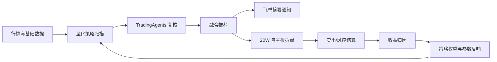

# 0507 项目迭代计划：数据源韧性 + AI/量化闭环 + 决策体验升级

> 最近更新：2026-05-18
> 当前主线：从「功能完整」升级为「每天能稳定给出简洁可执行建议，并能用模拟收益闭环验证」。

## 1. 当前阶段判断

项目已经具备完整主链路：

当前不应继续盲目增加页面，而应优先解决三件事：

1. **决策成本**：用户每天需要一眼看到「买什么、买多少、为什么、风险是什么、是否要卖」。
2. **收益可信度**：所有推荐必须进入模拟盘或后验样本，能统计真实约束下的收益。
3. **策略反哺**：收益数据要反向影响策略权重、参数、风控阈值，而不是只做展示。

## 2. 已完成的重要能力

### 数据源与数据质量

- 已建立多数据源 fallback 思路：AKShare、东方财富、新浪、Baostock/Tushare 可选。
- 已有数据源健康与数据质量页面能力。
- 已有实时行情落盘检查与量化数据可用度提示。

### 量化研究

- 已实现首批量化策略：均线、MACD、RSI、布林带、动量、突破、多因子、量价、低波质量等。
- 已实现量化跑分验证、异步队列、重试/续跑、跑分结果展示。
- 已实现量化每日信号池和排行榜。
- 已实现量化 Top 候选进入 Agent 复核和模拟盘闭环。

### TradingAgents 与 AI 候选

- 已接入 TradingAgents 分析与队列。
- 已有 AI 每日优选、智能候选、Agent 尾盘建议收益追踪。
- 已有信号后验和 Agent 尾盘 Alpha 账本。

### 模拟盘与收益闭环

- 已建立 20W 自主模拟盘。
- 已支持推荐信号自动模拟买入、风控卖出、止损止盈、收益归因。
- 已支持交易收益闭环、信号绩效、闭环优化台、策略版本实验。

### 飞书链路

- 已完成飞书多维表格写入，替代微信回调。
- 已新增飞书机器人 webhook 荐股摘要推送：
  - 量化交易场景推荐。
  - 全市场荐股闭环。
  - 模拟盘荐股同步。
- 机器人消息只保留结论、Top 标的、当前股价、动作、评分/仓位、风控，不推送长篇原因。

## 3. 后续迭代总路线

### P0：今日作战台 + 飞书摘要闭环（最高优先级）

目标：让用户每天只看一个页面/一条消息，就能决策。

任务：

1. 新增或强化「今日作战台」。
2. 聚合今日推荐、当前持仓、卖出建议、风控状态、任务健康。
3. 每条推荐统一展示：
   - 买/观察/卖/不操作。
   - 当前股价。
   - 建议仓位。
   - 核心理由。
   - 风险。
   - 来源：纯量化 / Agent 融合 / AI 优选 / 策略共识。
4. 飞书机器人摘要区分：
   - 开盘推荐。
   - 尾盘推荐。
   - 卖出/风控提醒。
   - 今日无推荐/暂停新增。
5. 飞书消息可配置 Top3 / Top5。

验收：

- 飞书摘要不超过 8 行。
- 页面首屏 10 秒内能看懂今天怎么做。
- 每条推荐都包含当前股价。

### P1：收益复盘中心收敛

目标：把分散的复盘页面收敛为统一入口。

任务：

1. 新建「收益复盘中心」。
2. 合并/承载以下能力：
   - 交易收益闭环。
   - 推荐绩效。
   - Agent 尾盘账本。
   - 强弱片段归因。
3. 保留旧路由兼容跳转。
4. 统一收益指标口径：
   - 平均收益。
   - 超额收益。
   - 胜率。
   - 最大回撤。
   - 样本数。
   - 是否建议放大/降权。

验收：

- 用户能在一个页面回答：哪个来源赚钱、哪个来源亏钱、哪个周期最有效。
- 页面默认显示结论和行动建议，明细折叠。

### P2：策略研究中心收敛

目标：把策略库、策略实验、参数版本、风险阈值统一管理。

任务：

1. 新建「策略研究中心」。
2. 合并/承载：
   - 量化策略库与权重。
   - 策略参数版本。
   - 策略实验。
   - 风险阈值建议。
   - 晋级/回滚记录。
3. 增加可视化策略编辑器：
   - 策略启停。
   - 默认参数。
   - 最大仓位。
   - 适用市场环境。
   - 晋级/降级规则。
4. 策略权重自动化：
   - 历史跑分。
   - 模拟盘收益。
   - 市场环境表现。
   - 样本稳定性。

验收：

- 每个策略有明确的加权/降权解释。
- 新增策略不需要改多个页面。

### P3：单笔推荐链路追踪

目标：提升系统可信度，让每一次推荐可追溯。

任务：

1. 新增单笔 trace 页面：`/signals/:id/trace` 或 `/recommendation-trade-outcomes/:id`。（已完成）
2. 展示完整链路：
   - 任务来源。
   - 当时价格。
   - 量化策略命中。
   - Agent 复核结果。
   - 风控判断。
   - 模拟买入/跳过。
   - 卖出原因。
   - 收益与超额收益。
3. 飞书摘要中的标的携带系统详情链接，便于从消息跳转到链路页。（已完成链接字段预留）

验收：

- 任意模拟交易都能追溯为什么买、为什么卖、赚亏多少。

### P4：数据源增强与回测严谨性

目标：让策略验证更接近真实交易。

任务：

1. 数据源增强：
   - 已把数据源能力扩展为 `fundamental_factor`、`money_flow`、`valuation`，数据源健康页会展示三类能力的动态路由。
   - Tushare Pro 作为首选付费增强：复权、指数成分、财务因子、估值、资金流。
   - AKShare/东方财富作为免费 fallback：估值快照、量价/资金流近似、历史 K 线兜底。
   - 后续评估聚宽/掘金量化的分钟级和更稳定行情。
2. 数据维度增强：
   - 行业轮动。
   - 资金流：已新增 `stock_money_flow_factors`，当前支持基于日线的量比、换手、5/20 日动量免费版落盘。
   - 财务质量：已新增 `stock_fundamental_factors`，当前支持本地质量代理分；Tushare 配置后可接真实 ROE/成长/负债字段。
   - 估值分位：已新增 `stock_valuation_factors`，支持 PE/PB/市值、250 日分位和估值分落盘。
3. 跑分增强：
   - 参数网格搜索。
   - 训练/验证/测试分区：已在跑分结果 `metrics_json.validation` 中沉淀 train/validation/test 分段收益、超额、回撤、交易数、泛化差距和 verdict。
   - 过拟合提示：跑分页显示样本外验证结论，验证/测试落差大则标为“观察”。
   - 大股票池任务切片：已新增 `POST /api/quant/backtests/walk-forward` 滚动验证接口和页面按钮，按多个窗口排队执行。

验收：

- 策略不仅有历史收益，还有稳定性与过拟合风险提示。

### P5：实盘参考纪律系统

目标：先不做自动实盘下单，但输出接近实盘可执行的纪律建议。

任务：

1. 每日纪律输出：
   - 今日最大新增仓位。
   - 单票上限。
   - 禁买行业/股票。
   - 止损/止盈线。
   - 复查时间。
2. 卖出建议增强：
   - 止损。
   - 止盈。
   - 移动止盈。
   - 反向信号。
   - 持有期到期。
3. 真实交易约束：
   - 涨停买不到。
   - 停牌。
   - 流动性不足。
   - 滑点/手续费/印花税。

验收：

- 推荐可以转化成人工交易清单。
- 收益统计考虑真实约束，而不只看理论收益。

### P6：视觉与信息层级优化

目标：继续降低“页面复杂、色块重、不知道看什么”的问题。

任务：

1. 页面顶部统一结论条。
2. 减少深色块，整体浅色化。
3. 高级参数、审计 JSON、长表格默认折叠。
4. 统一色彩语义：
   - 收益：红/绿。
   - 风险：橙/红。
   - 中性信息：蓝灰。
5. 右上角用户信息轻量化。

验收：

- 普通用户先看到结论，研究人员仍能展开细节。

## 4. 当前优先级建议

近期最建议按以下顺序推进：

1. **今日作战台**：把推荐、持仓、卖出、风控放到一页。
2. **收益复盘中心**：合并复盘页面，减少认知成本。
3. **单笔链路追踪**：让系统每次推荐都可解释、可复盘。
4. **策略研究中心**：合并策略实验/版本/权重，继续自动反哺。
5. **数据源增强**：引入更稳定的数据源和财务/行业因子。
6. **视觉优化**：所有页面结论优先、细节折叠。

## 5. 关键风险

1. **过拟合风险**：策略历史收益高，不代表未来有效，必须使用验证集和模拟盘闭环约束。
2. **数据质量风险**：免费数据源可能有延迟、复权差异、停牌处理不一致。
3. **Agent 成本与稳定性**：TradingAgents 不应对全市场无差别调用，只应复核 TopN。
4. **页面复杂度风险**：继续堆页面会降低用户决策效率。
5. **误用风险**：系统当前是模拟盘和投研辅助，不应被误认为自动实盘下单。

## 6. 下一轮建议开工项

建议下一轮直接开始：**P0 今日作战台**。

最小可交付版本：

1. 新增 `/today` 或在 `/dashboard` 强化“今日作战”区块。
2. 接口聚合：
   - 今日推荐 TopN。
   - 当前持仓。
   - 卖出/风控候选。
   - 任务健康。
   - 飞书推送状态。
3. 页面展示：
   - 今日结论。
   - 买入候选。
   - 卖出候选。
   - 持仓风险。
   - 最近一次飞书摘要。
4. 导航调整：把「今日作战」放到左侧第一个入口。

## 7. 执行任务清单与进度追踪

> 维护规则：每推进一个任务，都更新本节状态。状态枚举：`TODO` / `DOING` / `DONE` / `BLOCKED`。

### 当前推进批次：P4 量化参数与因子闭环（2026-05-18）

本批次目标：让「网格搜索冠军参数」不只停留在跑分页展示，而是能进入次日开盘量化扫描；同时确保开盘扫描前自动刷新本地因子表，让多因子、量价、低波质量等策略使用最新可得数据。

| ID     | 状态  | 任务                         | 交付物                                 | 验收方式                                           |
| ------ | ----- | ---------------------------- | -------------------------------------- | -------------------------------------------------- |
| C4-1   | DONE  | 网格冠军参数纳入每日扫描     | 参数版本自动选型服务 + 日扫合并逻辑    | `grid_search` active candidate/champion 可被采用   |
| C4-2   | DONE  | 开盘扫描前自动刷新因子       | 量化闭环执行前因子落盘                 | 定时任务运行结果含 factor_sync，策略读取新因子     |
| C4-3   | DONE  | 跑分页展示参数版本沉淀结果   | 网格摘要展示 upsert 版本和采用提示     | 用户知道哪些冠军参数会参与后续 A/B 扫描            |
| C4-4   | DONE  | 文档和操作手册同步           | 更新本计划和操作手册                   | 手册说明「网格搜索 → 沉淀参数 → 次日扫描」完整路径 |
| C4-5   | DONE  | 编译/构建/差异校验           | 后端 tsc、前端 tsc、前端 build、diff   | 无新增类型错误或构建阻断                           |

进度备注：

- 2026-05-18 已新增 `QuantStrategyParamVersionService.getActiveParamsForScan()`：每日扫描参数优先级为「手工覆盖 > champion > active_candidate（含 grid_search / experiment）> baseline」，同等优先级按 rank/excess/更新时间选择。
- `QuantFusionService.runDailyPipeline()` 已接入 active scan 参数选择，`generated.active_scan_params` 会返回采用的参数版本、策略列表和选择摘要；量化信号 raw factors 会继续写入 `param_version_key/type/status/ab_group`，方便后续 A/B 收益验证。
- 量化闭环开盘扫描前默认执行 `StockFactorService.syncDerivedFactors()`，并将结果写入 `generated.factor_sync`；定时任务参数支持 `sync_factors_before_scan`、`factor_sync_scope`、`factor_sync_limit`，默认开启。
- 跑分页「参数网格搜索摘要」已增加参数版本沉淀说明与版本 Tag，提示沉淀后的候选会进入后续开盘扫描和 A/B 验证。
- 已修复手动触发 `/api/quant/daily-pipeline/run` 时默认参数误当“手工覆盖”的问题，避免默认参数压过 `grid_search` / `champion` 参数版本。
- 已新增 `GET /api/quant/param-versions/active-scan`，并在「策略研究总览」展示“下一次开盘扫描将采用的参数版本”，避免网格/冠军参数自动采用黑盒化。
- 已补齐因子源可插拔框架：`provider=auto` 会在 Tushare 开启时优先尝试 `daily_basic` / `moneyflow` / `fina_indicator`，并保留 `local_derived` 兜底；数据同步页会展示估值/资金流/质量因子的来源构成。
- 量化任务飞书报告已加入因子刷新摘要和扫描参数版本摘要，明天定时任务完成后可在多维表格 `message` 与 `结果摘要` 中确认 provider、写入数量和采用参数版本。
- `active-scan` 结果已增加候选诊断：每个策略会返回候选版本排行、已选原因和未选原因；策略研究页展示候选数量与备选未采用理由，便于人工判断是否需要干预。
- 开盘扫描前因子同步已增加覆盖率跳过机制：默认三类因子覆盖率均 ≥92% 时跳过重复落盘，减少开盘任务耗时；定时任务可通过 `factor_sync_skip_if_coverage_rate_gte` 调整阈值。
- 已新增 `GET /api/strategy-research/opening-preflight` 开盘前自检：检查量化日扫任务、看门狗、因子覆盖、实时行情、参数版本和飞书配置；策略研究总览顶部展示自检状态 Tag。
- 已新增 `GET /api/market/factors/provider-smoke` 真实因子源烟测接口：优先检测 Tushare `daily_basic / moneyflow / fina_indicator` 是否可用，失败时明确提示继续使用 `local_derived` 兜底。
- 开盘前自检已接入 `factor_provider` 检查，策略研究页会直观显示“真实因子源是否可用、可用了哪些切片、失败原因是什么”，避免把“数据更真实”做成黑盒。
- `QuantDataFreshnessService` 已把 `factor_snapshots` 纳入闭环新鲜度：不再只看实时行情和信号，还会提示因子快照最新日期、最低覆盖率与来源构成。
- 今日作战台已新增 `discipline` 聚合：输出今日是否允许新增、最多新增几只、默认仓位、单票上限、现金/总仓位红线、禁买行业/重点风控股票和复查时间，向“可执行纪律系统”推进一版。
- 部署脚本已新增运行时目录自愈：`simple_deploy.js / sync_and_deploy.js` 会先创建 `shared/uploads/avatars` 并尽力修正属主/权限，降低 release 切换导致头像目录不可写、后端启动失败的风险。
- 质量校验已通过：后端 `tsc`、前端 `tsc --noEmit`、前端生产构建、`git diff --check`。生产构建仅保留历史 Prettier warning。

### P0 今日作战台 + 飞书摘要闭环

| ID   | 状态 | 任务                       | 交付物                          | 验收方式                                                   |
| ---- | ---- | -------------------------- | ------------------------------- | ---------------------------------------------------------- |
| P0-1 | DONE | 设计今日作战台数据聚合口径 | 后端聚合接口字段定义            | 能覆盖推荐、持仓、卖出、风控、任务健康                     |
| P0-2 | DONE | 实现今日作战台后端接口     | `GET /api/today/command-center` | 登录后返回今日结论、买入候选、卖出候选、持仓风险、任务状态 |
| P0-3 | DONE | 实现今日作战台前端页面     | `/today` 页面                   | 首屏 10 秒内看懂今日操作建议                               |
| P0-4 | DONE | 调整导航入口               | 左侧新增/置顶「今日作战」       | 用户无需在多个页面找今日结论                               |
| P0-5 | DONE | 飞书摘要继续优化           | 开盘/尾盘/风控场景文案区分      | 飞书消息不超过 8 行，含当前股价                            |
| P0-6 | DONE | 今日作战台只读烟测         | 构建 + 接口烟测                 | 不触发真实交易/Agent，页面正常渲染                         |

进度备注：

- 2026-05-18 P0 今日作战台聚合接口已实现：新增 `TodayCommandCenterService`、`TodayController`、`today.routes.ts`，注册 `/api/today/command-center`。
- `/today` 前端已改为调用统一聚合接口，替代前端多接口拼装。
- 飞书机器人摘要已增加风控/卖出场景：`paper_trading_risk_check` 会推送“检查多少持仓、卖出/计划多少、当前价、执行价、盈亏、持仓天数”，仍保持短消息。
- 质量校验已通过：后端 `tsc`、前端 `tsc --noEmit`、前端生产构建、`git diff --check`。生产构建仍存在历史 Prettier warning，集中在既有任务/策略页面，不影响本轮改动。

### P1 收益复盘中心

| ID   | 状态 | 任务                     | 交付物                               | 验收方式                                   |
| ---- | ---- | ------------------------ | ------------------------------------ | ------------------------------------------ |
| P1-1 | DONE | 设计统一收益复盘口径     | 收益指标映射表                       | 平均收益/超额/胜率/回撤/样本数口径一致     |
| P1-2 | DONE | 新增收益复盘中心聚合接口 | `GET /api/review/performance-center` | 返回交易闭环、信号绩效、Agent 尾盘三类摘要 |
| P1-3 | DONE | 新增收益复盘中心页面     | `/review` 复盘总览 Tab               | 一个页面回答哪个来源赚钱                   |
| P1-4 | DONE | 旧页面兼容跳转/弱化导航  | 路由兼容                             | 不破坏原页面功能                           |

进度备注：

- 2026-05-18 已新增 `ReviewPerformanceCenterService`、`ReviewController`、`review.routes.ts`，注册 `/api/review/performance-center`。
- `/review` 已从跳转页改为复盘总览，聚合模拟交易闭环、信号后验、信号质量日报、Agent 尾盘账本和组合风险画像。
- 左侧导航「收益复盘」新增“复盘总览”，旧的 `/recommendation-performance`、`/agent-tail-alpha`、`/recommendation-trade-outcomes` 继续兼容跳转/链路追踪。
- 质量校验已通过：后端 `tsc`、前端 `tsc --noEmit`、前端生产构建。

### P2 策略研究中心

| ID   | 状态  | 任务                     | 交付物                              | 验收方式                                   |
| ---- | ----- | ------------------------ | ----------------------------------- | ------------------------------------------ |
| P2-1 | DONE  | 设计策略研究中心信息架构 | 策略/参数/风险/版本 Tab             | 策略实验与版本不再割裂                     |
| P2-2 | DONE  | 聚合策略研究接口         | `GET /api/strategy-research/center` | 返回策略权重、参数版本、实验冠军、风险阈值 |
| P2-3 | DONE  | 新增策略研究中心页面     | `/strategy-research` 研究总览 Tab   | 每个策略有加权/降权解释                    |
| P2-4 | DONE  | 策略可视化编辑器 MVP     | 启停/仓位/环境/晋级规则             | 修改后进入每日扫描软约束                   |

进度备注：

- 2026-05-18 已新增 `StrategyResearchCenterService`、`StrategyResearchController`、`strategyResearch.routes.ts`，注册 `/api/strategy-research/center`。
- `/strategy-research` 已从跳转页改为「策略研究总览」，聚合策略库、策略权重、资金预算、策略实验、参数版本验证和自主闭环优化。
- 左侧导航「策略研究」新增“策略研究总览”，原策略权重、参数版本、策略实验、优化建议、事件策略榜均保留为 Tab。
- 2026-05-20 策略启停、默认参数、运行仓位、环境适用、生命周期规则已在「策略权重/策略库」抽屉中可视化编辑；默认视图只展示核心运行纪律，高级参数折叠。
- 2026-05-20 运行策略已接入每日量化扫描：`min_score`、`max_position_pct`、偏好/回避市场环境进入信号评分与融合候选；当前采用软约束，避免误杀有效机会。

### P3 单笔推荐链路追踪

| ID   | 状态 | 任务                     | 交付物                       | 验收方式                                      |
| ---- | ---- | ------------------------ | ---------------------------- | --------------------------------------------- |
| P3-1 | DONE | 梳理信号到交易的关联字段 | trace 数据字典               | 能串起 signal/trade/outcome/task              |
| P3-2 | DONE | 实现 trace 接口          | `GET /api/signals/:id/trace` | 返回任务、价格、策略、Agent、风控、买卖、收益 |
| P3-3 | DONE | 新增 trace 页面          | `/signals/:id/trace`         | 任意模拟交易可解释为什么买卖                  |
| P3-4 | DONE | 飞书标的链接预留         | 摘要中可附系统链接           | 点击可进入 trace 或详情页                     |

进度备注：

- 2026-05-18 已新增 `SignalTraceController`、`signalTrace.routes.ts`，注册 `/api/signals/:id/trace`；旧接口 `/api/paper-trading/recommendation-outcomes/:id/trace` 保持兼容。
- `RecommendationTradeOutcomeService.getTrace()` 已补充 `trace_id`、`trace_url`、`summary`、`key_evidence`、`decision_context`，明确字段含义、价格、策略、Agent/融合、风控、交易与收益。
- `/signals/:id/trace` 页面已升级为结论优先的链路页：顶部结论、关键证据、风控完整度、步骤流、交易证据、量化/Agent 证据和任务/交易记录。
- 飞书机器人摘要已支持推荐项 `trace_url` 链接；自动模拟盘跟单、量化融合归档和荐股归档会回填系统链路地址。

### P4 数据源增强与回测严谨性

| ID   | 状态 | 任务                         | 交付物             | 验收方式                      |
| ---- | ---- | ---------------------------- | ------------------ | ----------------------------- |
| P4-1 | DONE | Tushare Pro 接入评估         | 数据源方案         | 明确成本、字段、fallback 顺序 |
| P4-2 | DOING | 财务/行业/资金流因子落库设计 | 表结构与同步任务   | 多因子策略可读取新因子        |
| P4-3 | DONE | 跑分训练/验证/测试分区       | 回测参数与结果字段 | 降低过拟合风险                |
| P4-4 | DOING | 参数网格搜索 MVP             | 队列任务           | 输出参数冠军与稳定性          |

进度备注：

- 2026-05-18 已扩展 `MarketDataFeature` 和 `DataSourceHealthService`：数据源健康接口会返回 `fundamental_factor`、`money_flow`、`valuation` 的路由计划，并在 `quant_readiness.factor_landing_plan` 中给出目标表和下一步。
- 已新增三张因子表：`stock_fundamental_factors`、`stock_money_flow_factors`、`stock_valuation_factors`，并注册到 Sequelize 启动同步列表。
- 已新增 `StockFactorService`，支持基于本地日线/股票快照生成免费版估值、量价资金流、质量代理因子；接口：
  - `GET /api/market/factors/coverage`
  - `POST /api/market/factors/sync`
- 数据同步页已新增「量化因子落盘」卡片，可查看估值/资金流/质量因子覆盖率、样本和下一步建议，并可手动触发同步因子。
- 跑分页已支持训练/验证/测试样本外验证、滚动验证按钮和 `POST /api/quant/backtests/walk-forward`，结果表新增“样本外验证”列。
- 多因子、低波质量、量价确认策略已开始读取 `factor_snapshot`：估值分、资金流分、质量分会进入策略理由和 raw factors。
- 已新增参数网格搜索 MVP：`POST /api/quant/backtests/grid-search`，跑分页新增「网格搜索」按钮，按策略生成多组参数任务并进入队列。
- 已新增参数网格搜索汇总：`GET /api/quant/backtests/grid-search/summary`，跑分页展示最近网格实验冠军、完成度、测试集超额和候选入口。
- 参数网格搜索汇总支持 `upsert_versions=true`，可将网格冠军沉淀为 `grid_search` 参数版本候选；跑分页提供「沉淀参数版本」按钮，并展示已沉淀版本 Tag。
- 已把 `grid_search` 参数候选纳入开盘 A/B 扫描：每日量化闭环会自动选择「手工 > champion > active_candidate（网格/实验）> 默认」的策略参数，并在信号中写入参数版本归因。
- 已把因子落盘接入量化闭环前置步骤：定时任务默认先刷新本地估值/资金流/质量因子，再运行信号扫描。
- 下一步：Tushare token 配置后补真实财务/资金流同步；进一步把参数版本收益按市场环境做自动放大/降级。

### P5 实盘参考纪律系统

| ID   | 状态 | 任务             | 交付物             | 验收方式                             |
| ---- | ---- | ---------------- | ------------------ | ------------------------------------ |
| P5-1 | DONE | 每日交易纪律模型 | discipline summary | 输出最大新增仓位、单票上限、禁买规则 |
| P5-2 | TODO | 卖出建议增强     | 风控候选接口/页面  | 止损/止盈/移动止盈/反向信号可见      |
| P5-3 | TODO | 真实交易约束诊断 | 成交可行性字段     | 涨停、停牌、流动性不足有明确提示     |

### P6 视觉与信息层级优化

| ID   | 状态 | 任务                 | 交付物                               | 验收方式                      |
| ---- | ---- | -------------------- | ------------------------------------ | ----------------------------- |
| P6-1 | TODO | 统一页面结论条组件   | `DecisionHeader` / `ConclusionStrip` | 重点页面首屏先显示结论        |
| P6-2 | TODO | 浅色化与色彩语义统一 | 全局样式 token                       | 减少重色块，风险/收益颜色统一 |
| P6-3 | DOING | 高级信息折叠规范     | 参数/JSON/审计折叠                   | 普通用户不被复杂细节打扰      |
| P6-4 | TODO | 右上角用户信息轻量化 | Header 用户区                        | 更简洁，保留环境识别          |
