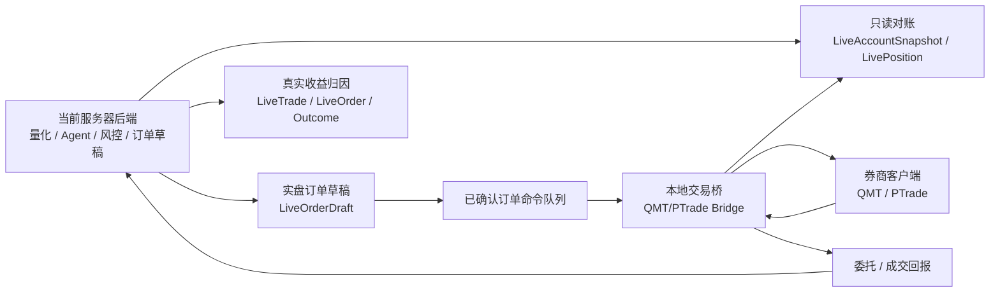

# QMT / PTrade 实盘交易接入下一步方案

> 更新时间：2026-05-31（v2：补齐 shadow_autopilot 对齐、桥接幂等/一致性、kill switch 自动触发、撤单语义、行情合规、灰度账户隔离）
> 目标：把当前项目从”量化 + Agent 推荐 + 模拟盘闭环”推进到”真实券商账户只读同步 → 订单草稿 → 受控实盘执行 → 真实收益反哺策略”的完整闭环。
> 原则：先只读、再草稿、后小额执行；服务器不直接保存交易密码；真实下单默认必须强确认和风控审计。

---

## 1. 当前项目已经具备什么

当前系统已经不是从零开始接实盘。已有基础能力如下：

| 模块 | 当前状态 | 相关位置 |
| --- | --- | --- |
| 量化信号 | 已支持多策略选股、打分、历史跑分、参数实验 | `backend/src/quant/` |
| Agent 融合 | 已支持 TradingAgents 分析、飞书消息、多维表格写入 | `backend/src/services/` |
| 模拟盘 | 已支持 20W 初始资金、自动买入、止损/止盈/移动止盈、收益归因 | `backend/src/services/PaperTradingAutomationService.ts` |
| 实盘安全边界 | 已有独立 live-trading 模块，默认禁止真实下单 | `backend/src/live-trading/` |
| 券商网关抽象 | 已有 `BrokerGateway` 统一接口，`BrokerPlaceOrderRequest` 已带 `client_order_id`，`BrokerPlaceOrderResult` 已带 `broker_order_id` | `backend/src/live-trading/brokers/BrokerGateway.ts` |
| 安全占位网关 | 已有 `mock_guarded` 和 `env_readonly` | `MockBrokerGateway.ts` / `EnvReadonlyBrokerGateway.ts` |
| 实盘只读对账 | 已能比较券商只读快照和策略模拟账户 | `LiveTradingService.getReconciliation` |
| 订单草稿 | 已能从策略候选生成实盘订单草稿，不自动下单 | `LiveOrderDraft` / `LiveTradingService` |
| 影子执行 | 已支持订单草稿影子执行、影子收益归因、影子预算归因、影子趋势 | `LiveTradingService.runShadowAutopilot` / `getShadowAutopilotDashboard` / `getShadowBudgetAttribution` |
| 风控校验 | 已有单笔占比、单股仓位、总仓位、资金、ST、涨停、行情 SLA 等检查 | `LiveRiskGuardService.ts` |
| 强确认 | 已有 `CONFIRM_LIVE_ORDER` 强确认机制 | `LiveTradingSafetyService.ts` |
| 账户模型 | `LiveBrokerAccount` 不包含任何券商密码字段；服务端结构上不允许保存交易密码 | `backend/src/models/LiveBrokerAccount.ts` |

也就是说，下一步不是重写交易系统，而是补上 **真实 QMT/PTrade 本地交易桥**。

---

## 2. QMT / PTrade 对本项目的价值

QMT / PTrade 本质上是券商或交易终端提供的 A 股程序化交易入口。它们对本项目的价值不是“让 AI 直接乱下单”，而是补齐真实交易闭环。

| 能力 | 对项目的帮助 |
| --- | --- |
| 查询真实资金 | 让订单草稿使用真实可用资金，而不是模拟资金 |
| 查询真实持仓 | 发现“模拟盘建议”和“真实账户持仓”的偏离 |
| 查询委托/成交 | 知道订单是否真正成交、是否部分成交、是否撤单 |
| 下单/撤单 | 在强确认和风控通过后执行真实买卖 |
| 成交回报 | 计算真实滑点、真实收益、真实失败原因 |
| 真实收益归因 | 反过来优化量化策略、Agent 融合权重、仓位规则和止盈止损 |

最核心的升级路径：

```text
推荐信号
  -> 量化/Agent 融合
  -> 模拟盘验证
  -> 真实账户只读对账
  -> 订单草稿
  -> 用户强确认
  -> QMT/PTrade 执行
  -> 成交回报
  -> 真实收益归因
  -> 反哺策略
```

---

## 3. 总体架构：服务器做大脑，本地交易桥做手脚

QMT / PTrade 通常运行在本地或 Windows 交易机上，不适合直接部署在当前 Linux 服务器里。推荐架构是：



### 3.1 推荐通信方式

优先采用 **本地交易桥主动连接服务器**：

1. 本地交易桥安装在登录了 QMT/PTrade 的机器上。
2. 交易桥定时把账户、持仓、委托、成交推送到服务器。
3. 服务器只保存标准化后的只读快照；服务端账户模型 `LiveBrokerAccount` 结构上就没有保存交易密码的字段，券商密码必须永远只留在本地交易机上。
4. 当订单草稿被用户强确认后，服务器生成”待执行命令”。
5. 本地交易桥通过 **长轮询 / SSE** 取命令（普通新单 1–3 秒间隔，撤单走独立 SSE 通道，命令变更时服务端立即 flush），执行后回传委托号、成交状态和错误信息。
6. 本地桥的 trader callback（订单/成交变化）触发即推送，不依赖定时拉取。

优点：

- 不要求公网服务器直接访问家庭/办公室交易机。
- 券商客户端和交易密码留在本地交易机。
- 可用签名 token、nonce 防重放、IP 白名单和本地 kill switch 保护。
- 适配 QMT 和 PTrade 时，服务器代码只依赖统一桥接协议。

### 3.2 时区与时钟约束

A 股运行在 `Asia/Shanghai` 时区，所有桥接请求时间戳必须以 UTC 发出并由服务端转换。本地 Windows 交易机的系统时间偏差会直接打穿 HMAC 60 秒窗口，本地桥启动时必须做一次 NTP 校时检查，偏差超过 30 秒拒绝启动。

---

## 4. 与现有代码的结合方式

当前 `BrokerGateway` 接口如下：

```ts
export interface BrokerGateway {
  getCapabilities(): BrokerCapabilities;
  getAccountSnapshot(): Promise<BrokerAccountSnapshot>;
  getPositions(): Promise<BrokerPosition[]>;
  getOrders(query?: BrokerOrderQuery): Promise<BrokerOrder[]>;
  getTrades(query?: BrokerTradeQuery): Promise<BrokerTrade[]>;
  placeOrder(order: BrokerPlaceOrderRequest): Promise<BrokerPlaceOrderResult>;
  cancelOrder(order_id: string): Promise<BrokerCancelOrderResult>;
}
```

注意：`BrokerPlaceOrderRequest` 已经包含 `client_order_id`，`BrokerPlaceOrderResult` / `BrokerCancelOrderResult` 已经返回 `broker_order_id` / `status` / `raw_payload`。也就是说**幂等 ID 在接口层已经流通**，缺的是把它写进 `live_orders` 表（见 §6.2）。

下一步新增两个实现方向：

| 网关 | 用途 | 下单能力 |
| --- | --- | --- |
| `BridgeReadonlyBrokerGateway` | 从本地桥推送/缓存的数据读取真实账户快照 | 禁止 |
| `QmtBridgeBrokerGateway` | 通过本地 QMT 桥执行已确认命令 | 受控开启 |
| `PtradeBridgeBrokerGateway` | 通过 PTrade 策略环境执行已确认命令 | 受控开启 |

建议先做 `BridgeReadonlyBrokerGateway`，等只读数据稳定后再开启执行能力。

---

## 5. QMT 与 PTrade 的适配差异

### 5.1 QMT

QMT 更适合做第一优先级适配。常见方式是本地 Python 进程使用 `xtquant`：

- `xtdata`：行情查询。
- `xttrader`：账户、持仓、委托、成交、下单、撤单。
- `XtQuantTraderCallback`：接收订单和成交回报。
- 需要本地 QMT / miniQMT 客户端处于登录状态。

**会话与订阅前置（必须）：**

1. `XtQuantTrader(path, session_id)`：本地桥需要持久化 `session_id` 到磁盘，重启后复用，避免每次重连出现新会话。
2. `trader.start()` → `trader.connect()`：必须先连接，未连成功之前的所有查询都会失败。
3. `trader.subscribe(account)`：只有订阅后 callback 才会推 `on_stock_order` / `on_stock_trade` / `on_order_error` / `on_cancel_error`。
4. 09:00 之前 QMT 服务可能未启动，本地桥要做"启动重试 + 09:15 仍未连上则告警"。

推荐本地桥职责：

| 功能 | QMT 侧实现 | 备注 |
| --- | --- | --- |
| 账户快照 | `query_stock_asset` | 集合竞价期间可能短暂失败，需降级重试 |
| 持仓 | `query_stock_positions` | |
| 当日委托 | `query_stock_orders` | 仅查当日，跨日历史需自行落库 |
| 当日成交 | `query_stock_trades` | |
| 下单 | `order_stock` | 同步返回券商委托号；失败原因走 `on_order_error` |
| 撤单 | `cancel_order_stock_async` | **异步**，结果以 callback 为准，不能用同步返回值判定 |
| 回调 | trader callback 标准化后**事件驱动推送**服务器，不依赖轮询 |

### 5.2 PTrade

PTrade 通常运行在券商策略环境里，适合做“策略脚本轮询命令”的适配：

- 脚本定时查询服务器命令。
- 用 PTrade 提供的账户/持仓/订单/成交函数同步状态。
- 用户确认后的订单才允许执行。
- 若 PTrade 环境限制网络访问，则改为本地文件/中转服务同步。

PTrade 的 API 与券商版本有关，必须拿到具体券商文档后才能实现字段映射。

### 5.3 适配优先级

1. **优先 QMT**：接口更适合本地 Python 网关，和当前项目架构更容易解耦。
2. **PTrade 为条件分支**：仅在券商不支持 QMT/miniQMT，或 P2 阶段确认 QMT 路线不可行时才启动 PTrade 适配，不与 QMT 平行投入，避免精力分散。
3. 两者不要直接污染业务层，业务层只看 `BrokerGateway` 标准对象。

---

## 6. 需要新增的后端能力

### 6.1 本地交易桥鉴权

新增一组桥接 API，专门给 QMT/PTrade 本地桥调用：

| API | 方法 | 作用 |
| --- | --- | --- |
| `/api/live-trading/bridge/heartbeat` | POST | 本地桥心跳、版本、客户端状态 |
| `/api/live-trading/bridge/account-snapshot` | POST | 推送账户资产快照 |
| `/api/live-trading/bridge/positions` | POST | 推送持仓快照 |
| `/api/live-trading/bridge/orders` | POST | 推送委托列表 |
| `/api/live-trading/bridge/trades` | POST | 推送成交列表 |
| `/api/live-trading/bridge/order-commands` | GET | 长轮询拉取已确认待执行订单，支持 `?cursor=...&wait=30` |
| `/api/live-trading/bridge/order-commands/stream` | GET (SSE) | 撤单等高时效命令的事件流通道 |
| `/api/live-trading/bridge/order-commands/:id/ack` | POST | 本地桥确认已接收命令，服务端把状态从 `pending → dispatched` |
| `/api/live-trading/bridge/order-events` | POST | 回传订单提交/失败/成交/撤单事件 |

鉴权要求：

- `X-Live-Bridge-Key`：桥接密钥 ID（不是 secret 本身）。
- `X-Live-Bridge-Timestamp`：请求时间戳（UTC，毫秒）。
- `X-Live-Bridge-Nonce`：每个请求唯一的 nonce，服务端在 5 分钟滑动窗口内做去重，重复 nonce 直接拒绝。
- `X-Live-Bridge-Signature`：HMAC-SHA256 签名，签名串包含 method + path + timestamp + nonce + body hash。
- 推荐升级到 **ed25519 非对称签名**：本地桥持私钥，服务端只存公钥，secret 泄露面更小；最低限度也要支持 `bridge_secret` 轮换接口。
- 请求时间戳偏差超过 60 秒拒绝。
- 每个 `bridge_key` 在数据库里**强绑定** `(user_id, account_id)`，所有写入只能落到该 account；跨账户 payload 直接拒绝并报警。
- `bridge_key` 必须独占绑定一个 `live_broker_accounts` 记录；同一用户可以同时存在主账户和灰度账户，账户唯一性以 `broker_account_key` 或 `(broker_key, account_role, account_no_masked)` 区分，不能再只依赖 `(user_id, broker_key)`。
- 所有 payload 写入审计日志 `live_execution_audit_logs`。
- bridge 端访问可叠加 IP 白名单和 mTLS（生产推荐）。
- bridge 路由建议在网关层加 per-bridge_key 限流（如 nginx limit_req zone=bridge:10m rate=20r/s），server 端实现暂未内置；运维负责。

### 6.2 数据表补充

现有表可复用：

- `live_broker_accounts`
- `live_account_snapshots`
- `live_positions`
- `live_order_drafts`
- `live_orders`
- `live_trades`
- `live_execution_audit_logs`

建议新增或补充：

| 表/字段 | 作用 |
| --- | --- |
| `live_broker_bridge_heartbeats` | 记录本地桥在线状态、版本、QMT/PTrade 登录状态 |
| `live_broker_commands` | 已确认待本地桥执行的命令队列；`client_order_id` 必须有 **唯一索引** |
| `live_broker_command_dispatches` | 每次派发给 bridge 的派发记录（command_id, bridge_key, dispatched_at, acked_at），用于"漏单/重发"审计 |
| `live_broker_events` | 本地桥回传的订单/成交/错误事件，与 `live_broker_commands` 1:N，带 `event_seq`、`event_time`、`source`，按 `(command_id, event_seq)` 唯一 |
| `live_broker_accounts.broker_account_key` | 服务端账户唯一键，建议格式 `broker_key:account_role:account_no_masked`，允许同一用户绑定同一券商的主账户/灰度账户 |
| `live_broker_accounts.bridge_key` | 本地桥密钥 ID，与账户独占绑定，建议唯一索引 |
| `live_broker_accounts.account_role` | `main` / `grayscale` / `readonly` / `sandbox`，用于灰度账户隔离和页面提示 |
| `live_orders.client_order_id` | 服务端生成的幂等 ID（建议 UUID，**唯一索引**） |
| `live_orders.broker_order_id` | 券商委托号 |
| `live_orders.bridge_status` | `pending` / `dispatched` / `submitted` / `partially_filled` / `filled` / `cancelled` / `failed` / `expired` |
| `live_trades.broker_trade_id` | 券商成交号，**唯一索引**避免重复入库 |

所有字段继续使用 `snake_case`。

#### 6.2.1 命令状态机（必须严格遵守）

```text
pending ──► dispatched ──► submitted ──► partially_filled ──► filled
                │              │                                  ▲
                │              └─────► cancelled ◄────────────────┘
                │              └─────► failed
                └─────► expired (超过 TTL 未被 ack)
```

- 终态：`filled` / `cancelled` / `failed` / `expired`，**不可回退**。
- `partially_filled` 可继续向 `filled` 或 `cancelled`（剩余撤单）转移。
- 状态推进**只允许由 bridge 事件驱动**；服务端不可凭派发时间或行情推断状态。
- 同一 command 收到乱序事件时，以 `event_seq` 较大者为准。
- 该状态机只属于 `live_broker_commands` / `live_orders.bridge_status`；`LiveOrderDraft.status` 仍只表达草稿生命周期（`preview/pending/approved/rejected/submitted/expired/blocked/shadow_executed`），禁止复用 command 状态，避免页面筛选和真实委托状态混淆。

#### 6.2.2 状态机 writer 责任表（避免"谁都不写 / 两个地方都写"）

| 目标状态 | 唯一 writer | 触发动作 | 必须写入字段 |
| --- | --- | --- | --- |
| `pending` | `LiveTradingService.submitApprovedDraft` | 用户强确认后立即落表 | `client_order_id`（必有 UUID）、`account_id`、quantity、limit_price |
| `dispatched` | bridge `/order-commands/:id/ack` 端点 | 本地桥 ack 已成功拉取 | 写 `live_broker_command_dispatches.acked_at` |
| `submitted` | bridge `/order-events` 端点 + `event_type=submitted` | 本地桥已调 `order_stock` 并拿到券商委托号 | 必须带 `broker_order_id`，缺失则直接走 `failed`（见 §7.4） |
| `partially_filled` | bridge `/order-events` + `event_type=trade` 累计 | trader callback `on_stock_trade` | 累加 `filled_quantity`；事件入 `live_broker_events` |
| `filled` | bridge `/order-events`，且 `filled_quantity == quantity` | 同上 | 服务端做累加判定，不接 bridge 自报 |
| `cancelled` | bridge `/order-events` + `event_type=cancelled` | `on_stock_order(status=已撤)` 或 `on_cancel_error` 成功 | 必须带 `parent_command_id` 关联原下单 |
| `failed` | bridge `/order-events` + `event_type=failed`，**或** 服务端 `submitApprovedDraft` 在 `submitted` 缺 `broker_order_id` 时立即标 failed | 任一 | 写 `metadata._bridge_invariant_violation`（若违反不变量） |
| `expired` | `BridgeCommandExpiryService.runOnce`（定时巡检） | TTL 内未 ack 或未进入下一态 | 不向 bridge 派发任何后续命令；同一 `client_order_id` 必须由人工重新生成 |

> 任何状态从**非 writer**写入都属于 bug。代码 review 必须以本表为准对照。

### 6.3 网关选择逻辑

当前 `LiveTradingService` 只识别：

- `mock_guarded`
- `env_readonly`

需要扩展：

```text
LIVE_BROKER_GATEWAY=mock_guarded
LIVE_BROKER_GATEWAY=env_readonly
LIVE_BROKER_GATEWAY=bridge_readonly
LIVE_BROKER_GATEWAY=qmt_bridge
LIVE_BROKER_GATEWAY=ptrade_bridge
```

默认仍是 `mock_guarded`。

真实下单放行必须同时满足：

- `LIVE_TRADING_ENABLED=true`
- `LIVE_ORDER_EXECUTION_ENABLED=true`
- `LIVE_TRADING_KILL_SWITCH=false`
- `LIVE_BROKER_GATEWAY` 在显式交易 allowlist：`qmt_bridge` / `ptrade_bridge`
- 当前网关 capability 声明 `trading_supported=true`

`mock_guarded`、`env_readonly`、`bridge_readonly` 永远不能因为环境变量误开而进入真实下单路径；它们只能用于页面联调、只读同步或 dry-run。

---

## 7. 本地交易桥设计

### 7.1 目录建议

新增本地桥目录：

```text
integrations/
  broker-bridge/
    README.md
    config.example.yaml
    bridge_common/
      auth.py
      models.py
      client.py
      normalizers.py
      kill_switch.py
    qmt_bridge/
      main.py
      qmt_adapter.py
      callbacks.py
    ptrade_bridge/
      strategy.py
      ptrade_adapter.py
```

### 7.2 本地桥配置

示例：

```yaml
server_base_url: "https://your-domain.com/api/live-trading/bridge"
bridge_key: "local-qmt-001"
bridge_secret: "从服务器生成的长随机密钥"
broker_type: "qmt"
account_id_masked: "****1234"
poll_interval_seconds: 5
snapshot_interval_seconds: 30
readonly_only: true
local_kill_switch_file: "./KILL_SWITCH_ON"
max_single_order_amount: 10000
allow_order_execution: false
```

### 7.3 本地与服务端 kill switch

必须支持两个熔断：

1. 服务器端：`LIVE_TRADING_KILL_SWITCH=true`。
2. 本地端：交易机出现 `KILL_SWITCH_ON` 文件或 GUI 开关打开。

任意一端熔断，都不能执行真实下单。

**服务端 kill switch 自动触发条件**（命中任一即自动置位，需人工解除）：

- 本地桥心跳丢失超过 5 分钟。
- 当日订单失败连续 ≥ 3 笔，或失败率 ≥ 50%（最少 4 笔样本）。
- 当日累计实盘浮亏 ≥ `LIVE_RISK_DAILY_LOSS_KILL_PCT`（建议初始 2%）。
- 当日成交订单数 ≥ `LIVE_RISK_MAX_DAILY_ORDER_COUNT × 1.5`。
- 收到任何"账户异常 / 资金异常 / 持仓异常"事件。

**kill switch 触发后的挂单策略**（必须明确，写入配置）：

- 默认：`freeze_new_only` —— 仅阻断新单，已挂未成交订单不动，由人工决定。
- 可选：`cancel_all_open` —— 一键撤单所有未成交，撤单本身仍走 bridge 命令通道，并标记 `reason=kill_switch`。
- 由 `LIVE_KILL_SWITCH_OPEN_ORDER_POLICY` 配置。

**演练要求**：P5 上线前必须在测试环境完整演练一次"开盘中突然熔断 → 一键撤单 → 复位"，演练记录入档。

### 7.4 一致性约定

服务端"已派发"与 bridge"已接收/已提交"两端可能错位，必须明确：

- 服务端派发命令后立即写 `live_broker_command_dispatches`，并把 command 标为 `dispatched`，但**只在收到 bridge 的 ack 后才允许进入下一步派发流程**（避免重复派发）。
- 命令默认 TTL 60 秒未 ack 即标 `expired`，需要用户手动重派；**绝不自动重试**（防止重复下单）。
- 状态以 bridge 回传的 `event_seq` 为权威；服务端不可基于派发时间或行情推断状态。
- 收到 `submitted` 事件但缺 `broker_order_id`：标 `failed` 而不是 `submitted`。
- 部分成交场景：`partially_filled` 持续累加 `filled_quantity`，`filled_quantity == quantity` 才进入 `filled`；剩余数量被撤单走 `cancelled` 且记录 `remaining_quantity`。
- 撤单语义：撤单也是一条 command，与原下单 command 通过 `parent_command_id` 关联；撤单结果以 `on_cancel_error` / `on_stock_order(status=已撤)` 为准，不信下单 API 的同步返回值。

#### 7.4.1 event_seq 生成与仲裁规范

`event_seq` 用于在乱序 / 重传场景下确定"哪条事件代表当前真实状态"，必须由 **bridge 端**生成并满足单调性：

- **生成公式**：`event_seq = wall_clock_us * 10000 + atomic_counter`
  - `wall_clock_us`：bridge 本地 64 位微秒时间戳（`time.time_ns() // 1000`）。
  - `atomic_counter`：bridge 进程内线程安全自增计数器（0 起步、每事件 +1、重启不持久化）。
- **跨重启单调性**：bridge 启动时必须把"上次最大 event_seq"持久化到磁盘（`~/.broker-bridge/seq.last`），下次启动若 `wall_clock_us < last_seq_us`（系统时间被回拨）则强制 `wall_clock_us = last_seq_us + 1` 以保证递增。
- **冲突约束**：`live_broker_events` 表必须有 `(command_id, event_seq) UNIQUE`；同一 `event_seq` 重复入库即拒绝。
- **乱序仲裁**：服务端推进 `bridge_status` 时，只取 `event_seq` 最大的事件作为 effective state；小于当前已落地最大 event_seq 的事件只入库做审计，不更新状态。
- **多 bridge 同账户**：方案禁止多 bridge 并发写同一账户（`bridge_key` 唯一绑定）；若运维强制做了灰度切换，新 bridge 的 `seq.last` 必须先大于旧 bridge 当日最大 event_seq，否则启动失败。
- **服务端时钟无权重**：服务端的 `received_at` 仅用于审计，不参与状态仲裁。

#### 7.4.2 长轮询 / SSE 部署面 timeout 配合

bridge 拉命令默认 `?wait=30`，反向代理与 Express 必须配合调高 timeout，否则会出现"连接被中间件砍断 → bridge 立刻重连 → 命令派发延迟拉胯"：

| 组件 | 配置项 | 建议值 | 说明 |
| --- | --- | --- | --- |
| Express | `server.keepAliveTimeout` | `35000`（ms） | 比 wait 多 5 秒缓冲 |
| Express | `server.headersTimeout` | `40000`（ms） | 必须大于 keepAliveTimeout |
| Nginx | `proxy_read_timeout` | `40s` | bridge 路由专用 location 单独配置 |
| Nginx | `proxy_send_timeout` | `40s` | 同上 |
| Nginx | `proxy_buffering` | `off` | SSE 通道必须关，否则事件被缓存 |
| Caddy | `transport.http.read_timeout` | `40s` | bridge handler 段单独配置 |
| Cloudflare | 套餐限制 | 100s | 不会成为瓶颈 |
| ALB / NLB | idle timeout | `60s` | 超过 wait+30 即可 |

实施清单：

1. `LIVE_BRIDGE_LONG_POLL_SECONDS` 改大时同步把上表三项调到至少 `wait + 10`，并在部署文档里写死。
2. 反向代理 bridge 路由独立 `location /api/live-trading/bridge/`，单独覆盖 timeout，避免影响其它 API。
3. SSE 路由（`/order-commands/stream`）必须额外 `X-Accel-Buffering: no` 头，Caddy 用 `header_down X-Accel-Buffering no`。
4. 容器健康检查不要打 bridge 路由（避免占用长连接配额）。

---

## 8. 页面改造方案

现有「实盘交易」页面已经存在，下一步不新增一堆页面，只增强当前模块。

### 8.1 安全边界页

增加：

- QMT/PTrade 桥接状态。
- 最近心跳时间。
- 本地桥版本。
- 券商客户端登录状态。
- 当前是否只读。
- 当前是否允许执行。
- 本地 kill switch 状态。

### 8.2 只读对账页

增加：

- 真实账户快照时间。
- 真实持仓同步来源：QMT / PTrade / env_readonly。
- 当日委托数量。
- 当日成交数量。
- 同步错误和字段缺失提示。
- “真实账户 vs 模拟策略账户”偏离原因分类：
  - 仅实盘持有。
  - 仅模拟建议。
  - 实盘偏轻。
  - 实盘偏重。
  - 价格差异。
  - 成交失败导致偏离。

### 8.3 订单审批页

增加：

- 草稿来源：量化 / Agent / 融合 / 对账偏离。
- 真实账户可用资金。
- 预计下单后仓位。
- QMT/PTrade 执行前置检查。
- 最近一次券商委托/成交状态。
- 一键拒绝并记录原因。

### 8.4 实盘收益闭环

新增一个 Tab 即可，不建议新增一级页面：

- 每笔真实交易关联的信号。
- 模拟成交价 vs 真实成交价。
- 滑点。
- 未成交原因。
- 真实收益。
- 与模拟盘收益差异。
- 反哺建议：策略权重提高/降低、风控参数收紧/放宽。

---

## 9. 定时任务与运行节奏

### 9.1 交易时间内

| 时间 | 动作 |
| --- | --- |
| 09:00-09:15 | 本地桥启动、NTP 校时、QMT 连接与 subscribe、登录检查 |
| 09:15-09:25 | 集合竞价期间账户/持仓查询可能短暂失败，降级重试 + 不告警 |
| 09:30-11:30 | 账户/持仓每 30 秒拉取一次；**委托/成交以 trader callback 事件驱动，触发即推**，不轮询 |
| 13:00-15:00 | 同上 |
| 草稿确认后 | 普通新单：bridge 长轮询拉取（≤3 秒生效）。**撤单：走 SSE 通道，目标 1 秒内送达 bridge** |
| 委托/成交变化 | trader callback 触发立即推送 `/order-events`，服务端用 `event_seq` 去重 |

### 9.2 收盘后

| 时间 | 动作 |
| --- | --- |
| 15:10 | 等 QMT 清算稳定 |
| 15:15 | 同步最终委托/成交（按当日全量拉一次，与事件流对账） |
| 15:25 | 实盘 vs 模拟盘对账 |
| 15:45 | 真实收益归因 |
| 16:00 | 反哺策略/风控参数建议，只生成建议不自动改生产 |

---

## 10. 分阶段落地计划

### P0：确认券商、运行环境与行情合规

目标：明确先接 QMT 还是 PTrade，并锁死合规行情口径。

任务：

- 确认券商是否支持 QMT、miniQMT、PTrade。
- 获取 API 文档、示例代码、限制说明。
- 准备一台本地/云桌面 Windows 交易机。
- 确认交易机能稳定登录券商客户端。
- 明确是否允许网络访问项目服务器。
- **行情合规**：确认实盘下单使用的行情源是否持牌。当前默认 `database_realtime_quotes` 仅用于内部研究，对外或真实下单前必须切换到 `licensed_configured` 或等价持牌源（`licensed_provider_required_for_external_use: true` 已是硬约束）。
- 明确实盘下单价格校验口径：**以本地 QMT 当下快照价为准**，服务端 `LiveMarketDataProvider` 做 T-1 秒兜底；不一致超过 `price_deviation_guard_pct` 直接拒单。

验收：

- 能在本地 Python 里成功查询账户/持仓。
- 不做任何下单。
- 行情口径与价格校验规则写入运行手册。

### P1：桥接协议和服务端只读接收

目标：本地桥还不接 QMT，只用模拟 payload 推送到服务器。

任务：

- 新增桥接鉴权中间件。
- 新增 heartbeat / snapshot / positions / orders / trades API。
- 新增桥接事件审计。
- 新增 `bridge_readonly` 网关。
- 页面展示桥接状态。

验收：

- 本地脚本推送 mock 账户后，实盘页能看到快照。
- 只读对账能使用桥接快照。
- 真实下单仍被阻断。

### P2：QMT 只读适配

目标：从真实 QMT 同步账户、持仓、委托、成交。

任务：

- 新增 `integrations/broker-bridge/qmt_bridge`。
- 实现 QMT 登录状态检测。
- 实现账户、持仓、委托、成交标准化。
- 推送到服务器。
- 增加 QMT 字段映射文档。
- 增加只读同步失败告警。

验收：

- 实盘页显示真实账户总资产、可用资金、持仓。
- 只读对账能显示真实账户与模拟盘偏离。
- 委托/成交能被记录到 `live_orders` / `live_trades` 或桥接事件表。

### P3：PTrade 只读适配

目标：如果实际券商更适合 PTrade，则实现同协议的 PTrade 只读桥。

任务：

- 根据券商 PTrade API 文档写字段适配。
- 若 PTrade 环境允许网络访问，则直接推送服务器。
- 若不允许网络访问，则增加本地中转方式。

验收：

- 与 QMT 只读验收一致。

### P4：订单草稿到本地命令队列

目标：订单草稿被确认后，不直接由服务器下单，而是生成本地桥可拉取命令。

任务：

- 新增 `live_broker_commands` + `live_broker_command_dispatches` + `live_broker_events`。
- 订单草稿强确认后写入 command queue（带 `client_order_id` 幂等 ID）。
- 本地桥长轮询拉取 + ack。
- 本地桥先 dry-run 回传，不调用 QMT/PTrade 下单。
- 页面显示命令状态机。

验收：

- 页面确认草稿后，本地桥能收到命令并 ack。
- dry-run 回传成功，event 链路完整。
- 不产生真实委托。
- 超 TTL 未 ack 命令被标 `expired`，不自动重发。

### P4.5：与已有 shadow_autopilot 通道对齐

目标：避免重复造轮子。现有 `LiveTradingService.runShadowAutopilot` / `runDraftShadowExecution` 已经是"草稿 → 影子成交 → 收益归因 → 预算归因"的完整通路；bridge 的 dry-run 应该复用这套，而不是新建第二套影子链路。

任务：

- 把 bridge dry-run 回传的"模拟成交"事件接入 `shadow_executed` 状态。
- 影子收益归因输入新增"bridge dry-run 来源"维度，与"服务端纯模拟"区分。
- 页面 Tab "影子执行" 增加来源筛选：`server_shadow` / `bridge_dry_run`。

验收：

- 同一份草稿走 bridge dry-run 后，能在影子执行 Tab 看到结果。
- 影子收益归因里能按来源拆分。

### P5：小额实盘执行灰度

目标：允许极小金额、强风控、强确认的真实下单。

**账户隔离要求**：P5 必须使用**专门开立的小额灰度账户**（不是用户主账户），账户额度上限独立配置，bridge_key 与该账户独占绑定。任何"用主账户跑灰度"的请求一律拒绝。

默认限制：

| 限制项 | 建议初始值 |
| --- | --- |
| 账户类型 | 独立灰度账户，与主账户物理隔离 |
| 单笔最大金额 | 5000-10000 元 |
| 单日最大订单 | 1-2 笔 |
| 单股最大仓位 | 5% |
| 总仓位上限 | 20%-30% |
| 允许标的 | 白名单或高流动性主板股票 |
| 禁止 | ST、涨停买入、无实时行情、无账户快照、行情源非持牌 |
| 交易模式 | 限价单 |
| 确认 | 页面强确认 + 本地桥非熔断 + 行情口径校验通过 |

验收：

- 能完成 1 笔真实小额买入。
- 能同步委托号和成交回报。
- 能在实盘收益闭环里看到真实成交。
- 任何失败不会重复下单（TTL + ack 双保险）。
- kill switch 演练通过。

### P6：真实收益闭环

目标：把真实交易表现纳入策略优化，但与模拟盘清晰分开展示。

任务：

- 真实成交关联来源信号。
- 计算真实滑点。
- 计算真实收益、真实最大浮盈/浮亏。
- 与模拟盘同信号收益对比。
- 输出策略调参建议，但不自动覆盖生产参数。

验收：

- 能回答：
  - 这笔真实交易来自哪个策略/Agent 结论？
  - 模拟盘赚/亏多少？
  - 实盘赚/亏多少？
  - 差异来自滑点、未成交、仓位不同，还是策略失效？

### P7：受控自动化

目标：在真实闭环稳定后，探索更高自动化程度。

前置条件：

- 至少 30-50 笔真实小额交易样本。
- 连续 20 个交易日无重复下单/漏单/异常撤单。
- 实盘收益归因可解释。
- Kill switch 演练通过。
- 手动确认链路运行稳定。

即使进入该阶段，也建议保留：

- 单日最大亏损熔断。
- 单日最大订单数。
- 单票黑名单。
- 交易机本地确认或本地白名单。
- 每日复盘报告。

---

## 11. 下一步建议立刻推进的开发任务

按优先级排序：

1. **实现桥接协议服务端 MVP**
   - 新增 bridge API。
   - 新增签名鉴权（HMAC + timestamp + nonce 防重放，bridge_key 绑定 account_id）。
   - 新增 heartbeat 和只读快照接收。

2. **实现本地 Python 桥骨架**
   - 先不依赖 QMT/PTrade。
   - 用 mock 数据推送服务器，验证链路和页面。
   - 内置 NTP 校时与本地 kill switch。

3. **实盘页增加”本地桥状态”区块**
   - 在线/离线。
   - 最近心跳。
   - 当前模式：mock / env_readonly / bridge_readonly / qmt_bridge / ptrade_bridge。
   - 是否允许执行。
   - 服务端 kill switch 是否被自动触发及原因。

4. **实现 QMT 只读 adapter**
   - 连接 + 持久化 session_id + subscribe 前置。
   - 查询资金、持仓、委托、成交，trader callback 事件驱动。
   - 标准化字段。
   - 推送服务器。

5. **只读对账每日任务**
   - 收盘后 15:25 自动跑一次真实账户 vs 模拟盘对账。
   - 飞书输出简洁摘要。

6. **订单草稿命令队列 + 与 shadow_autopilot 打通**
   - 强确认后生成命令（带 `client_order_id` 唯一索引）。
   - 本地桥长轮询 + ack，dry-run 回传走现有 `shadow_executed` 通道。
   - 状态机严格遵守 §6.2.1。

7. **小额真实执行（独立灰度账户）**
   - 在只读稳定后再开。
   - 默认 `LIVE_ORDER_EXECUTION_ENABLED=false`，必须手动开启。
   - 灰度账户与主账户物理隔离，bridge_key 独占绑定。
   - 行情口径切到持牌源，kill switch 演练通过。

---

## 12. 关键环境变量

建议新增/扩展：

```bash
# 网关模式
LIVE_BROKER_GATEWAY=bridge_readonly

# 只读同步
LIVE_READONLY_ENABLED=true

# 真实下单总开关，初期必须 false
LIVE_TRADING_ENABLED=false
LIVE_ORDER_EXECUTION_ENABLED=false
LIVE_TRADING_KILL_SWITCH=true

# 桥接鉴权
LIVE_BRIDGE_ENABLED=true
LIVE_BRIDGE_KEY=qmt-local-001
LIVE_BRIDGE_SECRET=change_me_to_long_random_secret
LIVE_BRIDGE_MAX_CLOCK_SKEW_SECONDS=60
LIVE_BRIDGE_NONCE_WINDOW_SECONDS=300
LIVE_BRIDGE_COMMAND_TTL_SECONDS=60
LIVE_BRIDGE_LONG_POLL_SECONDS=30

# 灰度账户隔离（P5 必填）
LIVE_GRAYSCALE_ACCOUNT_ID=
LIVE_GRAYSCALE_BRIDGE_KEY=

# 行情口径
LIVE_MARKET_DATA_PROVIDER=licensed_configured  # P5+ 必须切换

# 实盘风控
LIVE_RISK_MAX_SINGLE_ORDER_PCT=5
LIVE_RISK_MAX_SINGLE_POSITION_PCT=10
LIVE_RISK_MAX_TOTAL_EXPOSURE_PCT=60
LIVE_RISK_MAX_DAILY_NEW_EXPOSURE_PCT=15
LIVE_RISK_MAX_DAILY_ORDER_COUNT=5
LIVE_RISK_PRICE_DEVIATION_GUARD_PCT=1.5

# Kill switch 自动触发
LIVE_RISK_DAILY_LOSS_KILL_PCT=2
LIVE_RISK_HEARTBEAT_TIMEOUT_MINUTES=5
LIVE_RISK_FAIL_STREAK_KILL=3
LIVE_KILL_SWITCH_OPEN_ORDER_POLICY=freeze_new_only  # freeze_new_only | cancel_all_open
```

本地桥配置不要提交到 Git。

---

## 13. 风险与边界

必须明确：

1. QMT/PTrade 能让系统接近真实交易，但不保证赚钱。
2. 真正有价值的是真实成交数据闭环，而不是”自动点买卖”。
3. 服务器不应保存券商交易密码；`LiveBrokerAccount` 模型结构上就没有该字段。
4. 本地交易桥必须有独立 kill switch，且服务端 kill switch 必须能被自动条件触发（见 §7.3）。
5. 所有真实订单都必须有 `client_order_id` 幂等键，**禁止失败后盲目重试**；命令超 TTL 走人工重派。
6. 实盘收益和模拟盘收益必须分开展示，不能混为一个收益率。
7. 策略参数不能因为少量真实样本自动大幅调整：
   - 真实样本 < 30 笔：策略权重/风控参数禁止自动调整，仅生成”建议”。
   - 真实样本 30–100 笔：自动调整幅度 ≤ ±5%/次，且需人工 review。
   - 真实样本 ≥ 100 笔且连续 20 个交易日稳定：自动调整幅度 ≤ ±10%/次。
8. 行情口径不一致时（QMT 本地快照 vs 服务端快照），下单价校验以本地为准；偏差超 `LIVE_RISK_PRICE_DEVIATION_GUARD_PCT` 直接拒单。
9. 撤单是异步的，撤单结果以 trader callback 为准，下单 API 的同步返回值不可信。
10. P5 灰度阶段必须使用独立小额账户，禁止用主账户跑灰度。

---

## 14. 完成后的理想状态

最终系统应该能做到：

- 每天自动推荐 A 股机会。
- 自动跑量化策略和 Agent 融合。
- 用模拟盘跟踪策略收益。
- 用 QMT/PTrade 同步真实账户。
- 自动发现真实持仓和策略建议的偏离。
- 生成可解释的订单草稿。
- 通过强确认后小额执行。
- 自动同步委托、成交和真实收益。
- 把真实收益反哺策略权重、止盈止损和仓位纪律。

这才是“能长期优化赚钱能力”的正确闭环。
