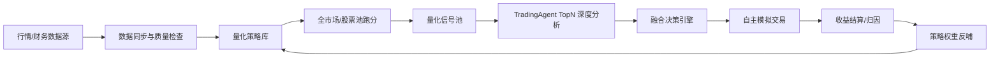

# 量化研究与 TradingAgent 融合实施追踪

> 目标：把当前以 TradingAgent 为核心的荐股链路，扩展为「量化策略批量筛选 + TradingAgent 深度研判 + 融合决策 + 模拟交易闭环反馈」的可验证自动化系统。
>
> 本文档用于持续追踪方案、拆解步骤、当前进度与后续上下文恢复。每完成一个阶段，都需要更新 `进度追踪` 和 `下一步`。

## 1. 总体架构



设计原则：

1. **可扩展**：策略实现必须继承统一接口，后续新增策略无需改核心引擎。
2. **可验证**：每个策略都能在指定股票池、时间段、成本模型下独立跑分。
3. **可解释**：策略输出不仅有分数，还要有命中因子、风险标记和核心理由。
4. **可融合**：量化分数、Agent 分数、市场环境、风控结果进入统一融合层。
5. **可闭环**：模拟交易收益回写策略表现，后续用于动态调整策略权重。

## 2. 数据源路线

### 第一阶段：免费优先

- AKShare：主力免费数据源，继续用于历史行情、实时行情、指数/行业数据。
- Baostock：作为历史日线补齐与一致性兜底。
- 东方财富/腾讯/新浪行情：用于实时/准实时行情快照。

### 第二阶段：性价比增强

- Tushare Pro：用于稳定日线、复权、财务因子、指数成分和基础估值数据。

### 第三阶段：更接近实盘

- 聚宽 JQData / 掘金量化：用于分钟级数据、专业行情和未来实盘探索。

## 3. 后端模块规划

```text
backend/src/quant/
  types/
    QuantTypes.ts
  strategies/
    QuantStrategy.ts
    MovingAverageTrendStrategy.ts
    MacdTrendStrategy.ts
    RsiMeanReversionStrategy.ts
    BollingerReversionStrategy.ts
    RelativeStrengthMomentumStrategy.ts
    BreakoutAtrStrategy.ts
    MultiFactorRankingStrategy.ts
  engine/
    StrategyRegistry.ts
    QuantBacktestEngine.ts
  services/
    QuantStrategyService.ts
    QuantBacktestService.ts
    QuantSignalService.ts
    QuantFusionService.ts
```

## 4. 数据表规划

- `quant_strategies`：策略注册、默认参数、分类、状态。
- `quant_backtest_tasks`：跑分任务配置、状态、进度。
- `quant_backtest_results`：每个任务下每个策略的收益指标和曲线。
- `quant_backtest_trades`：策略回测交易明细。
- `quant_signals`：每日量化信号池。

## 5. 前端页面规划

建议新增导航「量化研究」：

1. **量化策略库** `/quant/strategies`
   - 展示策略卡片、分类、默认参数、最近表现、启用状态。
2. **策略跑分实验室** `/quant/backtests`
   - 选择股票池、策略、日期、成本参数，批量跑分并对比收益曲线。
3. **量化信号池** `/quant/signals`
   - 查看每日量化信号、策略命中、量化分、风险标记、是否适合进入 Agent。
   - 支持一键运行「量化信号生成 -> 融合归档 -> Agent 复核 -> 模拟盘采样」闭环。

## 6. TradingAgent 融合探索

推荐流程：

1. 量化策略每日全市场跑分，生成 Top 候选。
2. 只对 Top N 候选调用 TradingAgent 深度分析。
3. 融合公式初版：

```text
final_score = 0.45 * quant_score
            + 0.35 * agent_score
            + 0.10 * market_regime_score
            + 0.10 * risk_control_score
            - disagreement_penalty
```

4. 决策规则：
   - 量化强 + Agent 强：优先买入。
   - 量化强 + Agent 弱：观察，不自动买。
   - Agent 强 + 量化弱：观察或极小仓位。
   - 双弱：剔除。
5. 平仓后统计策略来源收益，反哺策略权重。

## 7. 实施阶段拆解

### P0：追踪文档与框架骨架

- [x] 建立本文档。
- [x] 新增量化模型、策略接口、策略注册器。
- [x] 新增基础 API 路由。

### P1：第一批量化策略

- [x] 双均线趋势策略。
- [x] MACD 趋势策略。
- [x] RSI 均值回归。
- [x] 布林带均值回归。
- [x] 相对强弱动量策略。
- [x] ATR/Donchian 突破策略。
- [x] 多因子打分策略。

### P2：策略跑分实验室

- [x] 同步跑分引擎 MVP。
- [x] 跑分任务/结果/交易明细入库。
- [x] 支持多策略并行对比。
- [x] 前端收益曲线、回撤、表格展示。

### P3：量化信号池

- [x] 每日量化信号生成接口。
- [x] 量化信号入库。
- [x] 信号池页面。
- [x] 接入定时任务 `量化策略全市场扫描`。

### P4：TradingAgent 融合

- [x] 量化 TopN -> TradingAgent 分析队列。
- [x] 融合决策记录。
- [x] 进入自主模拟盘。
- [ ] Agent 完成后，把量化/Agent 分歧显式写入融合审计表。

### P5：收益反哺

- [x] 回写策略来源到交易收益闭环（通过 `AIInvestmentSignal.metadata.strategy_variant` 记录量化策略来源）。
- [ ] 策略权重自动调整。
- [ ] 闭环优化台展示量化策略权重。

## 8. 当前进度追踪

### 2026-05-16

- 已根据需求整理完整实施方案。
- 已创建本追踪文档，作为后续压缩上下文后的恢复入口。
- 本轮开始落地 P0/P1/P2/P3 的 MVP：后端可扩展策略框架、跑分任务、信号池、前端三页面。
- 已新增 `backend/src/quant/**` 可扩展量化框架：
  - `QuantStrategy` 抽象基类 + `StrategyRegistry` 注册器；
  - 7 个首批策略：双均线、MACD、RSI、布林带、相对强弱动量、ATR 突破、多因子；
  - `QuantBacktestEngine` 同步跑分 MVP；
  - `QuantSignalService` 每日信号生成；
  - `QuantFusionService` 量化候选融合、归档、TradingAgents 队列提交与模拟盘采样。
- 已新增量化数据表模型并在启动时幂等同步：
  - `quant_strategies`
  - `quant_backtest_tasks`
  - `quant_backtest_results`
  - `quant_backtest_trades`
  - `quant_signals`
- 已新增受保护 API：
  - `GET /api/quant/strategies`
  - `POST /api/quant/backtests`
  - `GET /api/quant/backtests`
  - `GET /api/quant/backtests/:id`
  - `POST /api/quant/signals/generate`
  - `GET /api/quant/signals`
  - `POST /api/quant/daily-pipeline/run`
- 已新增前端导航「量化研究」和三页面：
  - 量化策略库 `/quant/strategies`
  - 策略跑分实验室 `/quant/backtests`
  - 量化信号池 `/quant/signals`
- 已新增默认定时任务 `量化策略全市场扫描`：
  - 工作日 15:32 触发；
  - 全市场生成量化信号；
  - Top 候选归档到 `ai_investment_signals`；
  - 高分候选提交 TradingAgents；
  - 可直接进入自主模拟盘采样；
  - 飞书 message 仅写结论、核心理由、当前股价与核心风险。
- 已把量化扫描纳入「自动荐股作战室」健康检查和任务创建表单。
- 已完成验证：
  - `backend tsc --noEmit` 通过；
  - `frontend tsc --noEmit` 通过；
  - `backend build` 通过；
  - `frontend build` 通过。

## 9. 已知限制与风险

1. 当前跑分引擎是同步 MVP，适合中小股票池/中等时间窗口；大规模全市场长周期跑分后续需要迁移到 Bull 队列，避免 HTTP 请求长时间占用。
2. 当前量化数据依赖既有 `Stock` + `DailyBar` 表；实时价格用于 Agent/模拟盘链路，量化信号本身仍以日线为主。
3. 当前融合分初版为 `quant_score + consensus_bonus - risk_penalty`，Agent 完成后的二次融合与分歧审计尚未独立成表。
4. 策略权重反哺目前通过 `AIInvestmentSignal.metadata.strategy_variant` 和既有收益闭环间接沉淀，尚未实现独立的「策略权重版本」自动调参。
5. 免费数据源对实时性、停复牌、复权、财务因子的稳定性有限；若后续要更接近实盘，建议优先接入 Tushare Pro 或聚宽/掘金数据。

## 10. 下一步

1. **P6 队列化跑分**：把 `POST /api/quant/backtests` 从同步执行改为 Bull 异步任务，前端轮询进度，支持更大股票池和更长窗口。
2. **P7 策略后验权重表**：新增 `quant_strategy_performance_snapshots` / `quant_strategy_weights`，按 5/10/20 日收益与模拟盘闭环结果更新策略权重。
3. **P8 Agent 二次融合审计**：TradingAgents 完成后计算 `final_score = quant + agent + market + risk - disagreement`，记录量化与 Agent 分歧、最终动作和原因。
4. **P9 数据源增强**：增加 Tushare Pro 配置与健康检查；把指数成分、财务因子、复权行情纳入多因子策略。
5. **P10 前端持续简化**：量化研究页面加入「只看结论」模式；把复杂参数折叠到高级设置，降低页面理解成本。

## 11. 服务器重装后的数据闭环重建 Runbook

> 背景：服务器重装后 PostgreSQL/Redis 虽已恢复，但 `daily_bars`、量化跑分结果、量化信号、因子快照均可能为空，需要重新跑完整闭环。

### 11.1 重建目标与验收阈值

1. **股票基础表**：`stocks` 中 A 股已上市股票数应约 5000+。
2. **全行情日线**：`daily_bars` 覆盖主要 A 股，最低验收：
   - `stocks_with_bars >= 5000` 或覆盖率 `>= 92%`；
   - `SH60 / SZ00 / SZ30 / SH68` 均有足够覆盖；
   - 最近交易日落到 `daily_bars.max(time)`。
3. **因子快照**：`stock_valuation_factors` / `stock_money_flow_factors` / `stock_fundamental_factors` 至少覆盖已具备日线的核心股票；无付费源时使用 `local_derived` 兜底。
4. **量化历史跑分**：按股票分片创建 `quant_backtest_tasks`，结果写入：
   - `quant_backtest_results`
   - `quant_backtest_trades`
   - `quant_strategy_experiments` / 参数版本候选（由服务自动沉淀）
5. **量化信号与排行榜**：
   - `quant_signals` 生成当日信号；
   - `/api/quant/rankings` 可见量化排行榜；
   - 小规模 `daily-pipeline` smoke 能跑通融合归档。

### 11.2 可续跑脚本

新增脚本：

```bash
scripts/deployment/rebuild_data_closed_loop.sh
```

推荐在服务器 `/opt/stocks/current` 中运行：

```bash
cd /opt/stocks/current
chmod +x scripts/deployment/rebuild_data_closed_loop.sh

# 先只补行情，低并发、可续跑；达到阈值后再跑因子/跑分/信号。
RUN_FACTORS_AFTER=0 \
RUN_BACKTESTS_AFTER=0 \
RUN_SIGNALS_AFTER=0 \
RUN_DAILY_PIPELINE_AFTER=0 \
MAX_MARKET_ROUNDS=80 \
TARGET_WITH_BARS=5000 \
TARGET_COVERAGE_PCT=92 \
./scripts/deployment/rebuild_data_closed_loop.sh

# 行情覆盖达标后，补因子、分片创建量化跑分、生成信号、跑融合 smoke。
RUN_FACTORS_AFTER=1 \
RUN_BACKTESTS_AFTER=1 \
WAIT_BACKTESTS_AFTER_QUEUE=1 \
RUN_SIGNALS_AFTER=1 \
RUN_DAILY_PIPELINE_AFTER=1 \
MAX_MARKET_ROUNDS=0 \
BACKTEST_CHUNK_SIZE=500 \
FACTOR_CHUNK_SIZE=800 \
./scripts/deployment/rebuild_data_closed_loop.sh
```

脚本特性：

- 通过 `/api/tasks/2/run` 复用正式“全量股票日线同步”任务，任务参数已设为：
  - `dataSource=tencent_only`
  - `batch_limit=100`
  - `concurrency=2`
  - `lookback_days=180`
  - `stale_first=true`
  - `include_no_data=auto`
- 会等待 `data-update` 队列空闲后再触发下一轮，避免重复加压。
- SQL 覆盖率使用 `count(distinct ...)`，避免 join 放大。
- 因子和跑分均按 symbols 分片，可重复执行。
- 跑分默认异步进入 `quant-backtest` 队列，服务器上由 worker 串行/低并发消费；`WAIT_BACKTESTS_AFTER_QUEUE=1` 会等待本批分片完成后再生成信号，避免信号/排行榜早于历史跑分结果。

### 11.3 关键检查 SQL

```sql
select
  case
    when s.symbol like 'sh.60%' then 'SH60'
    when s.symbol like 'sz.00%' then 'SZ00'
    when s.symbol like 'sz.30%' then 'SZ30'
    when s.symbol like 'sh.68%' then 'SH68'
    when s.symbol like 'bj.%' then 'BJ'
    else 'OTHER'
  end as bucket,
  count(distinct s.id) as stocks,
  count(distinct b.stock_id) as with_bars,
  count(b.*) as bars,
  min(b.time)::date as first_day,
  max(b.time)::date as last_day
from stocks s
left join daily_bars b on b.stock_id = s.id
where s.type='stock' and s.is_listed=true
group by 1
order by 1;
```

量化闭环表：

```sql
select 'quant_strategies', count(*) from quant_strategies
union all select 'quant_backtest_tasks', count(*) from quant_backtest_tasks
union all select 'quant_backtest_results', count(*) from quant_backtest_results
union all select 'quant_backtest_trades', count(*) from quant_backtest_trades
union all select 'quant_signals', count(*) from quant_signals
union all select 'stock_valuation_factors', count(*) from stock_valuation_factors
union all select 'stock_money_flow_factors', count(*) from stock_money_flow_factors
union all select 'stock_fundamental_factors', count(*) from stock_fundamental_factors;
```

### 11.4 当前重建状态（2026-05-19 晚间最终验收）

- 服务已恢复并通过健康检查：`stocks-backend / nginx / stocks-postgres / stocks-redis` 均 active/healthy。
- 股票基础表已恢复：`stocks = 5522`，其中 A 股已上市口径 `5518`。
- 全行情日线已完成：
  - `daily_bars = 596231`
  - `stocks_with_bars = 5516 / 5518 = 99.96%`
  - 日期范围：`2025-11-20 ~ 2026-05-19`
  - 主板/创业板/科创覆盖充分；BJ 多数仅有当日一根 K 线，属于数据源返回限制。
- 因子快照已完成（免费兜底）：
  - `stock_valuation_factors = 5190`
  - `stock_money_flow_factors = 5190`
  - `stock_fundamental_factors = 5190`
  - source 当前为 `local_derived`；后续配置 Tushare 后可自动优先增强。
- 量化历史跑分已完成：
  - `quant_backtest_tasks = 11`，全部 `COMPLETED`
  - `quant_backtest_results = 99`
  - `quant_backtest_trades = 5501`
  - 最佳结果：`multi_factor_ranking`，总收益 `35.4854%`，超额 `32.6211%`，最大回撤 `-10.6479%`，Sharpe `3.6351`。
- 信号/排行榜已完成：
  - `quant_signals = 1022`
  - `/api/quant/rankings` 可见量化排行榜，summary `buy_count = 1022`。
  - `/api/quant/performance-dashboard` 已可见 `latest_backtests.overview`：11 个完成任务、99 个策略结果、5501 笔交易。
- 融合 smoke 已完成：
  - `daily-pipeline` 以 `archive_only` 模式跑通，scanned `215`、signal `220`、archive `30`、selected `30`。
  - `quant_fusion_audits = 0` 是预期结果：本次重建 smoke 关闭了 Agent/飞书/模拟盘写入，等待正式开盘/收盘定时任务沉淀。
- 开盘自检已通过：
  - `risk_count = 0`
  - `warn_count = 0`
  - 腾讯实时行情兜底落盘 `120` 只，解决 AKShare/EastMoney 实时接口断连导致的 `realtime_quotes = 0` 问题。

### 11.5 下一步观察顺序

1. 明日 09:35 观察「量化策略开盘机会扫描」是否按定时任务自动执行并刷新实时行情。
2. 明日 09:55 观察「量化开盘链路看门狗」是否通过，并检查飞书多维表格/机器人摘要是否包含“量化交易场景推荐”。
3. 等 TradingAgents 异步完成后确认 `quant_fusion_audits` 产生融合结果，收益驾驶舱中 Agent 融合模块从等待状态转为可见。
4. 收盘后确认模拟盘/参数实验盘产生交易或归档收益样本，并继续反哺策略参数版本。
5. 如果腾讯实时接口也出现限流，再接入第二实时兜底源（新浪/雪球/付费行情）并保留数据源健康权重。

---

## 11. 2026-05-17 持续推进记录

### P6：量化跑分队列化（完成）

- [x] 新增 `backend/src/jobs/quantBacktestQueue.ts` 与 `backend/src/jobs/quantBacktestWorker.ts`。
- [x] `POST /api/quant/backtests` 默认进入 Bull 队列，返回 `QUEUED/RUNNING/COMPLETED/FAILED` 状态。
- [x] 前端跑分实验室支持轮询任务详情和进度条，避免长回测阻塞 HTTP。
- [x] 自动化健康检查纳入 `quant_backtest` 队列，能看到等待、失败和积压情况。

### P7：策略收益反哺与权重（完成）

- [x] 新增 `quant_strategy_performance_snapshots` 与 `quant_strategy_weights`。
- [x] 从 `RecommendationTradeOutcome` 归因策略来源，计算样本数、闭环数、平均收益、平均超额、胜率、ProfitFactor 和质量分。
- [x] 生成 `increase / slight_increase / observe / reduce / pause` 权重动作。
- [x] `QuantFusionService` 已读取策略权重，把真实收益反馈纳入下一轮融合分。
- [x] 策略库页面新增“真实收益反哺策略权重”看板，样本不足时自动用默认观察权重兜底。

### P8：TradingAgent 二次融合审计（完成）

- [x] 新增 `quant_fusion_audits`。
- [x] TradingAgents 结果完成后计算：

```text
final_score = 0.45 * quant_score
            + 0.35 * agent_score
            + 0.10 * market_regime_score
            + 0.10 * risk_control_score
            - disagreement_penalty
```

- [x] 写入最终动作、量化/Agent 分歧、当前股价和可读理由。
- [x] 信号池页面新增“最近 Agent 融合审计”卡片，只展示最终动作、最终分、当前价和核心理由。

### P9：数据源增强（完成第一版）

- [x] `DataSourceHealthService` 为 AKShare、Baostock、Tushare、东方财富、腾讯、新浪、TradingAgents 增加：
  - 免费/付费层级；
  - 量化用途；
  - 配置提示；
  - 优缺点；
  - 推荐建议。
- [x] `/api/market/data-sources/health` 新增 `quant_readiness`：
  - 历史 K 线、实时行情、财务因子、日内数据、Agent 研判可用度；
  - 量化数据可用度总分；
  - 当前缺失配置；
  - 推荐优先接入 Tushare Pro。
- [x] 数据同步页面新增“量化数据可用度”卡片，明确当前主链路、缺失配置和下一步建议。

### P10：前端简化与信息架构（完成第一版）

- [x] 导航栏将量化研究收敛为单入口“量化机会台”，内部用 Tab 切换：今日机会 / 跑分验证 / 策略权重。
- [x] 信号池默认开启“只看结论”，优先展示股票、动作、当前价、量化分和核心理由；风险与策略明细可切回高级视图。
- [x] 跑分实验室把初始资金、候选上限、仓位、最低分等参数折叠到高级设置，默认只暴露股票池、策略和时间。
- [x] 页面继续沿用浅色金融编辑风，降低深色块和复杂信息密度。

### P11：策略扩展（完成第一版）

- [x] 新增 `low_volatility_quality`：低波质量防守策略，偏稳健候选和回撤控制。
- [x] 新增 `volume_price_confirmation`：量价确认策略，用温和放量、换手、均线结构和短动量过滤候选。
- [x] 默认量化闭环任务已纳入新增策略。

### P12：回测基准超额收益（完成第一版）

- [x] 量化跑分任务自动尝试同步并读取沪深 300 基准收益。
- [x] 回测结果写入 `benchmark_return_pct` 和 `excess_return_pct`。
- [x] 跑分实验室展示超额收益，避免只看绝对收益误判策略质量。

### 当前验证

- [x] `backend tsc --noEmit` 通过。
- [x] `frontend tsc --noEmit` 通过。

## 12. 后续 P13-P18 计划

1. **P13 行情数据专业化**：配置 Tushare Pro 后补齐复权行情、财务因子、指数成分，逐步让多因子策略不只依赖行情与估值快照。
2. **P14 市场环境分层回测**：按牛/熊/震荡/压力市拆分策略表现，避免单一权重跨市场失效。
3. **P15 策略组合优化器**：把单策略信号升级为组合层权重优化，约束行业集中度、波动、回撤和单票暴露。
4. **P16 自动卖出与收益闭环增强**：把量化卖出信号、Agent 降级、止盈止损、时间止盈统一进入模拟盘退出决策。
5. **P17 信号解释压缩**：所有飞书 message 继续保持“结论 + 当前股价 + 核心理由 + 风险”，完整分析只放 `结果摘要`。
6. **P18 端到端生产验证**：远端部署后手动触发一次量化闭环，确认数据源、队列、Agent、模拟盘和飞书写入均正常。

### P13：Tushare 增强落地（部分完成）

- [x] `backend/python/market_data_helper.py` 的 Tushare 日线查询增加 `daily_basic` 合并：换手率、PE/PB/PS、总股本/流通股本、总市值/流通市值。
- [x] Tushare 个股基础查询补充行业、估值、市值与换手率字段。
- [x] 数据源类型与归一化链路补齐上述字段，`DailyBar.market_cap` 能优先写入 Tushare 历史总市值。
- [ ] 生产环境仍需配置 `TUSHARE_ENABLED=true` 与 `TUSHARE_TOKEN` 后做一次主动探测和小样本同步验证。

### P14：量化卖出信号接入模拟盘风控（完成第一版）

- [x] `QuantFusionService` 不再丢弃 `sell` 信号；当卖出/回避票数压过买入票数时，归档为 `AISignalDecision.SELL`。
- [x] 既有 `PAPER_TRADING_RISK_CHECK` 已启用 `enable_sell_signals=true` 且 `sell_signal_source_type=all`，因此量化卖出信号会进入模拟盘退出判定。
- [x] 自主模拟盘的止损、止盈、移动止盈、卖出信号、最长持有期继续统一由风控检查任务处理。

### P15：策略资金分配与组合预算（完成第一版）

- [x] 新增 `/api/quant/allocation-policy`，默认以 20W 模拟资金生成策略层组合预算。
- [x] 预算模型综合策略质量分、闭环样本置信度、后验动作和策略权重，输出策略资金占比、建议资金、单票上限。
- [x] 策略权重页新增“20W 模拟资金策略组合建议”，展示策略预算、单票上限和更新时间，页面保持浅色、简洁、少信息过载。
- [x] `QuantFusionService` 已把策略预算写入量化候选 metadata，并用 `strategy_max_single_trade_pct` 约束候选建议仓位。
- [x] TradingAgents 复核队列透传策略预算，Agent 完成后的自动跟单也会继承单票上限。
- [x] `PaperTradingAutomationService` 在实际下单前读取策略预算上限，对 `suggested_position_pct` 与最终仓位做 cap，避免单策略/单票过度拥挤。
- [ ] 后续把行业集中度、相关性、波动率和最大回撤约束纳入组合层优化，而不是只做单策略预算与单票上限。

### P16：市场环境分层反馈（完成第一版）

- [x] `QuantStrategyFeedbackService` 在刷新策略权重时，按市场状态（强势/弱势/震荡/反弹/压力/未知）统计每个策略的样本、闭环、平均收益、平均超额、胜率、超额胜率、ProfitFactor 和质量分。
- [x] 同步按行业状态（强势/中性/弱势/未知）生成分层统计，写入 `quant_strategy_performance_snapshots.metrics.by_industry_regime`。
- [x] `quant_strategy_weights.metrics` 同步保存 `by_market_regime` 与 `by_industry_regime`，为后续 market-aware weighting 做准备。
- [x] `QuantSignalService` 生成信号时归因市场/行业环境，写入 `raw_factors.market_environment`。
- [x] `QuantFusionService` 已把市场/行业环境分层后验纳入融合分：`quant_score + consensus_bonus + strategy_weight_adjustment + environment_weight_adjustment - risk_penalty`。
- [x] 量化闭环归档前新增行业/策略集中度保护，默认单行业最多 4 条、单策略最多 8 条，避免 Top30 被同一板块或同一策略挤满。
- [x] 信号池结论卡新增市场/行业环境提示，便于只看结论时理解当前候选所处环境。
- [x] `PaperTradingAutomationService` 入场风控新增策略预算暴露检查：若某策略当前持仓 + 本次待买仓位超过 `strategy_allocation_pct`，自动跳过，防止后验强策略无限加仓。
- [x] 飞书模拟盘 message 新增简洁暴露提示：总暴露、今日新增、行业上限、策略预算是否生效；买入明细只展示策略单票上限/策略预算。
- [x] 模拟盘入场风控继续新增现金水位、组合回撤和个股 20 日波动率约束：默认现金底线 8%、组合回撤超过 12% 暂停新增、个股日波动率超过 7% 不追入。
- [x] 定时任务参数支持 `min_cash_reserve_pct`、`max_portfolio_drawdown_pct`、`max_single_stock_volatility_pct`，默认量化闭环任务已带上这些参数。
- [x] 飞书模拟盘 message 的入场暴露行改为只展示总暴露、今日新增、现金底线、组合回撤和“策略预算已约束”，保持可读不冗长。
- [x] 入场风控新增候选与当前持仓的 20 日收益相关性检查，默认最高相关性超过 0.82 跳过，避免持仓同涨同跌。
- [x] 入场风控新增组合 VaR 代理值检查，默认超过 10% 跳过；该值由当前暴露、候选仓位和 20 日波动率估算。
- [x] 定时任务、自动荐股闭环与量化闭环参数均支持 `max_position_correlation`、`max_portfolio_var_pct`。
- [x] 飞书模拟盘 message 保持简洁，只提示“相关性/VaR 已约束”，完整细节放 `结果摘要`。
- [ ] 后续继续把真实相关性矩阵、行业相关度、逐笔真实滑点和实盘成交约束纳入组合层约束。

### 当前验证（P15/P16 后）

- [x] `python3 -m py_compile backend/python/market_data_helper.py` 通过。
- [x] `backend tsc --noEmit` 通过。
- [x] `backend tsc` 通过。
- [x] `frontend tsc --noEmit` 通过。
- [x] `frontend build` 通过（仍提示 CRA bundle size 较大，为既有体积问题）。
- [x] `git diff --check` 通过。

### P17：组合风险画像（完成第一版）

- [x] 新增 `backend/src/services/PaperTradingRiskProfileService.ts`，把模拟盘当前持仓沉淀为组合层风险画像。
- [x] 新增鉴权接口 `GET /api/paper-trading/risk-profile`，输出现金水位、总仓位、组合回撤、行业/策略集中度、20 日波动率、持仓相关性和 VaR 代理值。
- [x] 风险状态压缩为“可继续小仓 / 谨慎加仓 / 暂停新增”，并给出用户只需要看的下一步动作。
- [x] 模拟交易页新增浅色「组合风险画像」卡片，不新增一级导航，避免页面继续膨胀。
- [x] 手动交易和自动风控后会自动刷新组合风险画像，保证页面看到的是最新风险状态。
- [ ] 后续把风险画像接入自动闭环运行摘要，使每次定时任务结束时同步记录当时组合是否允许继续加仓。
- [ ] 后续使用更真实的行业相关度矩阵、指数 Beta 和压力测试替代当前轻量相关性/VaR 代理值。

### P18：风险画像接入自动闭环摘要（完成第一版）

- [x] `PaperTradingAutomationService` 在自动跟单和风控退出后生成 `risk_profile`，任务结果可直接看到风控后组合状态。
- [x] 量化闭环 `QuantFusionService` 返回 `risk_profile`，定时任务结果摘要可追踪本轮是否还能继续加仓。
- [x] 全市场自动荐股闭环 `AutomatedRecommendationLoopService` 返回 `risk_profile`，并写入飞书结果摘要。
- [x] 飞书 message 新增一行简洁组合风险：状态、现金水位、总仓位、回撤和一句结论；不展开完整分析。
- [ ] 下一步将 `risk_profile.status.level` 反向接入下一轮 `run_paper_trading` 参数：danger 自动暂停新增，watch 自动降低仓位倍率。

### P19：组合风险画像反向控制自动跟单（完成第一版）

- [x] 自动荐股闭环在进入 Agent/模拟盘前读取组合风险画像，并生成 `risk_profile_gate`。
- [x] `risk_profile_gate` 规则：`danger` 暂停新增买入；`watch` 自动把跟单数量限制到最多 2 笔，并把默认/最大仓位减半；`safe` 正常执行。
- [x] Agent 复核后的自动跟单也会透传 `paper_trade_risk_profile_gate`，避免 Agent 完成后绕过组合风险约束。
- [x] 量化策略扫描闭环也接入同一套 `risk_profile_gate`，保证 TradingAgents 链路和纯量化链路共用组合风险纪律。
- [x] 模拟盘自动跟单结果会记录 `risk_profile_gate`，如果被暂停或降仓，跳过原因会写入结果摘要和飞书。
- [ ] 下一步把 risk gate 的触发频率、错失收益和保护收益沉淀为可视化统计，验证“暂停/降仓”是否真的提升组合收益。

### P20：风险闸门统计沉淀与任务页可见（完成第一版）

- [x] `RecommendationLoopPolicySnapshotService` 已把 `risk_profile` 和 `risk_profile_gate` 写入 `run_metrics` 与 `metadata`，后续可以按闸门动作统计收益保护效果。
- [x] 自动化健康接口 `latest_loop` 返回最近一次组合风险画像与风险闸门动作。
- [x] 任务编排页「最近荐股闭环」新增风险闸门与组合风险展示：正常放行 / 自动降仓 / 暂停新增、现金水位与总仓位。
- [x] 健康检查下一步建议会优先提示最近是否触发了组合风险闸门，避免用户只看到成交/跳过数量。
- [ ] 下一步建立 risk gate 后验分组：比较 `allow / reduce / pause` 后 5/10/20 日收益、错失收益与保护收益。

### P21：风险闸门后验分组统计（完成第一版）

- [x] 策略快照 Dashboard 新增 `groups.by_risk_profile_gate`，按 `allow / reduce / pause / observe` 统计版本数、成交、计划、闭环样本、平均超额、胜率和稳健分。
- [x] 新增 `risk_gate_analysis`，比较正常放行与保护动作后的平均闭环超额，输出 protection delta 与一句结论。
- [x] 策略参数优化页新增「组合风险闸门后验」卡片，展示保护触发次数、allow 均超额、保护后均超额和动作排行。
- [x] 策略参数版本明细表新增「风险闸门」列，能看到每个闭环版本是正常放行、自动降仓还是暂停新增。
- [ ] 下一步把 risk gate 后验结果反向调节阈值：若暂停导致明显错失收益，则提高 danger 门槛；若保护有效，则继续收紧高相关/高回撤规则。

### P22：风险闸门后验反向调参（完成第一版）

- [x] 自动荐股闭环读取策略快照 Dashboard 的 `risk_gate_analysis`，把保护动作样本、保护后均超额、正常放行均超额和 protection delta 写入 `policy_promotion`。
- [x] 若风险闸门触发样本不少于 3 次且保护后超额显著更好（delta ≥ 0.5pct），下一轮自动小幅收紧仓位与跟单数量。
- [x] 若风险闸门触发样本不少于 3 次且保护后明显跑输正常放行（delta ≤ -0.8pct），下一轮自动小幅放松仓位，降低过度保守造成的错失收益。
- [x] 飞书全市场荐股闭环 message 新增一行“风险闸门”：只展示暂停新增/自动降仓/正常放行和后验调参结论，不展开完整分析。
- [ ] 下一步把 risk gate 的阈值本身版本化（现金底线、最大回撤、相关性、VaR），用后验结果自动推荐阈值而不只是调整仓位。

### P23：风险阈值版本化建议（完成第一版）

- [x] `risk_gate_analysis` 新增 `suggested_limits`，根据保护动作触发样本和 protection delta 输出 `observe / tighten / relax / keep`。
- [x] 建议阈值覆盖现金底线、总仓位、行业集中度、相关性、VaR 与单票波动阈值，先写入策略快照 Dashboard，不新增表。
- [x] 自动荐股闭环生成 `risk_profile_gate` 时会携带 `threshold_version`，记录本轮采用/建议的风险阈值版本。
- [x] 策略参数优化页在「组合风险闸门后验」中展示阈值建议与核心阈值，便于后续观察是否过度保守或保护有效。
- [ ] 下一步把 `suggested_limits` 作为定时任务参数的候选更新源，在连续 2-3 次同向建议后自动写入任务参数。

### P24：风险阈值任务参数建议（安全只读版完成）

- [x] 自动化健康接口新增 `risk_limit_suggestion`，从最近一次闭环的 `threshold_version` 生成任务参数建议。
- [x] 建议覆盖 `AUTO_RECOMMENDATION_LOOP` 与 `QUANT_DAILY_PIPELINE` 任务，不直接改库，只返回 `suggest_only`。
- [x] 每个目标任务返回当前参数、建议参数、变化字段，便于后续人工或自动合并。
- [x] 任务编排页「最近荐股闭环」新增“风险阈值建议（只读）”，展示现金底线、总仓位、行业、相关性和 VaR 建议值。
- [ ] 下一步可增加“连续 N 次同向建议”判定与一键应用按钮，但默认仍不自动覆盖生产任务。

### P25：风险阈值建议一键预览/应用（完成第一版）

- [x] 新增 `POST /api/tasks/risk-limit-suggestion/apply`，默认 `dry_run=true`，只返回差异预览，不自动改库。
- [x] 接口只允许更新 `AUTO_RECOMMENDATION_LOOP` 与 `QUANT_DAILY_PIPELINE` 的风险阈值参数，变更键白名单限定为现金底线、总仓位、行业集中、回撤、相关性、VaR 与单票波动。
- [x] 支持 `source_loop_run_id` 乐观校验，避免用户基于过期风险阈值建议误写任务参数。
- [x] `dry_run=false` 需要前端二次确认后才会写入 `scheduled_tasks.parameters`，并重新加载已启用的定时任务。
- [x] 任务编排页将“风险阈值建议”从纯只读升级为“预览差异 → 确认应用”的安全流程，页面仍保持浅色、低噪音、结论优先。
- [ ] 后续增加连续 N 次同向建议/样本置信度门槛，只有稳定建议才展示“建议应用”主按钮；低样本继续弱化为观察提示。

### P26：风险阈值建议稳定性门槛（完成第一版）

- [x] 自动化健康接口读取最近 8 次荐股闭环快照，统计 `threshold_version.action` 的最近同向次数与可执行样本数。
- [x] `risk_limit_suggestion.stability` 新增 `can_apply / confidence / consecutive_same_action / label / reason / history`，用于区分“稳定建议”和“观察建议”。
- [x] 只有最近至少 2 次同向且动作为 `tighten/relax` 时，前端才突出展示“预览并应用”；其他情况弱化为观察提示。
- [x] 应用预览弹窗新增稳定性与置信度说明；低置信建议禁用确认应用，避免低样本误调参。
- [x] 后端应用接口继续保留 `dry_run` 与 `source_loop_run_id` 校验；参数变更仍限定风险阈值白名单。
- [ ] 后续把稳定性判定从“动作连续”升级为“动作连续 + protection delta 方向一致 + 保护样本数递增”，进一步降低过拟合。

### P27：风险阈值稳定性进入飞书结论（完成第一版）

- [x] 策略快照 Dashboard 的 `risk_gate_analysis` 新增 `suggestion_stability`，与任务健康页使用同一套“最近同向次数/置信度/是否可应用”语义。
- [x] 自动荐股闭环把 `suggestion_stability` 透传到 `threshold_version.stability`，保证当轮结果、策略快照和后续飞书报告能串起来。
- [x] 飞书全市场荐股闭环 message 只新增一行“阈值建议”：稳定建议则提示人工预览后应用，否则提示继续观察，不展开完整阈值细节。
- [x] 飞书多维表格新增风险阈值建议状态、置信度、原因；完整稳定性结构只放 `结果摘要`，不污染 message。
- [x] 策略参数优化页的「组合风险闸门后验」同步展示稳定/观察标签与置信度，便于从页面判断是否值得应用。
- [ ] 后续将量化策略扫描闭环也接入同一份 threshold stability，上报纯量化链路的稳定阈值建议。

### P28：量化扫描接入风险阈值稳定建议（完成第一版）

- [x] `QuantFusionService` 在量化全市场扫描时读取最近策略快照 Dashboard 的 `risk_gate_analysis.suggested_limits` 与 `suggestion_stability`。
- [x] 量化扫描生成的 `risk_profile_gate.threshold_version` 也携带阈值建议与稳定性，保证纯量化链路与自动荐股闭环共享风险阈值反馈。
- [x] 量化扫描结果新增 `risk_threshold_suggestion`，用于任务结果摘要、页面或后续 Agent 自动跟单透传。
- [x] 飞书量化策略扫描 message 新增一行简洁“阈值建议”：稳定建议提示人工预览后应用，低置信建议提示继续观察。
- [x] 飞书量化扫描多维表格字段新增风险阈值建议状态/置信度/原因；完整结构只放 `结果摘要`。
- [ ] 后续把纯量化链路的阈值建议也写入独立 policy snapshot，区分 TradingAgents 融合闭环与纯量化闭环的保护效果。

### P29：风险阈值稳定性共享服务（完成第一版）

- [x] 新增 `RiskThresholdStabilityService`，统一封装 `threshold_version.action` 的历史抽取、连续同向统计、置信度和 `can_apply` 判定。
- [x] `TaskAutomationHealthService` 改为调用共享服务生成 `risk_limit_suggestion.stability`，任务页与后端应用接口继续使用同一输出结构。
- [x] `RecommendationLoopPolicySnapshotService` 改为调用共享服务生成 `risk_gate_analysis.suggestion_stability`，策略参数优化页和飞书结论不再维护重复算法。
- [x] 共享服务只读取既有 JSONB 快照，不新增数据库字段；后续扩展 protection delta/样本递增门槛时只需要改一处。
- [ ] 后续把 `RiskThresholdStabilityService` 增强为可配置策略：动作连续门槛、最小保护样本、delta 方向一致性都从任务参数读取。

### P30：风险阈值稳定性加入收益证据门槛（完成第一版）

- [x] `RiskThresholdStabilityService` 的 `can_apply` 从“连续同向”升级为“连续同向 + 保护样本数 + protection delta 方向一致”。
- [x] 收紧建议需要保护样本不少于 3 且保护差值 `>= 0.5pct`；放松建议需要保护样本不少于 3 且保护差值 `<= -0.8pct`。
- [x] `risk_gate_analysis.suggestion_stability` 新增 `evidence_passed / protected_runs / protection_delta_pct`，任务页、策略页和飞书可看到是否具备收益证据。
- [x] 低样本或收益证据不一致时，即使动作连续也只标记为观察建议，不允许直接确认应用阈值。
- [ ] 后续将 evidence 门槛参数化，并支持分阈值归因：现金底线、总仓位、行业集中、相关性和 VaR 分开判断。

### P31：风险阈值稳定性门槛参数化（完成第一版）

- [x] `RiskThresholdStabilityService` 新增 `RiskThresholdStabilityConfig`，将连续同向次数、可执行样本数、最小保护样本、收紧/放松 protection delta 阈值参数化。
- [x] 默认门槛保持保守：连续同向 ≥2、可执行样本 ≥2、保护样本 ≥3、收紧 delta ≥0.5pct、放松 delta ≤-0.8pct。
- [x] `stability.thresholds` 会随接口返回，页面/飞书可以解释当前为什么是稳定建议或观察建议。
- [x] 当前调用方先使用默认配置，不改变现有行为；后续可从任务参数或系统配置注入自定义门槛。
- [ ] 后续在任务参数中增加 `risk_threshold_stability_*` 配置项，并在任务编排页提供只读展示与安全编辑。

### P32：风险阈值稳定性门槛进入任务参数（完成第一版）

- [x] 默认任务 `AUTO_RECOMMENDATION_LOOP` 与 `QUANT_DAILY_PIPELINE` 增加 `risk_threshold_stability_*` 参数，当前默认仍为连续同向 2、可执行样本 2、保护样本 3、收紧 delta 0.5、放松 delta -0.8。
- [x] `ensureDefaultTasks` 会把缺失的稳定性门槛补到既有默认任务参数中，不覆盖用户已有配置。
- [x] 自动化健康摘要会展示这些门槛参数，便于排查为什么阈值建议不能应用。
- [x] 任务编排页的风险阈值建议卡片新增“门槛”说明，让用户看到当前稳定性判定标准。
- [ ] 后续将这些任务参数真正注入 `RiskThresholdStabilityService`，支持不同任务使用不同稳定性门槛。

### P33：任务参数驱动风险阈值稳定性判定（完成第一版）

- [x] `RiskThresholdStabilityService` 新增 `buildConfigFromParameters`，可从任务参数解析 `risk_threshold_stability_*` 配置。
- [x] 自动化健康接口优先读取 `AUTO_RECOMMENDATION_LOOP`（其次 `QUANT_DAILY_PIPELINE`）任务参数作为稳定性判定门槛。
- [x] 自动荐股闭环读取当前 loop policy 中的稳定性参数，并传入策略快照 Dashboard，保证飞书/快照/任务页的 `can_apply` 与实际任务门槛一致。
- [x] 量化扫描闭环读取自身任务参数中的稳定性门槛，并传入 Dashboard 后再生成 `risk_threshold_suggestion`。
- [ ] 后续在任务编排页提供“安全编辑稳定性门槛”的专门控件，避免直接编辑 JSON 时填错字段。

### P34：任务页稳定性门槛安全编辑（完成第一版）

- [x] 任务编排页新增“调整稳定性门槛”入口，位于风险阈值建议卡片内，不新增一级导航。
- [x] 新增稳定性门槛弹窗，用表单编辑连续同向次数、可执行样本、最少保护触发、收紧 delta、放松 delta，避免用户直接改 JSON 字段。
- [x] 保存时只更新 `AUTO_RECOMMENDATION_LOOP` 与 `QUANT_DAILY_PIPELINE` 的 `risk_threshold_stability_*` 白名单字段，不触发交易、不改风险阈值。
- [x] 保存前二次确认，保存后刷新任务和健康状态，保证页面展示与后端判定一致。
- [ ] 后续增加“恢复默认保守门槛”按钮与变更审计记录。

### P35：稳定性门槛默认恢复与轻量审计（完成第一版）

- [x] 稳定性门槛安全编辑弹窗新增“恢复默认保守门槛”按钮，一键回到连续同向 2、可执行样本 2、保护样本 3、收紧 0.5pct、放松 -0.8pct。
- [x] 保存稳定性门槛时，在关键任务参数中写入 `risk_threshold_stability_updated_at` 与 `risk_threshold_stability_update_note`，形成轻量可追溯记录。
- [x] 审计记录仍存放在任务 JSON 参数中，不新增表，不影响定时任务执行与交易逻辑。
- [ ] 后续新增独立审计表或任务日志事件，记录修改前后 diff 与操作者信息。

### P36：质量收敛与构建验证（完成第一版）

- [x] 执行前端生产构建，修复 TaskScheduler 与 RecommendationLoopPolicies 的 Prettier/ESLint 警告。
- [x] 修复稳定性门槛保存流程中的 non-null assertion，降低前端严格模式风险。
- [x] 后端 `tsc --noEmit`、前端 `tsc --noEmit`、`git diff --check` 均通过。
- [x] 前端生产构建通过，P37 前仅剩 CRA 主包体积提示。
- [ ] 后续继续补充自动化冒烟测试脚本，覆盖登录、任务健康、量化扫描与模拟盘页面核心路径。

### P37：前端路由懒加载与首屏体积收敛（完成第一版）

- [x] `App.tsx` 将主要页面组件改为 `React.lazy` + `Suspense` 按路由懒加载，降低首屏主包压力。
- [x] 登录页、量化工作台、任务页、模拟交易页、复盘页等均保持原路由不变，仅改变加载方式。
- [x] 新增统一页面加载态 `route-loading`，路由 chunk 加载时给用户明确反馈。
- [x] 顺手移除 `selectedKey` 重复定义，并通过 Prettier 修复前端格式警告。
- [x] 前端生产构建主包 gzip 从约 729KB 降到约 208KB，CRA 体积警告消失。
- [ ] 后续可继续按图表库/Recharts、Ant Design 图标和量化研究子页面做更细粒度 code splitting。

### P38：只读核心冒烟测试脚本（完成第一版）

- [x] 新增 `scripts/tests/smoke_readonly_core.js`，用于部署后快速验证核心链路，不触发同步、荐股分析、模拟交易或队列写入。
- [x] 覆盖进程健康、登录、用户资料、行情服务健康、数据源健康、数据更新状态、定时任务、自动化健康、任务日志队列详情、量化信号/跑分/融合审计、模拟盘风险画像等只读路径。
- [x] 支持 `SMOKE_BASE_URL / SMOKE_USERNAME / SMOKE_PASSWORD / SMOKE_TOKEN / SMOKE_TIMEOUT_MS`，并默认跳过 TradingAgents 外部健康探测，避免部署冒烟被远端波动误伤。
- [x] 输出每个检查点的 PASS/FAIL/WARN/SKIP、耗时和最终 JSON 汇总；关键检查失败时返回非 0 exit code，便于接入部署脚本或 CI。
- [x] 已通过 `node --check scripts/tests/smoke_readonly_core.js` 语法验证。
- [ ] 后续将冒烟脚本接入部署脚本，在服务重启后自动跑一次核心只读验证并把摘要写入运维日志。

### P39：任务参数变更审计（完成第一版）

- [x] 新增 `task_parameter_audit_logs` 模型，记录任务参数变更的任务、事件类型、操作者、来源闭环、改前/改后参数与字段级 diff，字段继续遵守 `snake_case`。
- [x] `SchedulerService.createTask/updateTask` 自动写入参数审计；稳定性门槛安全编辑会标记为 `risk_stability_settings_updated`。
- [x] 风险阈值建议确认应用时写入 `risk_limit_suggestion_applied` 审计，包含来源 `loop_run_id`、动作、原因和稳定性证据，便于后续回看调参是否提升收益。
- [x] 新增 `GET /api/tasks/parameter-audits` 只读接口，默认只返回风险阈值与稳定性门槛等关键参数变更。
- [x] 任务编排页新增「参数变更审计」浅色卡片，展示最近关键参数变更、操作者、来源闭环与核心 diff，不新增一级导航。
- [x] 后端 `tsc --noEmit`、前端 `tsc --noEmit`、`node --check scripts/tests/smoke_readonly_core.js`、`git diff --check` 均通过。
- [ ] 后续将部署脚本接入只读冒烟测试，并把冒烟摘要也写入审计/运维日志，形成“部署→验证→追踪”的闭环。

### P40：风险阈值分项归因（完成第一版）

- [x] 新增 `RiskThresholdAttributionService`，基于历史闭环快照中的风险画像与收益结果，分项评估现金底线、总仓位、行业集中、持仓相关性、组合 VaR、单票波动阈值。
- [x] 每个阈值输出 `action / confidence / sample_count / triggered_count / breach_rate / trigger_delta / suggested_limit / reason`，避免只用整体 risk gate 动作一把梭调参。
- [x] 策略快照 Dashboard 的 `risk_gate_analysis` 新增 `threshold_attribution`，并把同一结构挂到 `suggested_limits.attribution`，供任务健康、量化扫描和飞书共享。
- [x] 自动荐股闭环与量化扫描的 `risk_profile_gate.threshold_version` 透传分项归因，后续每轮模拟交易都能知道当时调参理由。
- [x] 飞书 message 只新增一行“阈值归因”结论，保持短消息可读；完整分项结构继续放在 `结果摘要`。
- [x] 策略参数优化页在阈值建议卡片下展示最多 3 个关键分项归因，不新增导航、不增加页面复杂度。
- [x] 后端 `tsc --noEmit`、前端 `tsc --noEmit`、`node --check scripts/tests/smoke_readonly_core.js`、`git diff --check` 均通过。
- [ ] 后续把分项归因纳入风险阈值应用门槛：只有整体稳定 + 对应分项也稳定时，才允许一键应用该字段。

### P41：风险阈值应用加入字段级证据门槛（完成第一版）

- [x] 风险阈值建议预览/应用不再无差别写入所有字段，而是读取 `threshold_attribution.items` 做字段级证据过滤。
- [x] 现金底线、总仓位、行业集中、相关性、VaR、单票波动需要满足：方向一致、置信度 ≥0.45、样本 ≥3、至少触发 1 次，才会进入 `suggested_parameters`。
- [x] 回撤阈值当前缺少稳定分项指标，先作为整体风控项保留可写入，后续补齐回撤分项归因后再纳入同样门槛。
- [x] 任务页风险阈值预览弹窗新增字段级证据提示，展示每个 diff 是“已放行”还是“观察”，以及触发样本数。
- [x] 审计记录会记录最终实际写入的字段，避免整体建议中低证据字段误入生产任务参数。
- [x] 后端 `tsc --noEmit`、前端 `tsc --noEmit`、`node --check scripts/tests/smoke_readonly_core.js`、`git diff --check` 均通过。
- [ ] 后续为回撤阈值补充专门的峰值回撤分项归因，并将其也纳入字段级证据门槛。

### P42：组合回撤阈值补齐字段级归因（完成第一版）

- [x] `RiskThresholdAttributionService` 新增 `max_portfolio_drawdown_pct` 分项，使用 `drawdown_pct / max_drawdown_pct / abs_drawdown_pct` 并按绝对回撤值判断触发。
- [x] 回撤阈值也会输出字段级 action、置信度、样本、触发次数、触发收益差值与建议阈值，和现金/仓位/行业/相关性/VaR/波动保持一致。
- [x] 风险阈值应用门槛取消“回撤字段例外”，所有风险阈值字段都必须有字段级证据才会进入实际写入。
- [x] 后端 `tsc --noEmit`、前端 `tsc --noEmit`、`node --check scripts/tests/smoke_readonly_core.js`、`git diff --check` 均通过。
- [ ] 后续继续增强字段级证据：把“连续 N 次同向”从整体建议下沉到单字段维度，避免某个字段偶发触发就被应用。

### P43：风险阈值字段级连续同向稳定性（完成第一版）

- [x] 任务健康与风险阈值应用预览新增 `field_stability`，从最近 8 次闭环快照提取每个阈值字段的分项归因动作历史。
- [x] 每个风险阈值字段需要满足“字段级最近 2 次同向 + 字段级样本证据 + 整体稳定建议”，才会进入实际写入候选。
- [x] 任务页预览弹窗在字段证据中展示“触发样本数”和“字段连续同向次数”，低稳定字段默认显示观察，不进入 `suggested_parameters`。
- [x] 该机制降低了某个单字段偶发触发导致整体任务参数被误调的风险，更适合长期自动化赚钱闭环。
- [x] 后端 `tsc --noEmit`、前端 `tsc --noEmit`、`node --check scripts/tests/smoke_readonly_core.js`、`git diff --check` 均通过。
- [ ] 后续可把字段级连续同向次数也参数化到任务配置中，并在安全编辑弹窗中统一管理。

### P44：部署后只读冒烟测试接入（完成第一版）

- [x] 新增 `scripts/deployment/post_deploy_smoke.js`，统一封装部署后的只读冒烟测试执行逻辑。
- [x] `sync_and_deploy.js` 与 `simple_deploy.js` 在 PM2 状态检查后自动执行 `scripts/tests/smoke_readonly_core.js`，验证健康检查、登录、任务健康、量化只读接口和模拟盘风险画像等核心路径。
- [x] 支持 `DEPLOY_SMOKE_BASE_URL / DEPLOY_SMOKE_USERNAME / DEPLOY_SMOKE_PASSWORD / DEPLOY_SMOKE_TOKEN / DEPLOY_SMOKE_TIMEOUT_MS / DEPLOY_SMOKE_INCLUDE_EXTERNAL`；可用 `DEPLOY_SKIP_SMOKE=true` 临时跳过。
- [x] 冒烟失败会让部署脚本失败退出，避免服务重启后核心接口异常但被误判为部署成功。
- [x] 已通过 `node --check` 验证部署脚本与冒烟脚本语法，并通过 `git diff --check`。
- [ ] 后续把冒烟结果摘要写入 `task_parameter_audit_logs` 或独立运维审计表，形成部署质量时间线。

### P45：部署冒烟结果进入审计闭环（完成第一版）

- [x] 新增 `POST /api/tasks/deployment-smoke-report`，将部署后只读冒烟结果写入 `task_parameter_audit_logs`，事件类型自动区分 `deployment_smoke_passed / deployment_smoke_failed / deployment_smoke_skipped`。
- [x] `smoke_readonly_core.js` 支持 `SMOKE_JSON_OUT`，输出机器可读的 `{ summary, results }`，便于部署脚本消费。
- [x] `post_deploy_smoke.js` 会读取冒烟摘要，并在提供 `DEPLOY_SMOKE_TOKEN` 或 `SMOKE_TOKEN` 时自动上报后端审计；未提供 token 时仍保留终端验证，不阻塞部署。
- [x] 审计记录包含部署 ID、base url、通过/失败/跳过数量、超时配置和最多 80 条检查点结果，方便后续排查“哪次部署导致接口异常”。
- [x] 后端 `tsc --noEmit`、冒烟/部署脚本 `node --check`、`git diff --check` 均通过。
- [ ] 后续在任务编排页的参数审计卡片里增加“部署验证”筛选和失败高亮，便于直接从页面追踪部署质量。

### P46：任务页部署验证审计筛选（完成第一版）

- [x] 任务编排页「参数变更审计」新增筛选：关键参数 / 部署验证 / 全部审计。
- [x] 部署冒烟审计记录展示通过数、失败数、关键失败数和目标 base url，便于直接从页面判断最近一次部署是否健康。
- [x] `deployment_smoke_failed` 使用浅红背景高亮，不改变页面整体浅色低噪音风格。
- [x] 前端 `tsc --noEmit` 与 `git diff --check` 均通过。
- [ ] 后续可将部署验证摘要和 PM2 状态合并成独立“运维健康”折叠区，但不新增一级导航。

### P47：部署冒烟上报支持内部 API Key（完成第一版）

- [x] `POST /api/tasks/deployment-smoke-report` 兼容 Bearer Token 与 `X-API-Key` 两种鉴权方式，仍不允许匿名写入。
- [x] `post_deploy_smoke.js` 优先使用 `DEPLOY_SMOKE_TOKEN/SMOKE_TOKEN`，否则使用 `DEPLOY_INTERNAL_API_KEY/INTERNAL_API_KEY`，默认兼容现有内部 API Key。
- [x] 部署脚本无需额外登录即可把冒烟结果写入审计，降低远端部署自动化接入成本。
- [x] 后端 `tsc --noEmit`、冒烟/部署脚本 `node --check`、`git diff --check` 均通过。
- [ ] 后续将默认 API Key 从脚本兜底迁移到部署环境变量，减少明文散落。

### P48：部署脚本移除内部 API Key 明文兜底（完成第一版）

- [x] `post_deploy_smoke.js` 不再内置内部 API Key 明文兜底，改为优先读取 `DEPLOY_INTERNAL_API_KEY / INTERNAL_API_KEY`，其次从本地 `backend/.env` 读取 `INTERNAL_API_KEY`。
- [x] 如果没有 token 或内部 key，部署后冒烟测试仍会执行，只是跳过后端审计上报，避免因为凭证缺失影响部署验证本身。
- [x] 已通过 `node --check scripts/deployment/post_deploy_smoke.js` 与 `git diff --check`。
- [ ] 后续继续清理其他历史部署脚本中的明文密码与旧 PushPlus 迁移逻辑，统一改为环境变量驱动。

### P49：主要部署脚本凭证配置化（完成第一版）

- [x] 新增 `scripts/deployment/deploy_config.js`，从环境变量与 `backend/.env` 读取部署 SSH、PostgreSQL、后端环境变量配置。
- [x] `sync_and_deploy.js` 移除硬编码 SSH 密码与数据库密码，改为 `DEPLOY_PASSWORD / SSH_PASSWORD` 和 `DEPLOY_PG_PASSWORD / backend/.env.DB_PASSWORD`。
- [x] `simple_deploy.js` 移除硬编码 SSH 密码、数据库密码、JWT、PushPlus 等迁移期 env 模板，改为复用本地 `backend/.env` 渲染远端 `.env`。
- [x] 保留默认 host/port/user 与远端路径，降低使用成本；敏感凭证必须由环境变量或 `.env` 提供。
- [x] 已通过 `node --check` 校验主要部署脚本，并通过 `git diff --check`。
- [ ] 后续继续清理 `fix_db* / deploy_pushplus / run_pushplus_deploy.sh` 等历史脚本中的明文凭证，或归档为只读历史记录。

### P50：历史部署脚本安全熔断（完成第一版）

- [x] 新增 `scripts/deployment/legacy_guard.js`，为历史部署/维护脚本提供统一的默认禁用保护。
- [x] 对 `fix_db* / deploy_pushplus / final_deploy / deploy_topic / update_topic / check_logs / full_logs` 等遗留脚本加入熔断，未显式设置 `ALLOW_LEGACY_DEPLOYMENT_SCRIPT=true` 时会直接退出。
- [x] 对 `run_pushplus_deploy.sh` 加入同样的 shell 级熔断，避免误执行旧 PushPlus 迁移和旧数据库变更脚本。
- [x] 主部署链路仍使用 `sync_and_deploy.js / simple_deploy.js`，不受遗留脚本熔断影响。
- [x] 已通过新增 guard 与所有被熔断 JS 脚本的 `node --check`、`bash -n scripts/deployment/run_pushplus_deploy.sh`，并验证默认执行会返回安全拦截。
- [ ] 后续继续把遗留脚本中的明文凭证彻底替换为环境变量或迁移到归档目录，降低源码泄露风险。

### P51：任务页运维健康摘要（完成第一版）

- [x] 任务编排页右侧新增「运维健康」浅色卡片，不新增一级导航，直接复用部署冒烟审计数据。
- [x] 卡片只展示最近部署验证结论、通过/失败/关键失败数量、目标服务地址和最多 3 个失败检查点，避免让用户在审计明细里找重点。
- [x] 失败状态使用低饱和浅红提示，通过状态使用浅绿提示，保持整体页面低噪音。
- [x] 审计列表原有「部署验证」筛选保留，运维健康负责结论，审计列表负责追溯明细。
- [x] 前端 `tsc --noEmit` 与 `git diff --check` 均通过。
- [ ] 后续可把 PM2 进程状态、最近一次部署 ID 与冒烟耗时趋势合并进同一折叠区，但仍避免新增导航和复杂大屏。

### P52：字段级风险阈值稳定性门槛参数化（完成第一版）

- [x] 新增任务参数 `risk_threshold_field_stability_min_consecutive_same_action`，用于控制单个风险阈值字段必须连续同向多少次才允许进入写入候选。
- [x] `TaskAutomationHealthService` 不再使用写死的字段级连续同向阈值，改为从全市场荐股闭环/量化全市场扫描任务参数读取，缺省仍为 2 次。
- [x] 默认任务模板与任务参数保留列表均补齐该字段，避免初始化或自动修复默认任务时丢失字段级门槛。
- [x] 任务页「稳定性门槛安全编辑」新增“字段连续同向”输入项，保存后同步写入两个关键闭环任务。
- [x] 参数审计 watch list 纳入该字段，后续调整字段级门槛可追溯改前/改后差异。
- [x] 后端 `tsc --noEmit`、前端 `tsc --noEmit` 与 `git diff --check` 均通过。
- [ ] 后续可继续把字段级最小样本数/触发数也参数化，但当前先保持简单，避免页面继续复杂化。

### P53：只读冒烟覆盖更多闭环支撑接口（完成第一版）

- [x] `scripts/tests/smoke_readonly_core.js` 新增任务参数审计时间线检查，验证部署验证/调参审计接口可读。
- [x] 新增量化策略权重与资金分配策略只读检查，覆盖“量化策略→权重反哺→仓位建议”链路。
- [x] 新增推荐交易收益闭环只读检查，并显式使用 `include_open=false`，避免触发打开持仓的价格同步与快照刷新。
- [x] 新增荐股闭环策略快照检查，覆盖“闭环快照→策略参数版本→风险阈值归因”的页面支撑数据。
- [x] 全部新增接口均为 GET 且不触发数据同步、Agent 分析、模拟交易或队列写入。
- [x] 已通过 `node --check scripts/tests/smoke_readonly_core.js` 与 `git diff --check`。
- [ ] 后续可在本地/远端服务可用时执行完整 smoke run，沉淀一份真实验证结果到部署审计。

### P54：遗留部署脚本明文敏感信息清理（完成第一版）

- [x] 在 P50 默认熔断基础上，继续移除 `scripts/deployment` 下遗留脚本中的旧 SSH 密码、PostgreSQL 密码、PushPlus Token、占位 JWT 等明文内容。
- [x] 遗留 JS 脚本统一复用 `deploy_config.js` 的 `getDeployConfig / renderBackendEnv / shellQuote`，如确需解锁执行也必须从环境变量或本地 `backend/.env` 读取凭证。
- [x] `run_pushplus_deploy.sh` 改为读取 `DEPLOY_PASSWORD/SSH_PASSWORD` 与 `DEPLOY_PG_PASSWORD/DB_PASSWORD`，缺失时直接退出，不再携带旧明文。
- [x] 保持主部署脚本 `sync_and_deploy.js / simple_deploy.js` 不受影响，遗留脚本仍需 `ALLOW_LEGACY_DEPLOYMENT_SCRIPT=true` 才可执行。
- [x] 已通过敏感串 `grep`、所有遗留 JS 的 `node --check`、`bash -n run_pushplus_deploy.sh` 与 `git diff --check`。
- [ ] 后续可将这些遗留脚本迁移到 `scripts/deployment/legacy/` 并补一份 README，进一步降低误用概率。

### P55：部署冒烟跳过也进入审计（完成第一版）

- [x] `post_deploy_smoke.js` 在 `DEPLOY_SKIP_SMOKE=true` 时不再只是本地返回，而是构造 `deployment_smoke_skipped` 摘要并尝试上报后端审计。
- [x] 跳过摘要包含 base url、部署 ID、timeout 配置和 `skip_reason=DEPLOY_SKIP_SMOKE=true`，方便运维健康卡片区分“验证通过”和“人为跳过验证”。
- [x] 未配置 token/internal api key 时仍只跳过上报，不阻断部署流程，保持原有部署体验。
- [x] 已通过 `node --check scripts/deployment/post_deploy_smoke.js` 与 `git diff --check`。
- [ ] 后续可在运维健康卡片中对连续多次跳过冒烟给出轻量提醒，避免长期关闭验证。

### P56：运维健康提示连续跳过部署验证（完成第一版）

- [x] 任务编排页「运维健康」卡片会统计最近部署冒烟审计中的连续跳过次数。
- [x] 最近一次为 `deployment_smoke_skipped` 时展示浅黄色提醒；连续 2 次及以上会明确提示“已连续 N 次跳过部署验证”。
- [x] 提醒文案保持结论优先，只建议恢复只读冒烟测试，不增加复杂运维配置。
- [x] 前端 `tsc --noEmit` 通过。
- [ ] 后续可结合部署 ID/时间线做更完整的运维质量趋势，但当前先保持轻量。

### P57：任务页审计区降低信息重复（完成第一版）

- [x] 右侧「运维健康」负责展示最近部署验证结论，底部「参数变更审计」负责追溯明细，页面分工更清晰。
- [x] 当审计筛选切到「部署验证」时，提示文案会明确说明“结论优先看运维健康，审计区用于定位历史失败接口/部署 ID”。
- [x] 关键参数审计仍保留收益闭环调参追溯说明，不影响风险阈值、稳定性门槛和任务参数差异查看。
- [x] 前端 `tsc --noEmit` 与 `git diff --check` 通过。
- [ ] 后续可把审计卡片默认折叠历史明细，仅露出最近 3 条，提高页面扫读效率。

### P58：审计明细默认收敛（完成第一版）

- [x] 任务页「参数变更审计」默认只展示最近 4 条记录，剩余历史通过“展开全部”查看。
- [x] 切换审计筛选或刷新审计时自动回到收敛状态，避免页面被历史明细拉得过长。
- [x] 展开后提供“收起历史”，原有关键参数/部署验证/全部审计筛选不受影响。
- [x] 视觉上使用浅色虚线提示条，不增加信息噪音。
- [x] 前端 `tsc --noEmit` 与 `git diff --check` 通过。
- [ ] 后续可进一步给每条审计增加“查看完整 JSON”弹窗，默认仍保持摘要化。

### P59：部署冒烟跳过原因可追溯（完成第一版）

- [x] 后端部署冒烟审计写入 `skip_reason`，不再只记录 skipped 数量。
- [x] 运维健康卡片会展示跳过原因，例如 `DEPLOY_SKIP_SMOKE=true`，避免用户误判为系统正常验证通过。
- [x] 部署验证审计明细也会展示跳过原因，方便追溯某次部署为什么没有执行只读验证。
- [x] 后端 `tsc --noEmit`、前端 `tsc --noEmit` 与 `git diff --check` 通过。
- [ ] 后续可把部署 ID 也做成更醒目的 Tag，方便与服务器日志对应。

### P60：部署 ID 在运维健康和审计中可见（完成第一版）

- [x] 运维健康卡片展示最近部署验证的 `deployment_id`，并支持一键复制，方便和服务器日志/发布记录对齐。
- [x] 部署验证审计明细摘要补充 `deployment_id`，历史追溯时不必展开 JSON。
- [x] 仍保持低噪音展示：部署 ID 作为 code 文本出现，不抢占核心结论。
- [x] 前端 `tsc --noEmit` 与 `git diff --check` 通过。
- [ ] 后续可把部署 ID 与 smoke 结果文件名、PM2 重启时间关联起来形成更完整的发布链路。

### P61：审计记录按需查看完整详情（完成第一版）

- [x] 任务页审计列表每条记录新增“详情”入口，默认仍只展示摘要和最多 3 个 diff，页面不变复杂。
- [x] 详情弹窗展示事件类型、任务、操作者、来源闭环、变更字段，并提供完整审计 JSON，便于排查部署验证/调参问题。
- [x] 复用现有浅色 codeblock 风格，不新增页面或导航。
- [x] 前端 `tsc --noEmit` 与 `git diff --check` 通过。
- [ ] 后续可对完整 JSON 做字段折叠和复制按钮，但当前已满足排障所需。

### P62：部署配置读取减少不必要凭证要求（完成第一版）

- [x] `deploy_config.js` 支持 `getDeployConfig({ requirePostgres: false })`，只看日志/检查状态的脚本不再强制要求数据库密码。
- [x] `full_logs.js / check_final.js / check_logs.js` 改为只要求 SSH 凭证，符合脚本实际用途。
- [x] 主部署脚本与涉及数据库迁移的遗留脚本仍保持 PostgreSQL 凭证必填，避免执行到一半失败。
- [x] 已通过相关部署脚本 `node --check` 与 `git diff --check`。
- [ ] 后续可继续把远端路径、服务名、健康检查端口也收敛进 deploy_config，减少脚本散落常量。

### P63：主部署脚本远端路径与 PM2 服务名配置化（完成第一版）

- [x] `deploy_config.js` 新增 `paths` 与 `pm2` 配置，支持通过 `DEPLOY_REMOTE_ROOT / DEPLOY_REMOTE_BACKEND / DEPLOY_REMOTE_FRONTEND / DEPLOY_LOCAL_BACKEND / DEPLOY_LOCAL_FRONTEND / DEPLOY_PM2_BACKEND / DEPLOY_PM2_FRONTEND` 覆盖。
- [x] `sync_and_deploy.js` 不再写死本地 backend/frontend 路径、远端 `/opt/stocks/*` 路径和 PM2 服务名。
- [x] `simple_deploy.js` 不再写死远端仓库根目录、后端/前端目录和 PM2 服务名。
- [x] `FRONTEND_BASE_URL` 在 `deploy_config.js` 中集中计算，减少重复默认值。
- [x] 已通过主部署脚本 `node --check` 与 `git diff --check`。
- [ ] 后续可把前端 `.env.production` 的 API/WS 地址也统一收敛到配置，减少历史脚本里的默认地址残留。

### P64：前端生产环境变量渲染配置化（完成第一版）

- [x] `deploy_config.js` 新增 `frontend_env` 与 `renderFrontendEnv`，集中管理 `REACT_APP_API_BASE_URL / REACT_APP_WS_URL / REACT_APP_ENV / REACT_APP_PUSHPLUS_QRCODE_URL`。
- [x] 历史 `deploy_topic.js / update_topic.js` 不再写死远端 API/WS 地址，改为从部署配置渲染前端 `.env.production`。
- [x] 支持 `DEPLOY_REACT_APP_API_BASE_URL / DEPLOY_REACT_APP_WS_URL / DEPLOY_REACT_APP_ENV / LEGACY_PUSHPLUS_QRCODE_URL` 覆盖。
- [x] 已通过固定远端地址 grep、相关部署脚本 `node --check` 与 `git diff --check`。
- [ ] 后续可继续把历史脚本里的中文 PushPlus 迁移命令归档，保留当前飞书链路为主。

### P65：字段级风险阈值证据门槛参数化（完成第一版）

- [x] 新增任务参数 `risk_threshold_field_min_confidence / risk_threshold_field_min_sample_count / risk_threshold_field_min_triggered_count`，把字段级证据门槛从硬编码迁移到可配置参数。
- [x] `TaskAutomationHealthService` 在判断单个风险阈值字段能否写入时，会同时读取字段连续同向、最小置信度、最小样本数、最小触发数。
- [x] 默认值保持保守：连续同向 2 次、置信度 ≥0.45、样本 ≥3、触发 ≥1。
- [x] 默认任务模板与任务参数保留列表补齐这些字段，避免自动修复默认任务时丢失。
- [x] 任务页「稳定性门槛安全编辑」新增字段级置信度/样本/触发配置，并纳入参数审计 watch list。
- [x] 后端 `tsc --noEmit`、前端 `tsc --noEmit` 与 `git diff --check` 通过。
- [ ] 后续可让收益后验自动建议这些门槛本身的调优方向，但必须先积累足够样本。

### P66：风险阈值预览展示字段级证据门槛（完成第一版）

- [x] 风险阈值建议预览弹窗的每个字段 diff 会展示当前字段级门槛：置信度、样本数、触发数和连续同向次数。
- [x] 用户可以直接看出某字段为什么“已放行”或仍在“观察”，减少黑盒感。
- [x] 前端类型定义补齐字段级 stability 的 `min_confidence / min_sample_count / min_triggered_count`。
- [x] 前端 `tsc --noEmit` 与 `git diff --check` 通过。
- [ ] 后续可把未放行字段也以只读观察列表展示，帮助理解为什么本轮没有写入某些阈值。

### P67：风险阈值预览展示观察未写入字段（完成第一版）

- [x] 风险阈值应用预览中，除实际会写入的 diff 外，也会展示最多 4 个“观察未写入”的字段。
- [x] 每个观察字段展示字段名与证据不足原因，帮助理解哪些阈值被字段级门槛拦下。
- [x] 该展示为只读浅色虚线区，不改变实际写入逻辑，不增加误操作入口。
- [x] 前端 `tsc --noEmit` 与 `git diff --check` 通过。
- [ ] 后续可按字段重要性排序观察项，例如现金/仓位/回撤优先。

### P68：观察未写入字段按风险重要性排序（完成第一版）

- [x] 风险阈值预览中的“观察未写入”字段按现金底线、总仓位、组合回撤、行业集中、相关性、VaR、单票波动排序。
- [x] 用户优先看到最影响组合安全的字段，不再依赖对象遍历顺序。
- [x] 排序仅影响展示，不改变字段级证据和实际写入逻辑。
- [x] 前端 `tsc --noEmit` 与 `git diff --check` 通过。
- [ ] 后续可把相同优先级字段再按证据接近程度排序，展示“最接近放行”的字段。

### P69：观察未写入字段按接近放行程度二级排序（完成第一版）

- [x] 在风险重要性排序基础上，观察字段会按置信度、样本数、触发数、连续同向相对门槛的综合接近程度做二级排序。
- [x] 这样同类字段中更接近放行的项会优先出现，便于判断下一轮可能被写入的风险阈值。
- [x] 排序只影响展示，不改变字段级证据门槛和写入逻辑。
- [x] 前端 `tsc --noEmit` 与 `git diff --check` 通过。
- [ ] 后续可在标签中显示“接近放行 xx%”，但当前先避免增加页面噪音。

### P70：本轮质量闸门（完成）

- [x] 后端 `/Applications/Codex.app/Contents/Resources/node node_modules/typescript/bin/tsc --noEmit` 通过。
- [x] 前端 `/Applications/Codex.app/Contents/Resources/node node_modules/typescript/bin/tsc --noEmit` 通过。
- [x] `smoke_readonly_core.js / post_deploy_smoke.js / sync_and_deploy.js / simple_deploy.js / deploy_config.js / legacy_guard.js` 均通过 `node --check`。
- [x] 所有被熔断的历史部署 JS 脚本通过 `node --check`，`run_pushplus_deploy.sh` 通过 `bash -n`。
- [x] `scripts/deployment` 下旧 SSH/PG/PushPlus/JWT 明文和固定前端 API/WS 地址扫描无命中。
- [x] `git diff --check` 通过。
- [ ] 下一轮建议优先推进：基于收益后验自动建议字段级门槛调优，并继续保持页面摘要化。

### P71：收益后验驱动字段级门槛只读建议（完成第一版）

- [x] `TaskAutomationHealthService` 新增 `field_gate_advice`，基于最近闭环快照中的字段级归因历史，生成字段级门槛的只读调优建议。
- [x] 建议仅包含“观察/保持/更保守/可观察放松”的结论，不会自动写入任务参数，避免过早自动调参。
- [x] 当前建议逻辑综合字段级可执行信号数、平均置信度、平均样本数、平均触发数，并输出可读 reason 与建议参数候选。
- [x] 任务页风险阈值建议卡片新增“字段门槛后验建议”浅色摘要，只展示结论和最多 2 个可观察字段，不新增页面、不增加操作入口。
- [x] 后端 `tsc --noEmit` 与前端 `tsc --noEmit` 均通过。
- [ ] 后续可把该只读建议接入安全预览弹窗，人工确认后再写入字段级门槛参数。

### P72：稳定性门槛弹窗展示字段级后验建议（完成第一版）

- [x] 「稳定性门槛安全编辑」弹窗顶部新增只读“收益后验参考”区域，展示字段级门槛建议结论与最多 3 条字段原因。
- [x] 建议区不会自动覆盖表单值，也不新增一键应用入口；用户仍需人工调整并保存。
- [x] 视觉保持浅色低噪音，作为参数编辑前的参考，而不是新的复杂页面。
- [x] 前端 `tsc --noEmit` 与 `git diff --check` 通过。
- [ ] 后续可做“应用建议到表单但不保存”的按钮，但必须清楚标识不会立即写入任务。

### P73：风险阈值应用预览展示字段门槛后验参考（完成第一版）

- [x] 风险阈值“预览并应用”弹窗新增字段门槛后验参考摘要。
- [x] 文案明确说明本次确认只写入风险阈值，不会自动修改字段级证据门槛，避免用户误解。
- [x] 该摘要复用浅色建议区，不改变实际风险阈值写入逻辑。
- [x] 前端 `tsc --noEmit` 与 `git diff --check` 通过。
- [ ] 后续可在预览弹窗里展示当前字段门槛参数值，便于人工判断是否需要另行调整。

### P74：风险阈值预览展示当前字段门槛值（完成第一版）

- [x] 风险阈值应用预览弹窗的字段门槛后验参考中展示当前门槛：置信度、样本数、触发数、连续同向次数。
- [x] 用户无需返回安全编辑弹窗即可知道当前字段级证据门槛。
- [x] 展示为只读 Tag，不改变任何写入逻辑。
- [x] 前端 `tsc --noEmit` 与 `git diff --check` 通过。
- [ ] 后续可补充“建议门槛值”与当前值对比，但需要先保证建议足够稳定。

### P75：本轮字段门槛后验建议质量闸门（完成）

- [x] 后端 `tsc --noEmit` 通过。
- [x] 前端 `tsc --noEmit` 通过。
- [x] 只读冒烟脚本、部署后冒烟脚本、主部署脚本、部署配置脚本、遗留脚本熔断器均通过 `node --check`。
- [x] 被熔断的历史部署 JS 脚本通过 `node --check`，`run_pushplus_deploy.sh` 通过 `bash -n`。
- [x] `scripts/deployment` 敏感串与固定前端 API/WS 地址扫描无命中。
- [x] `git diff --check` 通过。
- [ ] 下一轮建议：把字段门槛建议值与当前值做并排对比，但仍保持手动确认。

### P76：字段门槛建议值与当前值并排展示（完成第一版）

- [x] 风险阈值应用预览中的字段门槛后验参考会展示建议参数与当前参数对比。
- [x] 稳定性门槛安全编辑弹窗也会展示建议值对比，方便人工调整表单。
- [x] 对比为只读文本，不自动覆盖表单、不自动保存。
- [x] 前端 `tsc --noEmit` 与 `git diff --check` 通过。
- [ ] 后续可增加“填入建议值但不保存”的显式按钮，但需要非常清晰的安全提示。

### P77：字段门槛建议值可填入表单但不自动保存（完成第一版）

- [x] 稳定性门槛安全编辑弹窗新增“填入建议值（不保存）”按钮。
- [x] 按钮只更新当前弹窗表单值，不调用后端、不保存任务；仍需用户点击“保存到关键任务”才会写入。
- [x] 点击后弹出提示，明确“尚未保存”。
- [x] 前端 `tsc --noEmit` 与 `git diff --check` 通过。
- [ ] 后续可在审计中区分“人工保存后来自建议值”与“完全手动输入”，但当前无需增加复杂度。

### P78：字段门槛保存记录建议来源标记（完成第一版）

- [x] 用户点击“填入建议值（不保存）”后，如果继续保存到关键任务，会写入 `risk_threshold_field_gate_update_source=filled_from_outcome_advice`。
- [x] 未使用建议填入时保存，则写入 `risk_threshold_field_gate_update_source=manual_input`。
- [x] 该字段进入任务参数，后续参数审计详情可以追溯门槛调整是否来自收益后验建议。
- [x] 前端 `tsc --noEmit` 与 `git diff --check` 通过。
- [ ] 后续可将该 source 字段加入审计摘要展示，但默认不展示，避免页面噪音。

### P79：字段门槛来源纳入审计与任务摘要（完成第一版）

- [x] `risk_threshold_field_gate_update_source` 纳入 `TaskParameterAuditService` watched keys，关键参数审计筛选可以追踪该字段。
- [x] `TaskAutomationHealthService.summarizeParameters` 纳入该字段，任务健康摘要中可以看到字段门槛来源。
- [x] 前端字段标签补充“字段门槛来源”，审计详情/差异展示具备可读名称。
- [x] 后端 `tsc --noEmit`、前端 `tsc --noEmit` 与 `git diff --check` 通过。
- [ ] 后续可在审计列表摘要中只对来源为 `filled_from_outcome_advice` 的记录加一枚轻量 Tag。

### P80：审计列表标识收益后验建议来源（完成第一版）

- [x] 参数变更审计列表中，如果记录包含 `risk_threshold_field_gate_update_source=filled_from_outcome_advice`，会显示“收益后验建议”轻量 Tag。
- [x] 仅相关记录展示，不影响普通参数变更记录的低噪音阅读。
- [x] 前端 `tsc --noEmit` 与 `git diff --check` 通过。
- [ ] 后续可在审计详情里对 source 字段做中文解释，但当前完整 JSON 已可追溯。

### P81：字段门槛建议闭环质量闸门（完成）

- [x] 后端 `tsc --noEmit` 通过。
- [x] 前端 `tsc --noEmit` 通过。
- [x] 只读冒烟脚本、部署后冒烟脚本、主部署脚本、部署配置脚本、遗留脚本熔断器均通过 `node --check`。
- [x] 被熔断的历史部署 JS 脚本通过 `node --check`，`run_pushplus_deploy.sh` 通过 `bash -n`。
- [x] `scripts/deployment` 敏感串与固定前端 API/WS 地址扫描无命中。
- [x] `git diff --check` 通过。
- [ ] 下一轮建议：把字段级门槛建议沉淀到策略快照/飞书摘要，形成可回溯的“建议→人工确认→收益变化”闭环。

### P82：字段级门槛建议写入飞书结构化摘要（完成第一版）

- [x] 飞书全市场荐股闭环报告的 `结果摘要` 增加 `risk_threshold_field_gate_advice`。
- [x] 飞书量化策略扫描闭环报告的 `结果摘要` 增加 `risk_threshold_field_gate_advice`。
- [x] `message` 正文不增加字段门槛细节，继续只保留结论和核心理由，避免飞书转发消息变复杂。
- [x] 后端 `tsc --noEmit` 与 `git diff --check` 通过。
- [ ] 后续可在页面中基于飞书摘要/审计记录追踪“建议→人工确认→收益变化”的闭环效果。

### P83：策略快照 Dashboard 沉淀字段级门槛建议（完成第一版）

- [x] `RecommendationLoopPolicySnapshotService.getDashboard()` 的 `risk_gate_analysis` 新增 `field_gate_advice`。
- [x] `suggested_limits` 内同步挂载 `field_gate_advice`，量化扫描/自动荐股闭环读取风险阈值建议时可透传该结构。
- [x] 建议基于历史快照中风险阈值分项归因 items 生成，只作为结构化观察信号，不改变现有阈值建议逻辑。
- [x] 后端 `tsc --noEmit` 与 `git diff --check` 通过。
- [ ] 后续可把快照页展示该字段门槛建议，但默认应保持折叠，避免策略页过载。

### P84：策略参数优化页展示字段门槛后验摘要（完成第一版）

- [x] 策略参数优化页的“组合风险闸门后验”卡片下新增字段门槛后验摘要。
- [x] 默认只展示结论和最多 2 个可观察字段，保持页面低噪音。
- [x] 展示只读，不提供写入入口；字段门槛修改仍从任务页安全编辑完成。
- [x] 前端 `tsc --noEmit` 与 `git diff --check` 通过。
- [ ] 后续可把字段 key 映射为中文标签，但当前先避免重复维护一套标签。

### P85：策略页字段门槛后验标签中文化（完成第一版）

- [x] 策略参数优化页的字段门槛后验 Tag 使用中文风险字段名，不再直接展示内部参数 key。
- [x] 覆盖现金底线、总仓位、组合回撤、行业集中、持仓相关性、组合 VaR、单票波动。
- [x] 前端 `tsc --noEmit` 与 `git diff --check` 通过。
- [ ] 后续可把风险字段标签抽成共享常量，避免任务页与策略页重复维护。

### P86：风险字段标签抽成前端共享常量（完成第一版）

- [x] 新增 `frontend/src/constants/riskLimits.ts`，统一维护风险阈值字段中文标签与展示优先级。
- [x] 任务页复用 `riskLimitKeyLabels / riskLimitKeyPriority`，移除页面内重复定义。
- [x] 策略参数优化页复用 `getRiskLimitKeyLabel`，后续字段标签只需维护一处。
- [x] 前端 `tsc --noEmit` 与 `git diff --check` 通过。
- [ ] 后续可继续把格式化函数也抽成共享工具，但先避免过度抽象。

### P87：字段门槛建议沉淀与展示质量闸门（完成）

- [x] 后端 `tsc --noEmit` 通过。
- [x] 前端 `tsc --noEmit` 通过。
- [x] 只读冒烟脚本、部署后冒烟脚本、主部署脚本、部署配置脚本、遗留脚本熔断器均通过 `node --check`。
- [x] 被熔断的历史部署 JS 脚本通过 `node --check`，`run_pushplus_deploy.sh` 通过 `bash -n`。
- [x] `scripts/deployment` 敏感串与固定前端 API/WS 地址扫描无命中。
- [x] `git diff --check` 通过。
- [ ] 下一轮建议：让只读冒烟覆盖策略快照 Dashboard 的字段门槛建议结构，防止接口回归。

### P88：只读冒烟覆盖字段门槛建议结构（完成第一版）

- [x] `smoke_readonly_core.js` 在检查策略快照 Dashboard 时，如果存在 `risk_gate_analysis.field_gate_advice`，会校验 `items` 为数组且存在 `conclusion`。
- [x] 兼容低样本环境：不强制要求一定生成 field gate advice，只在字段存在时校验结构。
- [x] 已通过 `node --check scripts/tests/smoke_readonly_core.js` 与 `git diff --check`。
- [ ] 后续可在远端部署后执行真实 smoke run，把结构校验结果写入部署审计。

### P89：字段门槛建议沉淀最终质量闸门（完成）

- [x] 后端 `tsc --noEmit` 通过。
- [x] 前端 `tsc --noEmit` 通过。
- [x] 只读冒烟脚本、部署后冒烟脚本、主部署脚本、部署配置脚本、遗留脚本熔断器均通过 `node --check`。
- [x] 被熔断的历史部署 JS 脚本通过 `node --check`，`run_pushplus_deploy.sh` 通过 `bash -n`。
- [x] `scripts/deployment` 敏感串与固定前端 API/WS 地址扫描无命中。
- [x] `git diff --check` 通过。
- [ ] 下一轮建议：实现“字段门槛建议→人工保存→后续收益变化”的归因小结，在策略页用 1 个摘要卡片展示。

### P90：字段门槛建议人工保存后的收益归因摘要（完成第一版）

- [x] `RecommendationLoopPolicySnapshotService.getDashboard()` 新增 `field_gate_adjustment_attribution`。
- [x] 后端会查找最近一次 `risk_stability_settings_updated` 且来源为 `filled_from_outcome_advice` 的参数审计记录。
- [x] 基于该记录时间点前后的策略快照平均超额收益，输出前后样本数、前后均值、差值和可读结论。
- [x] 样本不足时返回 `insufficient_samples`，不做过度判断。
- [x] 后端 `tsc --noEmit` 与 `git diff --check` 通过。
- [x] 策略参数优化页已接入该归因摘要，用一个轻量横条展示结论、前后样本、前后均超额和变化值。
- [x] 只读冒烟脚本已增加 `field_gate_adjustment_attribution` 的结构兼容校验。
- [ ] 后续可在样本达到阈值后，把该归因结论作为“是否继续沿用字段门槛”的晋级因子之一。

### P91：字段门槛人工采纳收益归因前端闭环（进行中）

- [x] `RecommendationLoopPolicies.tsx` 增加 `field_gate_adjustment_attribution` 类型定义和只读展示。
- [x] 展示遵循低噪音原则：不新增导航、不放完整分析，只展示结论、前后样本与 delta。
- [x] `smoke_readonly_core.js` 对该结构执行可选字段校验，避免低样本环境误报。
- [x] 质量门禁：前端/后端 TypeScript、部署脚本语法、敏感串扫描和 `git diff --check`。
- [ ] 后续可在样本达到阈值后，把该归因结论作为“是否继续沿用字段门槛”的晋级因子之一。

### P92：字段门槛收益归因接入策略晋级置信度（进行中）

- [x] `buildPromotionAdvice()` 读取 `field_gate_adjustment_attribution`，并透传到 `promotion`。
- [x] 当字段门槛人工采纳后收益样本已 ready 且 delta 明显为负时，只保护性下调晋级置信度，不自动改风险参数。
- [x] 当 delta 为正时，仅加入晋级理由提示“继续观察”，不自动放大参数。
- [x] 自动荐股闭环的 `policy_promotion` 透传精简归因字段，便于后续飞书/审计追踪。
- [x] 策略参数页置信度卡片展示字段后验对置信度的影响值。
- [x] 只读冒烟脚本校验 `promotion.field_gate_adjustment_attribution` 与顶层归因结构一致。
- [x] 质量门禁：后端/前端 TypeScript、脚本语法、敏感串扫描和 `git diff --check`。
- [ ] 后续可把该归因信号加入飞书结构化 `结果摘要`，继续保持 `message` 只放结论和核心理由。

### P93：字段门槛调参归因写入飞书结构化摘要（进行中）

- [x] 全市场自动荐股闭环飞书 `结果摘要` 新增 `risk_threshold_field_gate_adjustment_attribution`。
- [x] 量化策略扫描闭环读取策略快照 Dashboard 时同步透传 `field_gate_adjustment_attribution`。
- [x] 量化策略扫描飞书 `结果摘要` 新增 `risk_threshold_field_gate_adjustment_attribution`。
- [x] 未修改 `message` 正文，飞书消息仍保持“结论 + 核心理由”。
- [x] 质量门禁：后端 TypeScript、脚本语法、敏感串扫描和 `git diff --check`。
- [ ] 后续可增加一个只读接口/页面小组件，展示“人工采纳字段门槛后 7/14/30 天收益变化”。

### P94：字段门槛调参归因增加 7/14/30 天观察窗（进行中）

- [x] `field_gate_adjustment_attribution` 新增 `windows`，包含 7/14/30 天样本数、窗口均超额、相对调参前均值的 delta 和短结论。
- [x] 策略参数优化页的字段门槛调参后验横条新增窗口摘要，仍保持单卡片低噪音展示。
- [x] 自动荐股闭环 `policy_promotion` 透传前 3 个窗口，飞书结构化摘要可回溯。
- [x] 只读冒烟脚本新增窗口结构校验。
- [x] 质量门禁：前后端 TypeScript、脚本语法、敏感串扫描和 `git diff --check`。
- [ ] 后续可将窗口结论沉淀为一个统一的 `decision` 字段，供策略晋级和任务页直接消费。

### P95：字段门槛多窗口归因统一决策字段（进行中）

- [x] `field_gate_adjustment_attribution` 新增 `decision`，输出 `support / caution / observe / insufficient`、中文标签、置信度和原因。
- [x] 策略晋级建议优先读取 `decision`：`caution` 时保护性下调置信度，`support` 只作为沿用理由，不自动放大参数。
- [x] 策略参数优化页展示 decision 中文标签和原因，减少用户理解成本。
- [x] 自动荐股闭环 `policy_promotion` 透传 decision，飞书结构化摘要可追踪。
- [x] 只读冒烟脚本新增 decision 结构校验。
- [x] 质量门禁：前后端 TypeScript、脚本语法、敏感串扫描和 `git diff --check`。
- [ ] 后续可把 decision 接入任务页的字段门槛建议弹窗，提示“当前人工采纳效果是否支持继续沿用”。

### P96：任务页字段门槛弹窗接入人工采纳后验决策（进行中）

- [x] `TaskAutomationHealthService` 的 `risk_limit_suggestion` 新增 `field_gate_adjustment_attribution`。
- [x] 该结构基于关键任务参数中的 `risk_threshold_field_gate_update_source=filled_from_outcome_advice` 与最近策略快照生成 7/14/30 天窗口 decision。
- [x] 任务页风险阈值预览弹窗展示“人工采纳后验”中文标签、置信度和原因。
- [x] 不自动写入字段门槛，仅作为人工确认参考。
- [x] 只读冒烟脚本检查 automation health 中的 decision 结构。
- [x] 质量门禁：前后端 TypeScript、脚本语法、敏感串扫描和 `git diff --check`。
- [ ] 后续可统一抽取字段门槛 attribution 计算逻辑，减少策略快照服务与任务健康服务之间的轻微重复。

### P97：字段门槛调参归因计算逻辑共享化（进行中）

- [x] 新增 `FieldGateAdjustmentAttributionService`，统一计算调参前后均超额、7/14/30 天窗口、decision 与结论。
- [x] `RecommendationLoopPolicySnapshotService` 改用共享服务，继续以审计记录作为人工采纳时间源。
- [x] `TaskAutomationHealthService` 改用共享服务，继续以关键任务参数中的人工采纳标记和更新时间作为时间源。
- [x] 后端 TypeScript 通过。
- [x] 质量门禁：前端 TypeScript、脚本语法、敏感串扫描和 `git diff --check`。
- [ ] 后续可增加共享服务的单元测试，覆盖无采纳记录、样本不足、support、caution、observe 五类场景。

### P98：字段门槛调参归因共享服务单元测试（进行中）

- [x] 新增 `scripts/tests/field_gate_adjustment_attribution_test.js`，使用 `ts-node` 直接测试共享服务。
- [x] 覆盖 `no_advice_adjustment`、`insufficient`、`support`、`caution`、`observe` 五类关键分支。
- [x] 测试不依赖数据库、网络或真实任务数据，可作为本地快速回归检查。
- [x] 已通过 `node scripts/tests/field_gate_adjustment_attribution_test.js`。
- [x] 质量门禁：后端/前端 TypeScript、脚本语法、敏感串扫描和 `git diff --check`。
- [ ] 后续可将该测试脚本纳入部署前只读检查集合，但当前先不改变部署流程。

### P99：本地只读回归入口（进行中）

- [x] 新增 `scripts/tests/local_readonly_regression.js`。
- [x] 集中运行字段门槛归因单测、只读 API 冒烟脚本语法、部署后 smoke 语法和部署配置语法。
- [x] 明确不触发网络、数据库写入、队列写入、Agent 或模拟交易；部署后 smoke 仍保持 API-only，不依赖源码/ts-node。
- [x] 已通过 `node scripts/tests/local_readonly_regression.js`。
- [x] 质量门禁：后端/前端 TypeScript、脚本语法、敏感串扫描和 `git diff --check`。
- [ ] 后续可把本地只读回归入口加入统一部署脚本的部署前可选检查开关。

### P100：部署前本地只读回归门禁（进行中）

- [x] 新增 `scripts/deployment/local_regression_gate.js`，封装部署前本地只读回归检查。
- [x] `sync_and_deploy.js` 与 `simple_deploy.js` 在 SSH 连接前默认执行本地只读回归。
- [x] 支持 `DEPLOY_SKIP_LOCAL_REGRESSION=true` 显式跳过，避免紧急部署被本地环境阻塞。
- [x] 部署后 smoke 仍保持 API-only，不依赖源码或 `ts-node`。
- [x] 已通过部署脚本语法检查与 `node scripts/tests/local_readonly_regression.js`。
- [x] 质量门禁：后端/前端 TypeScript、脚本语法、敏感串扫描和 `git diff --check`。
- [ ] 后续可把本地回归结果写入部署审计，但当前不增加写操作，保持部署前检查无副作用。

### P101：本地只读回归结果 JSON 化（进行中）

- [x] `local_readonly_regression.js` 支持 `LOCAL_REGRESSION_JSON_OUT`，输出 summary 与每个检查项结果。
- [x] 部署前门禁默认把结果写入 `.bridge-state/local_readonly_regression_latest.json`，也可用 `DEPLOY_LOCAL_REGRESSION_JSON_OUT` 覆盖。
- [x] 结果文件仅保存在本地，不写数据库、不调用远端、不改变部署后 smoke 的 API-only 特性。
- [x] 已通过带 JSON 输出的本地回归检查与 `local_regression_gate.js` 语法检查。
- [x] 质量门禁：后端/前端 TypeScript、脚本语法、敏感串扫描和 `git diff --check`。
- [ ] 后续可让部署后 smoke 上报时携带本地回归 summary，但需确认是否要把本地机器信息写入远端审计。

### P102：部署后 smoke 上报携带本地回归摘要（进行中）

- [x] `post_deploy_smoke.js` 会读取本地只读回归 JSON，并在上报 payload 中增加 `local_regression`。
- [x] 仅上传 `success / passed / failed / total / generated_at` 汇总字段，不上传本地路径、用户名、机器名或源码位置。
- [x] `DEPLOY_LOCAL_REGRESSION_JSON_OUT` 可指定读取位置，默认读取 `.bridge-state/local_readonly_regression_latest.json`。
- [x] 跳过部署后 smoke 时也会保留该摘要字段，便于审计“跳过 smoke 前是否跑过本地回归”。
- [x] 已通过 `post_deploy_smoke.js` 语法检查与 `DEPLOY_SKIP_SMOKE=true` 路径验证。
- [x] 质量门禁：后端/前端 TypeScript、脚本语法、敏感串扫描和 `git diff --check`。
- [ ] 后续可在任务页部署审计详情中展示 `local_regression` 摘要。

### P103：任务页展示部署前本地回归摘要（进行中）

- [x] 部署冒烟上报接口会把 `local_regression` 写入审计 `after_parameters` 与 `metadata`。
- [x] 任务页「运维健康」卡片展示最近部署前本地回归是否通过，以及 passed/total、failed 汇总。
- [x] 参数审计列表中的部署验证记录展示本地回归 passed/total。
- [x] 前端不展示本地路径、机器信息或源码位置。
- [x] 后端/前端 TypeScript 通过。
- [x] 质量门禁：脚本语法、敏感串扫描和 `git diff --check`。
- [ ] 后续可把部署审计详情弹窗的 JSON 重点字段做中文摘要，但当前完整 JSON 已可追溯。

### P104：部署审计详情中文摘要（进行中）

- [x] 任务页审计详情弹窗中，部署验证记录先展示中文摘要：部署结论、API 通过/失败、本地回归 passed/total、跳过原因。
- [x] 失败检查点最多展示 4 条，标注关键/可选，便于快速定位。
- [x] 完整审计 JSON 继续保留在摘要下方，保证可追溯。
- [x] 前端 TypeScript 通过。
- [x] 质量门禁：后端 TypeScript、脚本语法、敏感串扫描和 `git diff --check`。
- [ ] 后续可继续把普通风险阈值参数审计详情也做中文摘要，减少读 JSON 的频率。

### P105：普通参数审计详情中文摘要（进行中）

- [x] 任务页审计详情弹窗中，非部署验证记录新增“参数变更摘要”。
- [x] 摘要展示变更项数、收益后验建议标记、来源闭环标记、更新说明，以及最多 8 个字段 before → after。
- [x] 完整审计 JSON 继续保留在摘要下方。
- [x] 前端 TypeScript 通过。
- [x] 质量门禁：后端 TypeScript、脚本语法、敏感串扫描和 `git diff --check`。
- [ ] 后续可把参数摘要组件再抽成独立组件，降低 TaskScheduler 单文件体积。

### P106：审计摘要组件低风险拆分（进行中）

- [x] 新增 `frontend/src/components/task/AuditSummaries.tsx`。
- [x] 将部署审计摘要和普通参数审计摘要从 `TaskScheduler.tsx` 抽离，保持 className 与 UI 行为不变。
- [x] `TaskScheduler.tsx` 改为引用 `DeploymentAuditSummary` 与 `ParameterAuditSummary`，降低页面单文件复杂度。
- [x] 前端 TypeScript 通过。
- [x] 质量门禁：后端 TypeScript、脚本语法、敏感串扫描和 `git diff --check`。
- [ ] 后续可继续拆分任务页中的风险阈值预览弹窗，进一步降低页面复杂度。

### P107：风险阈值预览弹窗低风险拆分（进行中）

- [x] 新增 `frontend/src/components/task/RiskLimitPreviewModal.tsx`。
- [x] 将风险阈值预览弹窗的展示 JSX 从 `TaskScheduler.tsx` 抽离，数据流、按钮行为、className 和保存逻辑保持不变。
- [x] `TaskScheduler.tsx` 仅传入 preview、字段门槛后验、格式化函数和回调，页面复杂度进一步下降。
- [x] 前端 TypeScript 通过。
- [x] 质量门禁：后端 TypeScript、脚本语法、敏感串扫描和 `git diff --check`。
- [ ] 后续可拆分稳定性门槛安全编辑弹窗。

### P108：量化指标、实时行情落盘与排行榜闭环（完成第一版）

- [x] 完成现状审计：当前已部署 9 类量化策略，覆盖趋势、动量、均值回归、突破、多因子、低波质量、量价确认；量化信号已落 `quant_signals`，TradingAgents 完成后已通过 `quant_fusion_audits` 做二次融合分。
- [x] 补齐优秀常用指标工具：新增 ADX/DMI、OBV、MFI、CCI、KDJ/Stochastic，保留既有 SMA/EMA/MACD/RSI/BOLL/ATR/波动/回撤/收益等基础指标。
- [x] 多因子策略接入 ADX/DMI、MFI、OBV、CCI：趋势强度、资金流、摆动过热共同参与综合分，避免只看均线/收益导致追高。
- [x] 量价确认策略接入 MFI、OBV、ADX/DMI：把“温和放量”升级为“价格站位 + 成交确认 + 资金流 + 趋势强度”联合确认。
- [x] 新增 `realtime_quotes` 实时行情快照表，字段使用 snake_case，记录当前价、涨跌幅、开高低、成交量、成交额、quote_time、trade_date、source 与 raw_payload。
- [x] 新增 `RealtimeQuoteService`，内部实时行情接口从 AKShare 拉取缺失 quote 时会写入 `realtime_quotes`，并同步刷新 `stocks.price / stocks.change_percent` 最新快照。
- [x] `QuantDataService` 生成量化上下文时优先读取最近实时行情快照/Stock 最新价，量化信号的当前价不再只依赖历史日线收盘价。
- [x] 新增 `GET /api/quant/rankings`：统一返回量化排行榜、Agent 融合后排行榜、实时行情落盘摘要、量化跑分状态与 Agent 二次跑分状态。
- [x] 量化信号池页面新增状态条：实时落盘、指标跑分、Agent复核；新增“量化排行榜”和“Agent融合后排行榜”，可直接看到量化分、当前价、核心理由、融合分、量化/Agent分差和最终动作。
- [x] 当前判断：
  - 量化指标：已从基础指标增强到更完整的一线常用指标集，但仍可继续扩展 Beta、行业相对强弱、资金净流入、财务质量与事件因子。
  - 实时数据：已具备独立落盘链路；只会在内部实时行情接口或后续主动同步调用时写入，不会凭空产生快照。
  - 指标跑分：量化信号生成会基于日线 + 最新价快照跑分并落 `quant_signals`。
  - 页面排行榜：已在 `/quant/signals` 可见量化排行榜与 Agent融合后排行榜。
  - Agent融合后二次跑分：既有 `aiPollingWorker -> QuantFusionAuditService.recordAgentFusion` 已落 `quant_fusion_audits`，本轮补齐了排行榜展示与分差可见性。
- [ ] 下一步把实时行情落盘接入 `QUANT_DAILY_PIPELINE` 开始前的小批量候选刷新，确保每日量化扫描前主动写入 Top/候选池最新 quote，而不是只依赖 Agent/内部接口被动触发。
- [ ] 下一步新增只读验证脚本检查 `realtime_quotes` 最新时间、`quant_signals` 最新交易日、`quant_fusion_audits` 最新融合日与页面排行榜 API，形成部署后可验证闭环。

### P109：量化排行榜只读冒烟验证（完成第一版）

- [x] `scripts/tests/smoke_readonly_core.js` 新增 `quant rankings dashboard` 检查点，验证 `/api/quant/rankings?limit=5` 返回成功。
- [x] 冒烟会校验 `summary`、`quant_rankings`、`fusion_rankings` 结构，并检查实时行情落盘摘要中的快照数/股票数为可解析数字。
- [x] 该检查是只读路径，不触发数据同步、Agent 分析、模拟交易或队列写入，可用于部署后快速确认“指标跑分/排行榜/API结构”没有断。
- [ ] 下一步可新增 DB 只读脚本，直接读取 `realtime_quotes / quant_signals / quant_fusion_audits` 最新时间差，给出数据新鲜度告警。

### P110：量化扫描前主动刷新实时行情（完成第一版）

- [x] `RealtimeQuoteService` 新增 `syncQuotesForSymbols`，支持按股票列表批量拉取 AKShare 实时行情并写入 `realtime_quotes`，同时更新 `stocks` 最新价快照。
- [x] `QuantSignalService.generateSignals` 新增 `refresh_realtime_quotes / quote_sync_limit` 参数；开启后会先对本轮股票池刷新 quote，再构造量化上下文。
- [x] `QuantFusionService.runDailyPipeline` 默认开启 `refresh_realtime_quotes`，每日量化闭环会在跑分前主动落盘候选池实时行情，而不是只依赖内部 quote 接口被动触发。
- [x] 默认定时任务「量化策略全市场扫描」参数新增 `refresh_realtime_quotes: true` 与 `quote_sync_limit: 220`，并在既有任务补参逻辑中保留/补齐该字段。
- [x] 量化闭环返回的 `generated.quote_sync` 与飞书 message 会提示本轮实时行情落盘条数和更新股票数，方便排查数据是否真的刷新。
- [ ] 后续增加行情新鲜度阈值：若 `realtime_quotes.latest_quote_time` 超过指定分钟数，则页面排行榜显示“行情过期”，并降低自动交易仓位。

### P111：实时行情新鲜度可见（完成第一版）

- [x] `RealtimeQuoteService.getPersistenceSummary` 新增 `age_minutes / freshness_threshold_minutes / is_fresh / freshness_status`，默认 30 分钟内视为新鲜，可通过 `REALTIME_QUOTE_FRESHNESS_MINUTES` 调整。
- [x] `/api/quant/rankings` 的实时行情摘要会透传新鲜度状态。
- [x] 量化信号池状态条在 quote 已落盘但过期时显示“已过期 N 分钟”，避免用户误以为排行榜一定使用刚刚刷新过的实时价。
- [ ] 后续把 quote 过期信号接入自动交易仓位折扣：行情过期时自动降低跟单数量/仓位，直到刷新成功。

### P112：实时价进入指标计算但不污染历史回测（完成第一版）

- [x] `QuantDataService.getContexts` 新增 `include_realtime_quote` 开关。
- [x] 每日信号生成默认 `include_realtime_quote=true`：若存在 `realtime_quotes` 最新快照，会把当前价合成到量化 K 线尾部，SMA/MACD/RSI/ADX/OBV/MFI/CCI 等指标都会基于最新价重新计算。
- [x] 若实时 quote 的 trade_date 与最新日线相同，会替换当天 bar；若 quote 晚于最新日线，会追加轻量 realtime bar；若 quote 晚于本次 end_date，则不会使用，避免时间穿越。
- [x] 策略跑分实验室/历史回测显式 `include_realtime_quote=false`，保证历史验证只使用当时日线数据，不被今天实时价污染。
- [ ] 后续把“实时 bar 合成来源”写入 `raw_factors.quote_source`，方便页面显示本条信号的价格来自日线还是实时快照。

### P113：量化信号价格来源追踪（完成第一版）

- [x] `QuantStockContext` 新增 `price_source / latest_quote_time`，区分实时行情、Stock 快照和日线收盘。
- [x] `QuantSignalService` 持久化信号时把 `price_source / latest_quote_time` 写入 `raw_factors`。
- [x] `/api/quant/rankings` 的量化排行榜返回价格来源，页面新增“价格源”列：实时 / 快照 / 日线。
- [x] 后续排查推荐分数时，可以直接看该股票当次跑分是否真的使用了 realtime quote。
- [ ] 下一步把价格源也透传到飞书量化扫描 `结果摘要`，但 message 仍只保留结论、当前价与核心理由。

### P114：行情过期降仓、飞书价格源与数据新鲜度检查（完成第一版）

- [x] `PaperTradingAutomationService` 在自动跟单前读取 `RealtimeQuoteService.getPersistenceSummary`，若实时行情已落盘但超过新鲜度阈值，自动把默认/最大仓位乘以 `quote_freshness_multiplier`（默认 0.5），并在跳过原因中提示“实时行情过期已降仓”。
- [x] 自动跟单结果的 `risk_profile_gate` 现在携带 `quote_persistence / quote_freshness_action / quote_freshness_reason / quote_freshness_multiplier`，便于飞书和页面追踪为什么降仓。
- [x] 飞书量化扫描 `结果摘要` 增加 `quote_sync`、首选标的价格源、行情时间；message 仍保持结论优先，只展示实时行情落盘数/更新数和核心结论。
- [x] 飞书模拟盘自动跟单 `结果摘要` 增加 `risk_profile_gate`，message 在行情过期降仓时只新增一行“行情新鲜度”，避免用户看到过多技术细节。
- [x] 新增只读脚本 `scripts/tests/quant_data_freshness_check.js`，直接检查 `realtime_quotes / quant_signals / quant_fusion_audits` 最新时间和数量，不触发同步、Agent、队列或交易。
- [x] `scripts/tests/local_readonly_regression.js` 增加新鲜度脚本语法检查，部署前至少保证检查脚本自身可运行。
- [ ] 后续把新鲜度脚本接入部署后 smoke 的可选阶段：有 DB 环境时输出 WARN，不阻断部署；生产关键表缺失才阻断。

### P115：线上量化表初始化与部署权限自愈（完成第一版）

- [x] 线上 smoke 发现 `task_parameter_audit_logs / quant_signals / quant_backtest_tasks / quant_fusion_audits / quant_strategy_weights` 等表不存在，根因是历史库里部分表 owner 为 `postgres`，应用角色 `stock_admin` 在启动时执行兼容 ALTER 被 `must be owner` 阻断，导致后续新增量化表全部未创建。
- [x] 后端启动 schema 同步从“一个异常阻断整批”改为“单表独立 sync + 独立日志”：历史表权限异常只会记录 warning，不再阻断 `quant_* / realtime_quotes / task_parameter_audit_logs` 等新表创建。
- [x] `ensureRecommendationLoopRuntimeSchema` 增加列/索引存在性预检查与单项容错，避免 `ALTER TABLE ... ADD COLUMN IF NOT EXISTS` 在非 owner 表上因为即使字段已存在仍需 owner 权限而失败。
- [x] 新增 `scripts/deployment/runtime_schema_migration.js`：部署前通过容器内 `psql -h 127.0.0.1` 执行幂等迁移，把 public schema、已有表、序列、视图、函数 owner/grant 统一修复给应用角色，并保留历史 PushPlus/微信字段兼容迁移。
- [x] `sync_and_deploy.js / simple_deploy.js` 复用运行时 schema 迁移，避免后续新增页面/API 只读 smoke 因生产 DB 权限或缺表再次失败。
- [x] `deploy_config.js` 的 DB 迁移默认使用容器内 `postgres` 角色；仅在显式提供 `DEPLOY_PG_PASSWORD` 时传入密码，适配当前线上 `host all all all trust` 的容器内维护链路。
- [x] 本地只读回归增加 `runtime_schema_migration.js / sync_and_deploy.js / simple_deploy.js` 语法检查，避免部署脚本修改后未被门禁覆盖。
- [ ] 后续可把生产 DB owner/grant 检查做成独立只读 health endpoint，在部署前直接提示“应用角色无法建表/改表”的风险。

### P116：量化收益驾驶舱与开盘闭环（进行中）

- [x] 新增 `QuantPerformanceDashboardService`，聚合完整指标目录、最新历史跑分排行榜、量化/Agent 融合信号摘要、定时任务状态与模拟盘收益分组。
- [x] 新增只读 API：`GET /api/quant/indicators` 与 `GET /api/quant/performance-dashboard`，用于页面直接看到“指标是否完整、历史收益是否存在、融合收益是否沉淀、开盘任务是否启用”。
- [x] 新增前端 `/quant/dashboard`「收益驾驶舱」Tab：展示开盘准备度、历史冠军收益、纯量化模拟收益、Agent融合模拟收益、明日开盘运行链路、收益对比、指标地图和量化调度任务。
- [x] 默认定时任务新增 `量化策略开盘机会扫描`：工作日 09:35 运行全市场量化扫描，刷新实时行情，提交 Agent 复核，并让纯量化与 Agent 融合候选进入 20W 自主模拟盘。
- [x] `QUANT_DAILY_PIPELINE` 任务参数补齐统一风控：开盘/收盘任务均支持行业/策略分散、现金保留、组合回撤、单票波动、涨跌停/停牌过滤、行情新鲜度与风险阈值建议。
- [x] TradingAgents 异步结果归档时显式标记 `quant_framework_signal / quant_agent_fusion`，方便模拟盘收益分组稳定区分“纯量化指标”和“量化 + Agent融合”。
- [x] 后端/前端 TypeScript、只读回归、部署后 smoke 均通过；线上 `ensureDefaultTasks` 已补齐新开盘任务。

### P117：量化导航归属、跑分并发与飞书场景标识（完成第一版）

- [x] 左侧导航新增一级模块「量化交易」，其下直接挂载「收益驾驶舱 / 今日机会 / 跑分验证 / 策略权重」，解决 `/quant/backtests` 等子页面未匹配菜单时回落到「工作台」的问题。
- [x] 原「量化回测」导航改名为「事件回测」，减少量化策略跑分与事件驱动回测的概念重叠。
- [x] 量化跑分 Bull worker 支持 `QUANT_BACKTEST_CONCURRENCY` 配置，默认并发 2、最大 3，既允许多策略跑分并发推进，又避免一次性打满数据库/行情服务。
- [x] `QUANT_DAILY_PIPELINE` 即使提交了 Agent 复核，也会立即写入量化扫描飞书摘要；`report_to_feishu=false` 时仍可显式关闭。
- [x] 飞书多维表格的 `message` 与 `文本/业务场景/推荐场景` 字段显式写入「量化交易场景推荐」，并继续保持只放结论、当前价、核心理由和主要风险，不展开完整分析。
- [x] 部署后发起 3 组量化跑分任务：趋势动量、均值回归/突破、多因子/风控/量价确认；worker 按并发 2 推进，PM2 最高短时 CPU 100%，结束后回到 0%，内存约 128MB。
- [x] 三组跑分均完成：多因子/风控/量价确认冠军为「量价确认策略」总收益约 44.87%、超额约 39.72%；回归/突破冠军为「ATR 突破策略」总收益约 33.07%；趋势动量冠军为「双均线趋势策略」总收益约 32.90%。
- [x] 部署后确认「量化策略开盘机会扫描」存在且启用：cron `35 9 * * 1-5`，`report_to_feishu=true`，`refresh_realtime_quotes=true`，`run_paper_trading=true`。
- [x] 使用轻量参数手动触发开盘任务链路验证：任务完成、归档 5 条、飞书写入成功，且 `message` 中包含「量化交易场景推荐」和当前股价。
- [x] 部署后 smoke 通过：23 pass / 0 fail / 1 skipped（TradingAgents 外部健康检查按默认跳过）。
- [ ] 后续可把生产 DB owner/grant 检查做成部署前硬门禁，避免历史权限噪音继续出现在 PM2 error log。

### P118：生产数据库运行时权限健康门禁（进行中）

- [x] 新增运行时 schema 表清单常量，覆盖核心业务表、量化表、模拟盘表、任务日志表与飞书/审计相关表。
- [x] 新增 `RuntimeSchemaHealthService`，只读检查应用角色对 public schema、运行表和自增序列的 owner/grant 状态，输出 healthy/warning/critical、缺表、权限缺口、owner 不一致与修复建议。
- [x] 新增 API `GET /api/tasks/runtime-schema-health`，并把结果合入 `/api/tasks/automation-health`，让系统运营页/冒烟脚本能直接看到 DB 写入权限风险。
- [x] 部署后 smoke 增加 runtime schema health 检查；critical 会作为 smoke 警告暴露，避免定时任务因为 `task_execution_logs` 或量化表权限不足而静默失败。
- [x] 部署脚本在迁移、构建和重启后执行数据库权限健康检查；如果仍存在 critical 权限/缺表问题会阻断部署完成。
- [x] 新增只读脚本 `scripts/tests/runtime_schema_health_check.js`，可在本地/服务器直接检查 PostgreSQL 权限；本地回归已覆盖脚本语法。
- [x] 部署后已执行生产 DB owner/grant 迁移，`runtime-schema-health` 从 warning 收敛为 healthy：32/32 张运行表存在，critical=0、warnings=0、owner_mismatches=0、sequence_gaps=0。

### P119：开盘量化链路看门狗与 A 股真实回测护栏（本轮完成）

- [x] 新增 `QuantOpenWatchdogService`，按交易日检查 09:35 开盘量化扫描任务是否存在、是否启用、是否有执行日志、量化信号数、融合归档数、模拟盘成交数以及实时行情落盘/新鲜度。
- [x] 新增只读接口 `GET /api/quant/open-watchdog`，用于页面/冒烟脚本/人工排查，不触发任何交易、同步或队列写入。
- [x] 新增默认定时任务 `量化开盘链路看门狗`（工作日 09:55），发现关键异常时标记任务失败，并通过飞书多维表格写入结论。
- [x] 飞书 `message` 遵守“只放结论和核心理由”原则，并明确标注“量化交易场景推荐”，不放完整分析，完整结构仅进入 `结果摘要`。
- [x] 量化收益驾驶舱新增开盘看门狗节点与数据质量中心：可见实时行情是否落盘、新鲜度、最近跑分真实执行诊断和开盘任务最近状态。
- [x] 只读核心冒烟新增 `quant open watchdog` 检查，作为部署后验证明日开盘链路可观测性的入口；该检查为非关键，不会因周末/盘前无信号误伤部署。
- [x] `QuantBacktestEngine` 默认切换到更接近 A 股真实交易的执行规则：次日开盘成交、T+1、100 股手、最低佣金、印花税、动态滑点、涨跌停/停牌/流动性/成交额占比约束。
- [x] 回测结果 `metrics_json.execution_diagnostics` 记录买卖尝试、成交、阻塞原因、佣金、印花税、滑点成本、挂单数量等诊断，避免“未来函数/无成本/不可成交”带来的虚假收益。
- [x] `QuantBacktestService` 为新跑分任务自动写入真实执行默认参数，后续页面或 API 未显式传参时也会使用真实规则。
- [ ] 下一步：补充量化策略实验版本表，把每次跑分参数、真实执行诊断和后验收益串成可比较的实验版本。
- [ ] 下一步：开盘后观察 09:35 扫描、09:55 看门狗、飞书写入、多维表格字段、模拟盘成交与收益闭环是否符合预期。

### P120：策略实验版本账本（本轮完成）

- [x] 新增 `quant_strategy_experiments` 表，记录每次量化跑分完成后的策略、参数、时间窗口、收益、真实执行诊断、实验分和可读结论。
- [x] `QuantBacktestService` 在跑分完成后自动调用 `QuantStrategyExperimentService.recordBacktestTask`，把历史跑分转化为可比较的实验版本。
- [x] 新增只读接口 `GET /api/quant/strategy-experiments`，输出实验总数、冠军实验、按策略聚合和最近实验列表。
- [x] 量化收益驾驶舱新增“策略实验版本与真实执行排行”，一眼看到当前冠军、超额收益、阻塞次数和实验结论。
- [x] 只读冒烟新增 strategy experiments 检查，保证部署后该实验账本接口可用。

### P121：实验参数反哺开盘扫描（本轮完成）

- [x] `QuantStrategyExperimentService` 新增 `getParamsByStrategySuggestion`，按实验分、超额收益、回撤、成交次数和稳定次数筛选可自动采用的策略参数。
- [x] 新增只读接口 `GET /api/quant/strategy-experiments/param-suggestions`，返回 `recommended_params_by_strategy`、逐策略建议、置信度和采用/观察/默认原因。
- [x] `QUANT_DAILY_PIPELINE` 默认开启 `use_experiment_params`：开盘/收盘扫描会先读取实验账本建议，再与任务中手工 `params_by_strategy` 合并；手工参数优先级更高，避免自动建议覆盖人工风控。
- [x] 默认定时任务「量化策略全市场扫描」和「量化策略开盘机会扫描」补齐 `experiment_param_policy`，当前门槛为实验分 ≥ 8、超额 ≥ 0、至少 1 笔交易、最大回撤 ≤ 35%、稳定次数 ≥ 1。
- [x] 量化收益驾驶舱新增“实验参数反哺开盘扫描”卡片，可以看到哪些策略参数会自动采用、哪些仍在观察、哪些继续默认参数。
- [x] 只读冒烟新增 param suggestions 检查，部署后可验证参数建议接口结构可用。
- [ ] 下一步：把参数建议和真实开盘后 1/3/5/10 日表现做成 A/B 版本对照，避免短期回测冠军过拟合后被直接放大。

### P122：参数 A/B 验证与模拟账户分层（本轮推进）

- [x] 新增 `quant_strategy_param_versions` 与 `quant_strategy_param_validations` 两张表，分别记录默认/实验/手工参数版本，以及每条量化信号在 1/3/5/10 日窗口内的真实收益、基准收益和超额收益。
- [x] 新增 `QuantStrategyParamVersionService`：支持从策略实验建议自动生成参数版本、为最新量化信号创建待验证样本、按日线刷新验证收益，并输出 A/B dashboard 聚合。
- [x] `QuantFusionService.runDailyPipeline` 在量化扫描前刷新参数版本，在生成信号时写入 `raw_factors.param_version_key/type/status`；扫描后自动创建/刷新参数验证样本，参数版本和后验收益开始闭环。
- [x] 新增只读接口 `GET /api/quant/param-versions` 与写入接口 `POST /api/quant/param-versions/refresh`、`POST /api/quant/param-validations/refresh`，冒烟新增只读结构检查。
- [x] 量化收益驾驶舱新增“策略参数 A/B 验证闭环”卡片：展示版本数、候选版本、验证完成数、当前冠军和 Top 版本列表。
- [x] 定义独立模拟账户家族：综合盘、纯量化盘、量化+Agent 融合盘、Agent独立盘、参数实验盘；量化闭环默认将纯量化直接跟单写入“纯量化盘”，TradingAgents 异步复核跟单写入“量化+Agent融合盘”，避免收益串盘。
- [x] 量化收益驾驶舱新增“独立模拟账户对照组”，可见不同账户总收益、PnL、持仓、交易数和胜率。
- [ ] 下一步：将参数 A/B 冠军纳入更严格的“推广/回滚”状态机，要求跨窗口、跨市场环境、跨行业样本稳定后才从 active_candidate 升级为 champion。
- [ ] 下一步：为参数实验盘单独承接小仓验证交易，并在收益恶化时自动回滚到默认参数。

### P123：参数冠军推广/回滚状态机与参数实验盘（本轮推进）

- [x] `QuantStrategyParamVersionService` 新增参数生命周期策略：按样本数、平均超额、近期超额、胜率、A/B 分和相对默认参数优势自动判断 `promote / degrade / rollback / observe`。
- [x] 参数版本状态机扩展为 `baseline / observing / active_candidate / champion / degraded / rolled_back / manual_override`；每次状态变更会写入 `metadata.lifecycle_history`，保留变更时间、原状态、新状态、原因和关键收益指标。
- [x] `POST /api/quant/param-validations/refresh` 在刷新收益验证后自动执行生命周期评估；新增 `POST /api/quant/param-lifecycle/refresh` 可单独触发推广/降级/回滚。
- [x] `QuantFusionService.runDailyPipeline` 在创建/刷新参数收益验证后自动执行生命周期评估，让每日开盘/收盘扫描都能推动冠军推广和风险回滚。
- [x] 参数实验盘真正参与跟单：当存在候选/观察参数或本轮已记录参数版本时，系统会把量化归档信号以更小仓位写入「Codex参数实验模拟盘（20W）」；该盘默认单票 3% 以内、最多 2 笔、总风险更保守，且不向飞书重复发送复杂消息。
- [x] 量化收益驾驶舱的 A/B 区块新增生命周期摘要：可推广、需降级、需回滚、近期超额收益和状态标签，用户可以直接看到参数是否该放大或回退。

### P124：参数环境分桶归因与实验盘交易归因（本轮推进）

- [x] 参数 A/B 验证样本创建时补齐 `market_environment / market_regime / industry_regime / industry / price_source / latest_quote_time / param_version_key` 元数据，确保后验收益能回看“当时所处市场/行业环境”和“当时价格来源”。
- [x] `QuantStrategyParamVersionService.getDashboard` 新增 `environment_attribution`：按市场环境、行业温度、具体行业拆分参数版本收益，输出样本数、平均收益、平均超额、胜率、A/B 分、最佳参数版本和弱势版本。
- [x] 参数环境分桶结论已进入量化收益驾驶舱 A/B 区块：用户可以直接看到某个参数版本更适合强势市、震荡市、行业强势或行业弱势，避免把单一行情冠军盲目全局推广。
- [x] `QuantPerformanceDashboardService` 新增参数实验盘交易归因：只读取「Codex参数实验模拟盘（20W）」独立账户，按 `param_version_key` 汇总真实模拟交易的闭环笔数、平均收益、平均超额、胜率、PnL、最佳/最差标的。
- [x] 量化收益驾驶舱新增“参数实验盘交易归因”面板，把“参数版本 → 小仓模拟交易 → 收益归因”串起来，为后续反向调参提供直接证据。
- [ ] 下一步：将 `environment_attribution` 纳入生命周期状态机，要求候选参数至少在 2 类市场环境或行业环境不劣于默认参数，才允许从 `active_candidate` 自动推广为 `champion`。
- [ ] 下一步：当参数实验盘某个 `param_version_key` 连续跑输或回撤扩大时，自动把该版本降级/回滚，并降低开盘扫描中的参数采用优先级。

### P125：生命周期接入环境/交易护栏（本轮推进）

- [x] 参数生命周期策略新增环境护栏：候选参数要推广为 `champion`，除全局样本、平均超额、胜率、A/B 分、相对默认优势外，还必须满足市场/行业分桶中至少存在优势环境桶，且弱势环境桶数量不能超过阈值。
- [x] 参数生命周期策略新增实验盘交易护栏：读取「Codex参数实验模拟盘（20W）」按 `param_version_key` 的真实模拟交易收益，若闭环交易均超额和累计 PnL 跌破阈值，优先触发 `degraded / rolled_back`。
- [x] `POST /api/quant/param-lifecycle/refresh` 和每日量化扫描内置生命周期评估均会携带 `trade_attribution / environment_guard / trade_guard` 结果，状态变更历史继续写入版本 `metadata.lifecycle_history`。
- [x] 量化收益驾驶舱 A/B 区块新增生命周期护栏说明：可见环境护栏覆盖版本数、推广所需优势环境桶、实验盘护栏覆盖版本数和 PnL 回滚线。
- [ ] 下一步：把当前护栏阈值从固定默认值升级为按策略风险级别自适应，例如高波动突破策略需要更多环境桶确认，低波质量策略可降低样本门槛。
- [ ] 下一步：将被 `rolled_back` 的参数版本从开盘扫描参数候选中显式排除一段冷却期，避免刚回滚的实验参数被下一轮实验建议重新采用。

### 11.6 本轮线上发布与验证记录（2026-05-19 深夜）

已发布到 `/opt/stocks/current` 并重启 `stocks-backend`：

- 实时行情兜底：`RealtimeQuoteService` 在 AKShare/EastMoney 实时接口返回空或断连时自动降级腾讯 `qt.gtimg.cn`，并继续写入 `realtime_quotes` 与 `stocks.price/change_percent` 快照。
- 排行榜统计：`/api/quant/rankings` 保留量化 `buy_count/watch_count`，融合统计使用 `fusion_buy_count/fusion_watch_count/fusion_avoid_count`，避免 summary 字段互相覆盖。
- 因子覆盖口径：因子覆盖用最新 `factor_date`，不再因为当日日线比低频因子新一天而误判 0% 覆盖。
- 收益驾驶舱：新增 `latest_backtests.overview` 和页面“全市场历史跑分概览”，直接展示任务数、结果数、交易样本、正收益率、平均收益和平均超额。
- 开盘/收盘定时任务：显式补齐 `notify_to_feishu_bot=true`，确保写多维表格之外也会走飞书机器人简洁摘要。
- 线上 smoke：公网前端地址 `http://127.0.0.1:3001` 下只读核心冒烟通过 `27 pass / 0 fail / 2 skipped`。

明日重点观察：

1. 09:35 开盘扫描是否刷新实时行情、归档量化候选、写入飞书多维表格并发送机器人摘要。
2. 09:55 看门狗是否成功，若失败需优先查看 `task_execution_logs` 与飞书记录。
3. TradingAgents 异步回调后 `quant_fusion_audits` 是否开始增长。
4. 模拟盘是否出现纯量化盘/量化+Agent融合盘的新持仓或被风控拦截原因。

### P126：参数生命周期风险自适应与开盘数据闭环新鲜度（本轮完成）

- [x] 新增 `QuantDataFreshnessService` 与 `GET /api/quant/data-freshness`，只读检查实时行情、量化信号、推荐归档、Agent 融合审计、参数 A/B 验证、模拟盘收益闭环。
- [x] 开盘自检 `QuantOpeningPreflightService` 接入 `data_freshness`，把数据闭环状态纳入明日开盘准备度。
- [x] 策略研究总览新增“开盘数据闭环检查”轻量卡片，展示每个闭环节点的正常/观察/风险和一句核心原因，避免用户必须读复杂 JSON。
- [x] 参数生命周期引入策略风险级别自适应门槛：高风险突破策略需要更多样本、胜率、超额收益和环境桶确认；低风险防守策略可更早观察放大但更慢回滚。
- [x] 参数回滚/降级写入 `lifecycle_cooldown_until`，已回滚版本和仍在冷却的降级版本会从开盘扫描候选中排除，避免刚失败参数被下一轮实验建议重新采用。
- [x] 开盘扫描参数诊断新增 `excluded_versions`，说明每个排除版本的状态、冷却期和原因。
- [x] 飞书量化任务摘要新增“参数护栏”短句，说明风险自适应与冷却排除已启用；仍保持 message 只放结论和核心理由。
- [x] 只读 smoke 新增 `quant data freshness` 检查。
- [x] 本地门禁通过：后端 TypeScript、前端生产构建、smoke 脚本语法。

下一步：

1. 线上发布后运行公网 smoke，确认 `/api/quant/data-freshness` 与 `/api/strategy-research/opening-preflight` 均可用。
2. 开盘后重点观察：09:35 量化扫描是否刷新行情、归档候选、发送飞书；09:55 看门狗是否把数据闭环状态写入飞书；Agent 异步完成后 `quant_fusion_audits` 是否增长。
3. 后续可把 `data_freshness` 卡片接入量化收益驾驶舱顶部，让“今日是否值得看推荐”更加直接。

### P127：量化收益驾驶舱接入数据闭环可信度（本轮完成）

- [x] `/api/quant/performance-dashboard` 返回 `data_freshness`，复用只读新鲜度服务，避免前端多次请求。
- [x] 收益驾驶舱 readiness 增加“闭环无关键风险”检查，避免只看实时行情落盘而忽略 Agent 融合/模拟盘收益沉淀状态。
- [x] 前端收益驾驶舱新增“今日推荐链路可信度”卡片，用 6 个轻量节点展示：实时行情、量化信号、推荐归档、Agent融合、参数A/B、模拟盘收益。
- [x] 本地后端 TypeScript 与前端生产构建通过。

下一步：发布该 UI/API 增量到线上，运行 smoke，并在明日开盘后观察可信度卡片从 warn 向 ok 收敛。

### P128：历史信号防未来实时价污染护栏（本轮完成）

- [x] 发现历史补样时 `trade_date=2026-04-20` 的部分信号读取了 `2026-05-19` 的实时行情元数据，存在时间穿越风险。
- [x] `QuantSignalService.generateSignals` 增加 `include_realtime_quote` 参数，并默认仅当 `trade_date >= today` 时合入实时行情；历史补样默认只使用对应日期日线。
- [ ] 部署后清理并重建 `2026-04-20` 的量化信号和参数 A/B 验证，确保历史样本没有未来价格源。

### P129：历史样本清理与模拟盘最低一手采样（本轮完成）

- [x] 线上部署 P128 历史信号防未来实时价污染护栏，并通过 `/healthz` 与只读 smoke。
- [x] 清理并重建 `2026-04-20` 历史补样：仅删除该日期 `quant_signals=254` 与 `quant_strategy_param_validations=860`，重建后 `price_source` 只剩 `daily_bar/stock_snapshot`，`latest_quote_time` 为空。
- [x] 定位纯量化模拟盘没有收益闭环样本的原因：冷启动仓位倍率过低，A 股 100 股一手约束导致“买不起一手”。
- [x] `PaperTradingAutomationService` 新增强制候选最低一手采样护栏：仅对 pipeline 指定 `signal_ids` 生效，并继续受策略单票上限、现金、日内新增仓位、总仓位、行业暴露等风控约束。
- [x] 小仓真实补样：纯量化盘成交 `sz.300693 盛弘股份`、`sz.300691 联合光电` 各 100 股；`recommendation_trade_outcomes` 产生 2 条 open 样本。

### P130：TradingAgents 归档空 loop_run_id 修复与融合审计补偿（本轮完成）

- [x] 定位 `quant_fusion_audits=0` 的根因：AI 轮询 job 已完成，但 `loopRunId` 为空时仍查询 `RecommendationLoopPolicySnapshot where loop_run_id=undefined`，导致 TradingAgents 结果归档失败。
- [x] 修复 `aiPollingWorker`：仅当 `loopRunId` 存在时查询策略快照；否则跳过，不影响 Agent 结果归档。
- [x] 对已完成的 2 个量化 Agent job 执行补偿：归档 2 条 `tradingagents` 信号，写入 2 条 `quant_fusion_audits`。
- [x] 当前量化数据闭环新鲜度为 `ok`，收益驾驶舱 readiness 达到 `100/ready=true`。
- [ ] 明日开盘后重点确认新 Agent job 不再出现“WHERE parameter loop_run_id has invalid undefined value”，并能自动写入融合审计。
