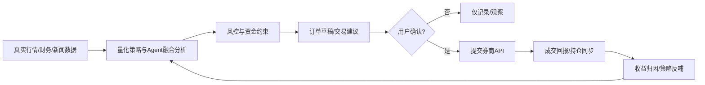
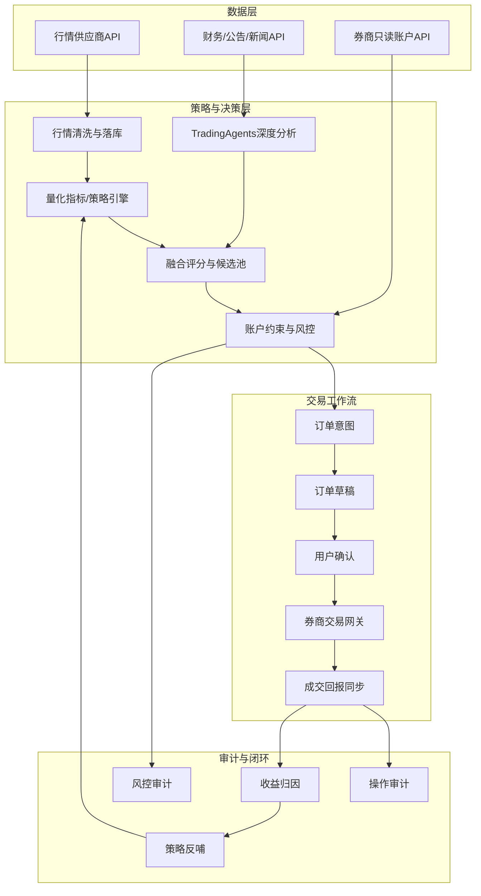

# 真实行情与实盘交易 API 接入可行性、边界与对外化方案

> 版本：2026-05-22  
> 适用项目：QuantX A 股自动投研交易平台  
> 适用对象：产品负责人、研发、运维、合规/法务、后续接手 Agent  
> 结论摘要：**可以接入真实行情 API 和券商/交易 API 做“实盘辅助决策 + 人工确认下单 + 全链路风控审计”；不应让 AI 在无人确认、无合规资质、无风险兜底的情况下直接代操真实证券账户。**

---

## 1. 一句话结论

当前网站已经具备「数据同步、量化跑分、TradingAgents 分析、模拟交易、收益闭环、飞书通知」等能力，技术上可以继续接入：

1. **真实行情数据 API**：用于实时行情、盘口、成交、分钟线、日线、财务因子、公告新闻等。
2. **真实券商交易 API**：用于账户资产、持仓、委托、撤单、成交回报查询，以及在合规约束下提交订单。
3. **实盘辅助工作流**：系统生成建议与订单草稿，用户人工确认后再提交到券商。

但不建议、也不应实现「AI 全自动直接操作用户真实证券账户」作为默认产品形态。正确方案是：



---

## 2. 能不能接真实股票 API？

### 2.1 真实行情 API：可以接入

可以接入真实行情与基础数据 API。该类能力适合优先建设，风险相对较低，也是当前项目走向实盘辅助的必要前置。

可接入的数据类型：

| 数据类型 | 用途 | 对系统价值 |
| --- | --- | --- |
| 实时行情快照 | 当前价、涨跌幅、成交额、换手率 | 提升推荐与消息中的价格真实性 |
| Level-1 五档盘口 | 买一卖一、盘口价差 | 校验成交可行性与滑点 |
| 分钟线 | 盘中择时、尾盘策略 | 支持开盘/午盘/尾盘不同策略 |
| 日线/复权日线 | 历史回测、指标计算 | 当前量化策略的基础数据 |
| 财务因子 | 估值、成长、盈利质量 | 提升中长期筛选质量 |
| 公告/新闻/舆情 | 风险事件与催化 | 提升 TradingAgents 分析质量 |
| 交易日历 | 定时任务与开收盘判断 | 避免节假日误触发 |

注意事项：

- 免费数据源通常存在延迟、限流、字段不稳定、授权边界不清晰等问题；适合研发验证，不适合商业化稳定服务。
- 对外使用必须确认数据授权范围，尤其是实时行情、分钟线、盘口、财务因子、新闻全文等。
- 数据要落库并做质量检查，包括缺口、重复、停牌、复权、涨跌停、异常价格、成交额单位等。

### 2.2 券商交易 API：技术上可以接入，但必须加边界

如果券商提供 API 或用户通过合规通道授权，可以接入如下能力：

| 能力 | 是否建议 | 说明 |
| --- | --- | --- |
| 查询资产 | 建议 | 用于展示真实资金、可用余额、总资产 |
| 查询持仓 | 建议 | 用于真实持仓风控与建议生成 |
| 查询委托/成交 | 建议 | 用于闭环统计与风控复盘 |
| 撤单 | 谨慎 | 需要用户确认或预设规则 |
| 下单 | 高风险，必须人工确认 | 系统只能生成订单草稿，用户确认后提交 |
| 全自动无人下单 | 不建议作为默认能力 | 存在合规、资金、误操作、模型幻觉与责任边界问题 |

---

## 3. 为什么不能让 AI 直接在真实场景下帮你操作账号？

这里的“不能”不是指技术绝对做不到，而是指**不应该以当前产品形态直接做无人确认的真实资金自动代操**。

### 3.1 投资建议与资产管理合规风险

真实股票账户涉及证券投资咨询、资产管理、投资顾问、自动化交易、适当性管理等监管要求。若系统直接替用户决策并执行交易，可能被认定为：

- 向用户提供具体证券买卖建议；
- 代客理财或自动管理资产；
- 未经许可提供投资顾问服务；
- 未履行风险揭示、适当性、留痕、投诉处理等义务。

因此，对外化产品必须以“投研工具 / 决策辅助 / 订单草稿 / 用户自决”为基本定位，而不是“AI 替你炒股”。

### 3.2 模型不具备收益保证，且可能产生错误

即使系统已经接入量化策略、Agent 分析和收益闭环，仍然存在：

- 行情数据延迟或错误；
- 策略过拟合；
- 模型幻觉或解释错误；
- 新闻/公告理解偏差；
- 黑天鹅事件；
- 开盘跳空、涨跌停无法成交；
- 流动性不足导致严重滑点；
- 网络/券商 API 故障导致重复下单、漏单、撤单失败。

这些问题在模拟盘里只是误差，在真实账户中会变成真实资金损失。

### 3.3 真实交易需要不可绕过的风控与责任确认

真实交易至少需要：

- 单笔最大亏损限制；
- 单股仓位上限；
- 总仓位上限；
- 行业集中度限制；
- 黑名单/停牌/ST/退市风险过滤；
- 涨跌停、流动性、盘口价差过滤；
- 用户确认与二次校验；
- 完整审计日志；
- 紧急停止开关；
- 异常回滚/撤单预案。

当前项目已有模拟盘风控与审计基础，但还没有达到可以无人值守处理真实资金的标准。

### 3.4 账号密钥与资金安全风险

券商交易密钥、Token、资金账号、交易密码属于高敏感凭证。若让 AI 或普通应用进程长期持有完整交易权限，会带来：

- 凭证泄露；
- 被越权调用；
- SSRF/注入/供应链攻击导致盗用；
- 日志误打印密钥；
- 多人开发环境误触发真实下单。

因此必须设计独立密钥托管、权限隔离、只读/交易权限分离和操作审计。

---

## 4. 推荐产品定位：实盘辅助，而不是无人代操

对外可用版本建议定位为：

> **A 股实盘辅助决策与交易纪律平台**：系统基于真实行情、量化策略、Agent 研报和账户持仓生成交易建议与订单草稿；用户保留最终决策权；所有真实下单必须经过用户确认、风控校验和审计留痕。

### 4.1 三种交易模式

| 模式 | 描述 | 是否适合当前阶段 | 对外风险 |
| --- | --- | --- | --- |
| 只读投研模式 | 只接行情、新闻、财务和账户只读信息，不下单 | 立即适合 | 低 |
| 人工确认实盘模式 | 系统生成订单草稿，用户确认后下单 | 推荐建设 | 中 |
| 受限自动执行模式 | 用户预授权小资金、小仓位、白名单策略自动执行 | 后期灰度 | 高 |

当前建议先做 **只读投研模式 → 人工确认实盘模式**，暂不开放无人确认自动执行。

---

## 5. 对外使用的完整技术方案

### 5.1 总体架构



### 5.2 新增核心模块

建议新增独立模块，避免把真实交易逻辑混进模拟盘：

```text
backend/src/live-trading/
  brokers/
    BrokerGateway.ts              # 券商网关统一接口
    MockBrokerGateway.ts          # 本地/测试券商实现
    EastMoneyGateway.ts           # 示例：东方财富/第三方适配层，按实际能力实现
    QmtGateway.ts                 # 示例：QMT/Ptrade 等本地网关适配
  market-data/
    LiveMarketDataProvider.ts     # 实时行情统一接口
    AkshareRealtimeProvider.ts    # 研发验证用
    LicensedQuoteProvider.ts      # 付费授权行情适配
  services/
    LiveAccountSyncService.ts     # 真实账户资产/持仓/成交同步
    LiveOrderIntentService.ts     # 真实订单意图生成
    LiveRiskGuardService.ts       # 实盘风控
    LiveOrderApprovalService.ts   # 人工审批/强确认
    LiveExecutionService.ts       # 下单/撤单执行
    LiveTradeReconcileService.ts  # 委托成交对账
  controllers/
    LiveTradingController.ts
  routes/
    liveTrading.routes.ts
```

### 5.3 统一券商接口设计

所有券商适配器必须实现统一接口：

```ts
export interface BrokerGateway {
  getCapabilities(): BrokerCapabilities;
  getAccountSnapshot(): Promise<BrokerAccountSnapshot>;
  getPositions(): Promise<BrokerPosition[]>;
  getOrders(query: BrokerOrderQuery): Promise<BrokerOrder[]>;
  getTrades(query: BrokerTradeQuery): Promise<BrokerTrade[]>;
  placeOrder(order: BrokerPlaceOrderRequest): Promise<BrokerPlaceOrderResult>;
  cancelOrder(order_id: string): Promise<BrokerCancelOrderResult>;
}
```

关键约束：

- `placeOrder` 不能被策略层直接调用，只能由 `LiveExecutionService` 在审批通过后调用。
- 券商能力要显式声明，例如是否支持市价单、限价单、撤单、融资融券、ETF、可转债等。
- 券商返回字段必须标准化，避免不同券商字段差异污染业务层。

### 5.4 实盘数据库表设计

建议新增表，不复用模拟盘交易表，避免真实/模拟混淆。

| 表名 | 作用 |
| --- | --- |
| `live_broker_accounts` | 用户绑定的券商账户，保存脱敏账号与权限状态 |
| `live_account_snapshots` | 账户资产快照，总资产、现金、可用资金 |
| `live_positions` | 实盘持仓快照 |
| `live_order_intents` | 系统生成的真实交易意图 |
| `live_order_drafts` | 待确认订单草稿 |
| `live_order_approvals` | 用户审批记录 |
| `live_orders` | 已提交券商的委托 |
| `live_trades` | 券商成交回报 |
| `live_risk_checks` | 每次下单前风控结果 |
| `live_execution_audit_logs` | 实盘执行审计日志 |
| `live_strategy_outcomes` | 实盘策略收益归因 |

字段命名继续遵守项目规范：全部使用 `snake_case`。

### 5.5 实盘风控规则

真实下单前必须经过不可绕过的风控：

| 风控项 | 建议默认值 | 说明 |
| --- | --- | --- |
| 单笔最大资金占比 | 5% | 任一订单不超过总资产 5% |
| 单股最大仓位 | 10% | 防止单票重仓 |
| 总股票仓位上限 | 60% | 初期保守，逐步放开 |
| 单日最大新增仓位 | 15% | 控制系统单日风险暴露 |
| 单日最大交易次数 | 5 笔 | 防止频繁交易 |
| ST/退市风险过滤 | 默认禁止 | 避免高风险标的 |
| 涨停买入 | 默认禁止 | 避免无法成交或次日风险 |
| 跌停卖出 | 仅提示 | 跌停可能无法成交 |
| 最小成交额/流动性 | 必须校验 | 避免小盘流动性踩踏 |
| 价格偏离保护 | 买入价不得高于参考价 X% | 防止异常滑点 |
| 黑名单 | 必须支持 | 用户/系统共同维护 |
| 紧急停止 | 必须支持 | 一键禁用实盘下单 |

### 5.6 用户确认机制

真实订单必须走强确认链路：

1. 系统生成订单意图：`BUY 600519 100 股，参考价 ¥xxx`。
2. 风控系统生成可读解释：为什么可以买、最大亏损是多少、触发了哪些限制。
3. 页面展示订单草稿。
4. 用户点击确认。
5. 对高风险订单要求二次确认，例如输入：`CONFIRM_LIVE_ORDER`。
6. 后端再次校验行情、账户、持仓、风控。
7. 提交券商 API。
8. 保存审计日志、委托号、成交回报。

任何一步失败，都不能默认重试下单。重试必须基于券商委托号做幂等校验。

---

## 6. 推荐页面设计

为了对外使用，建议新增一级模块「实盘交易」，与「模拟交易」隔离。

| 页面 | 路径 | 作用 |
| --- | --- | --- |
| 实盘总览 | `/live-trading/overview` | 真实账户资产、持仓、当日盈亏、风险状态 |
| 订单审批 | `/live-trading/orders` | 查看系统生成的订单草稿，人工确认/拒绝 |
| 持仓风控 | `/live-trading/risk` | 单股/行业/总仓位风险、止损止盈建议 |
| 成交与对账 | `/live-trading/reconcile` | 券商委托、成交、系统记录一致性检查 |
| 实盘收益闭环 | `/live-trading/outcomes` | 每笔实盘交易的来源、理由、收益、归因 |
| 账户与权限 | `/live-trading/accounts` | 绑定券商、权限状态、密钥轮换、只读/交易权限 |

页面原则：

- 默认只展示结论和关键风险，不展示大段分析。
- 所有真实下单按钮必须醒目但克制，避免误触。
- 模拟盘和实盘必须有明显视觉区分，例如实盘使用“红色风险角标 + 实盘账户编号脱敏”。
- 实盘页面必须显示“当前是否允许交易 / 是否只读 / 是否熔断”。

---

## 7. 对外商业化/多用户方案

### 7.1 角色与权限

| 角色 | 权限 |
| --- | --- |
| 普通用户 | 查看自己的行情、建议、账户、订单草稿；确认自己的订单 |
| 高级用户 | 可配置策略偏好、风险参数、黑白名单 |
| 运营人员 | 查看系统健康、任务状态、脱敏统计；不可看用户完整账户凭证 |
| 风控管理员 | 配置全局风控上限、熔断规则 |
| 系统管理员 | 用户管理、服务配置、审计查看 |

### 7.2 租户隔离

对外必须增加多租户字段：

- `tenant_id`
- `user_id`
- `broker_account_id`

所有查询必须带租户和用户隔离，防止数据串号。

### 7.3 密钥与凭证安全

- 券商密钥必须加密存储，不能明文落库。
- 交易密码不应长期保存；如必须保存，要使用 KMS/硬件密钥/独立密钥服务。
- 后端日志禁止打印 token、cookie、资金账号、交易密码。
- 区分只读权限与交易权限。
- 交易权限建议短期有效，到期重新授权。
- 所有敏感操作写审计日志。

### 7.4 合规与用户协议

对外上线前至少需要：

1. 明确产品不是收益承诺工具。
2. 明确系统输出仅供参考，用户独立决策。
3. 风险揭示书。
4. 用户适当性问卷。
5. 交易确认授权书。
6. 数据授权说明。
7. 隐私政策。
8. 投诉与纠纷处理流程。
9. 审计日志保留周期。
10. 如涉及证券投资咨询/投顾/资管性质，需咨询专业法务并取得必要资质或与持牌机构合作。

---

## 8. 分阶段实施计划

### 阶段 0：明确边界与开关

目标：先把产品边界固化到系统中。

- 增加全局配置：`LIVE_TRADING_ENABLED=false`。
- 增加页面提示：当前为模拟盘，不是实盘。
- 所有实盘 API 默认关闭。
- 增加“实盘能力状态页”，展示只读/交易权限是否启用。

验收标准：

- 未开启实盘配置时，任何真实下单接口都返回禁止。
- 页面明确区分模拟盘与实盘。

### 阶段 1：真实行情接入

目标：先让推荐和消息使用更真实的价格。

- 抽象 `LiveMarketDataProvider`。
- 接入至少一个研发数据源和一个可替换的授权数据源接口。
- 实时行情落库：快照、分钟线、数据质量状态。
- 修改推荐 message：展示推荐时刻价格、行情时间、数据源。
- 加入行情延迟检测。

验收标准：

- 可以在页面看到最新价、时间戳、延迟状态。
- 定时任务写入飞书/机器人消息时，包含真实行情时间与价格。
- 数据源异常时推荐降级，不盲目下结论。

### 阶段 2：券商只读账户同步

目标：先同步真实账户，不做交易。

- 实现 `BrokerGateway` 只读方法。
- 同步资产、持仓、委托、成交。
- 新增实盘总览页面。
- 将真实持仓纳入风险分析。
- 不开放下单接口。

验收标准：

- 能看到真实账户资产与持仓。
- 系统可以基于真实持仓生成“建议”，但不能提交订单。
- 所有账号信息脱敏展示。

### 阶段 3：订单草稿与人工确认

目标：系统生成订单草稿，用户人工确认。

- 新增 `live_order_intents` 与 `live_order_drafts`。
- 复用当前订单意图/拒单归因逻辑，但写入实盘草稿表。
- 新增订单审批页面。
- 确认前做二次行情与风控校验。
- 用户确认后才进入执行层。

验收标准：

- 系统不能直接从策略调用券商下单。
- 所有订单草稿都有来源、理由、价格、风险、用户确认记录。

### 阶段 4：小范围实盘下单灰度

目标：在极小资金、强风控、人工确认下提交真实订单。

- 支持限价买入/卖出。
- 支持撤单。
- 支持成交回报同步。
- 支持委托状态轮询。
- 支持幂等下单。
- 支持紧急停止。

验收标准：

- 每笔实盘订单有完整链路：信号 → 风控 → 用户确认 → 券商委托 → 成交 → 收益。
- API 故障不会重复下单。
- 触发熔断后无法继续提交新订单。

### 阶段 5：实盘收益闭环

目标：把实盘表现反哺策略，但不让模型无审计自改生产参数。

- 实盘收益归因。
- 策略来源对比。
- 推荐命中率、胜率、盈亏比、最大回撤。
- 与模拟盘差异分析。
- 生成调参建议，但仍需人工审计后应用。

验收标准：

- 能回答“哪些策略在真实账户赚钱”。
- 能回答“模拟盘和实盘差距来自滑点、成交失败还是策略失效”。
- 参数调整仍走 Canary / 审计 / 回滚流程。

### 阶段 6：受限自动执行探索

目标：仅在合规、安全、用户明确授权前提下探索。

可选限制：

- 仅限单用户自用。
- 仅限小资金子账户。
- 仅限白名单策略。
- 单笔、单日、总仓位极低上限。
- 仅限卖出风控自动执行，买入仍人工确认。
- 自动执行前发通知，延迟 N 秒允许用户取消。

验收标准：

- 必须有法务/合规确认。
- 必须有紧急停止和审计。
- 必须有异常回滚和人工接管流程。

---

## 9. 数据源与券商接入建议

### 9.1 行情数据源选择原则

| 场景 | 建议 |
| --- | --- |
| 本地研发 | 可继续使用 AKShare / 东方财富公开接口等低成本源 |
| 内部自用 | 可使用稳定性更高的付费数据源，重点看分钟线、复权、限流 |
| 对外商业化 | 必须采购授权明确的数据服务 |

评估维度：

- 是否支持 A 股实时行情；
- 是否支持分钟线和历史复权；
- 是否支持财务因子、公告新闻；
- API 限流与稳定性；
- 商业授权范围；
- 是否允许缓存落库；
- 成本是否随用户量增长；
- SLA 与故障响应。

### 9.2 券商接入选择原则

优先选择：

1. 官方或半官方 API；
2. 支持只读与交易权限分离；
3. 支持委托/成交查询；
4. 支持撤单；
5. 支持沙箱或仿真环境；
6. 支持幂等或可通过客户端订单号去重；
7. 有稳定文档和错误码。

不建议：

- 逆向客户端协议；
- 用机器人模拟点击下单；
- 将交易密码明文写在脚本中；
- 在开发环境连接真实交易账户；
- 多人共享同一交易密钥。

---

## 10. 当前项目需要改造的清单

### 10.1 后端

- 新增 `live-trading` 模块。
- 新增真实行情 provider 抽象。
- 新增券商网关抽象。
- 新增实盘账户、持仓、订单、成交、审批、审计模型。
- 实盘接口全部加认证、权限、风控和审计。
- 定时任务区分模拟盘与实盘。
- 加入全局实盘熔断开关。
- 所有真实下单接口默认禁用，需环境变量和管理员开关同时开启。

### 10.2 前端

- 新增「实盘交易」一级模块。
- 模拟盘页面增加“模拟”标识，避免用户误解。
- 实盘页面增加“真实资金风险”标识。
- 订单审批页面必须简洁：结论、价格、数量、最大风险、确认按钮。
- 真实下单按钮增加二次确认。
- 账户信息脱敏展示。

### 10.3 运维

- 生产环境单独配置实盘密钥。
- 密钥轮换机制。
- 交易 API 访问 IP 白名单。
- 异常告警：下单失败、撤单失败、成交回报缺失、行情延迟、风控熔断。
- 每日开盘前健康检查。
- 每日收盘后对账。

### 10.4 测试

- 券商 mock 测试。
- 沙箱/仿真交易测试。
- 幂等重复请求测试。
- 断网/超时/半成功测试。
- 涨跌停/停牌/ST 测试。
- 风控拦截测试。
- 权限越权测试。
- 审计日志完整性测试。

---

## 11. 最小可行版本 MVP

如果要最快落地，建议 MVP 范围如下：

### 11.1 做什么

1. 接入一个更稳定的实时行情源。
2. 增加实盘只读账户同步。
3. 系统基于真实持仓生成建议。
4. 生成订单草稿，但不自动下单。
5. 用户在页面点击确认后，才调用券商 API。
6. 每笔真实订单回写收益闭环。

### 11.2 不做什么

1. 不做无人确认自动买入。
2. 不做高频交易。
3. 不做融资融券。
4. 不做期权/期货。
5. 不做策略自动大规模改参。
6. 不向外宣传“保证赚钱”。

### 11.3 MVP 验收

- 真实行情价格可见且带时间戳。
- 真实持仓可见且脱敏。
- 系统每天生成不超过 N 条实盘建议。
- 用户可以确认或拒绝订单草稿。
- 成交后收益能被追踪。
- 所有真实交易都有审计链路。
- 任意异常不重复下单。

---

## 12. 风险提示与产品话术

推荐对外话术：

> 本系统是投研与交易纪律辅助工具。系统会基于行情、量化模型、AI 研报和账户风险生成交易建议与订单草稿，但所有真实交易均需用户自主确认。市场有风险，模型可能出错，历史收益不代表未来表现。

不建议话术：

- “AI 自动帮你炒股”
- “稳赚”
- “躺赚”
- “保证收益”
- “全自动无风险交易”
- “无需看盘”

---

## 13. 推荐下一步

建议下一步按以下顺序推进：

1. **先补产品边界**：页面、文档、环境变量都明确当前是模拟盘，不是实盘。
2. **先接真实行情**：让所有推荐和飞书消息里的价格、时间戳、行情延迟更真实。
3. **再做券商只读**：同步真实账户但不交易。
4. **再做订单草稿**：系统建议，用户确认。
5. **最后再做实盘下单**：小资金、强风控、可回滚、全审计。

最终目标不是让 AI 无约束代操账户，而是把 AI、量化、风控、纪律和收益闭环结合起来，让用户在真实市场中做更高质量、更可追踪、更少情绪化的决策。
