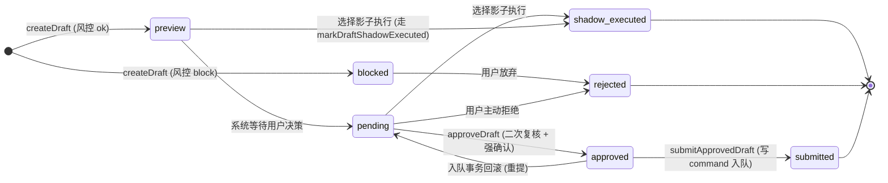
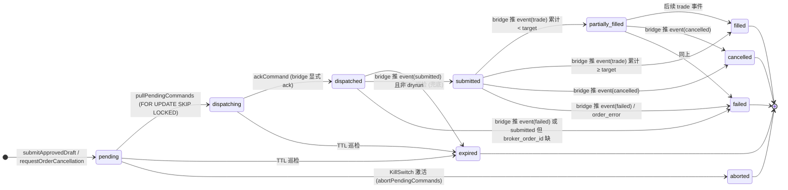
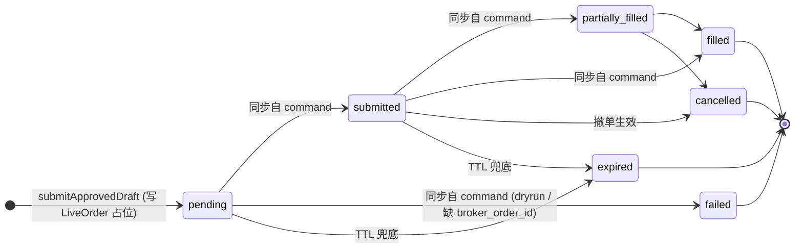
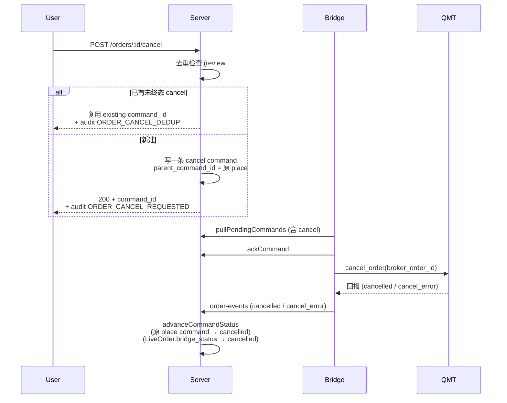
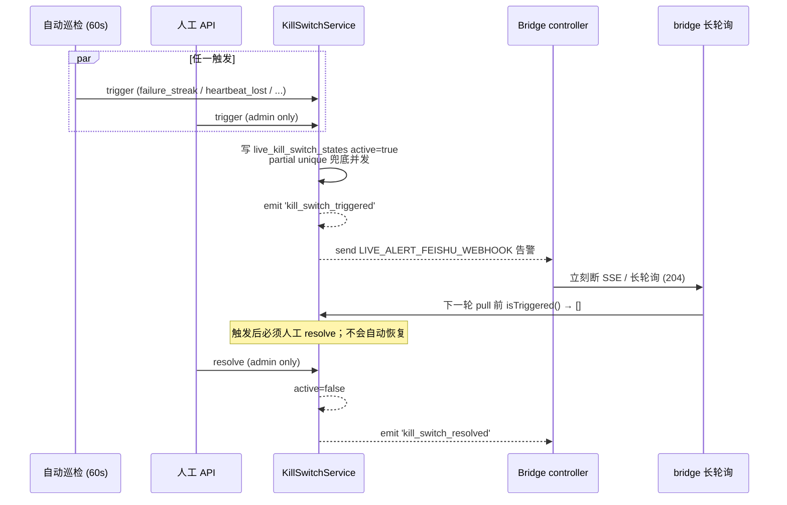

# 实盘状态机可视化

> 三层状态对应三张表：`LiveOrderDraft` × `LiveBrokerCommand` × `LiveOrder.bridge_status`。
> 三层都是各自独立的状态机，通过 `draft_id / order_id / command_id` 串起来。
> 收敛在终态后不会再有事件改它（除非人工 SQL）。

## 1. 草稿（`LiveOrderDraft.status`）

由 **用户操作 + 风控** 推进；终态 = `submitted / rejected / shadow_executed`。



关键转移说明：

| from → to | 触发 | 入口 service 方法 | 落 audit |
| - | - | - | - |
| (init) → `preview` / `blocked` | 用户 POST 草稿 | `LiveTradingService.createDraft` | `ORDER_DRAFT_CREATED` |
| `pending` → `rejected` | 用户主动拒绝 | `rejectDraft` | `ORDER_DRAFT_REJECTED` |
| `pending` / `preview` → `shadow_executed` | 影子执行 | `markDraftShadowExecuted` | `ORDER_SHADOW_EXECUTED` |
| `pending` → `approved` → `submitted` | 强确认下单 | `approveDraft` → `submitApprovedDraft` | `ORDER_DRAFT_APPROVED` + `ORDER_ENQUEUED` |
| `approved` → `pending` (回退) | 入队事务回滚 | `submitApprovedDraft.catch` | `ORDER_ENQUEUE_FAILED` |

## 2. 命令（`LiveBrokerCommand.status`）

由 **bridge 长轮询 + 事件回传 + TTL 巡检 + KillSwitch** 推进；终态 = `filled / cancelled / failed / expired / aborted`。



关键转移说明：

| from → to | 触发 | 入口 service 方法 | 落 audit |
| - | - | - | - |
| `pending` → `dispatching` | bridge 长轮询拉取 | `BridgeService.pullPendingCommands` | （审计在事件路径上） |
| `dispatching` → `dispatched` | bridge 显式 ack | `BridgeService.ackCommand` | （`BRIDGE_REQUEST`） |
| `pending/dispatching/dispatched` → `expired` | TTL 巡检 | `BridgeCommandExpiryService.scanCommandsExpired` | `BROKER_COMMAND_EXPIRED` |
| `pending` → `aborted` | KillSwitch 激活 | `KillSwitchService.abortPendingCommands` | `KILL_SWITCH_TRIGGERED` + `BROKER_COMMAND_ABORTED` |
| `dispatched` → `submitted/failed` | bridge 推 `submitted` 事件 | `BridgeService.advanceCommandStatus` | `BRIDGE_STATUS_SUBMITTED / FAILED` |
| `submitted/partially_filled` → `filled` | 累计成交达到 target | `advanceCommandStatus`（事务内 increment） | `BRIDGE_STATUS_FILLED` |
| `submitted/partially_filled` → `cancelled` | 撤单回报 | `advanceCommandStatus` | `BRIDGE_STATUS_CANCELLED` |
| 任意 → terminal | 任何 event 写入 | 用 `WHERE status NOT IN terminal` 防覆盖 | （同上） |

**`aborted` 终态特别说明 (audit M-6)**:
- 触发: 仅由 `KillSwitchService.abortPendingCommands` 写入; 把 KillSwitch 激活
  时所有仍为 `pending` 的命令一次性置 aborted, 阻断 bridge 后续拉取.
- 终态: **不再进入 TTL 巡检** (`BridgeCommandExpiryService.scanCommandsExpired`
  的 `WHERE status IN ('pending','dispatching','dispatched')` 不覆盖 aborted), 与
  cancelled / failed / expired 并列.
- 不会回到 active: KillSwitch resolve 后已经 aborted 的命令不会自动复活, 需用户
  手动 resubmit (设计意图: 熔断是高风险信号, 强制人工 review).

## 3. 委托（`LiveOrder.bridge_status`）

是 `LiveBrokerCommand.status` 的镜像（一对一关联）。变化都靠 `advanceCommandStatus` 或 expiry 服务同步写。



注意：
- `LiveOrder.bridge_status` 与 `LiveBrokerCommand.status` 用同一套字符串
- 同步写时也用 `WHERE bridge_status NOT IN terminal` 防覆盖（review #4 修复）
- TTL 兜底由 `BridgeCommandExpiryService.scanOrdersExpired` 处理"创建了 order 但 command 创建失败"的孤儿（grace = TTL × 5）

## 4. 撤单（一条独立 cancel 命令）



`cancel_error` 不会让 cancel command 进 terminal；只入 audit，等下次重试或人工。

## 5. Kill switch 联动



## 6. 全景图

```mermaid
flowchart LR
  User --> Draft[LiveOrderDraft]
  Draft -->|approve| Command[LiveBrokerCommand]
  Command -->|enqueue| Order[LiveOrder]
  Bridge[QMT Bridge] -.pull.-> Command
  Bridge -.ack.-> Command
  Bridge -.events.-> Command
  Command -.sync.-> Order
  Expiry[BridgeCommandExpiry 15s] -.expire.-> Command
  Expiry -.expire 兜底.-> Order
  KillSwitch[KillSwitch 60s 自动巡检] -.熔断.-> Command
  KillSwitch -.告警.-> Feishu[飞书"实盘告警"群]
  Audit[(LiveExecutionAuditLog)] -.>|critical/error|Feishu
  Order -.成交回填.-> Trade[LiveTrade]
  Trade -.对账.-> Recon[end_of_day_reconciliation.js]
```

## 修改本图时要同步的位置

如果你改了状态机或事件名：

1. `backend/src/live-trading/auditEvents.ts` 加 / 改枚举值
2. 本文件对应的 mermaid 节点
3. `docs/live_trading_review_round_2.md` 如涉及修复
4. `docs/live_trading_launch_checklist.md` 如涉及 audit event 监控
5. 跑 `bash scripts/ci/check_audit_events.sh` 确认没硬编码遗漏
